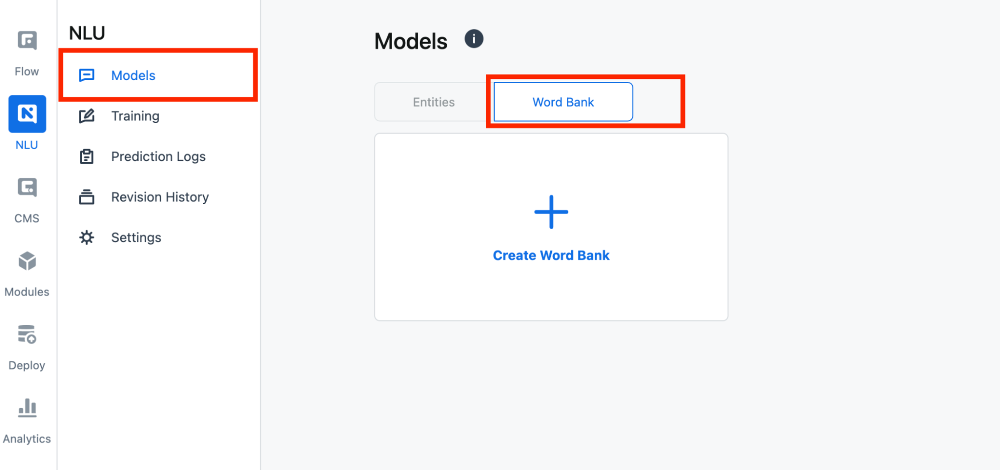
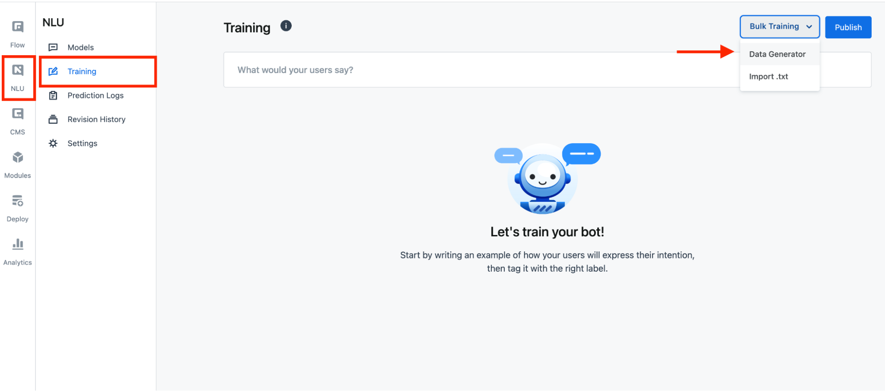
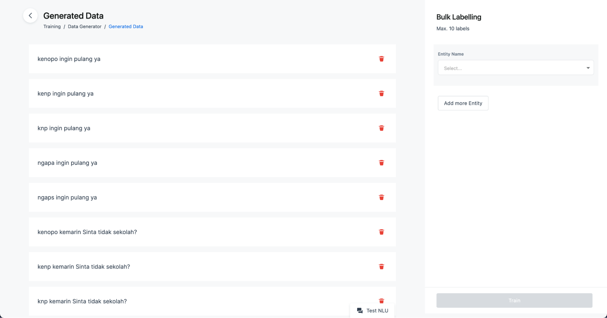
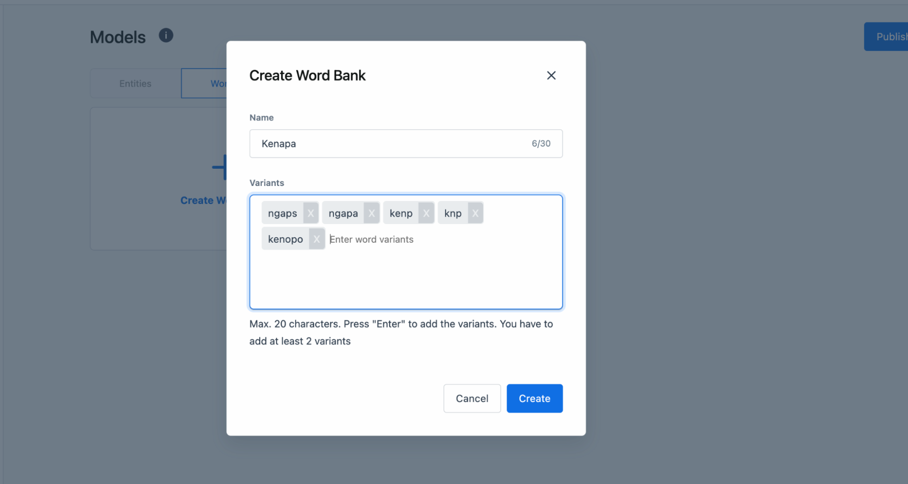
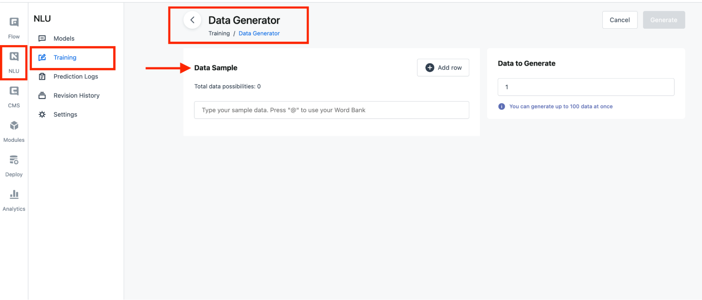
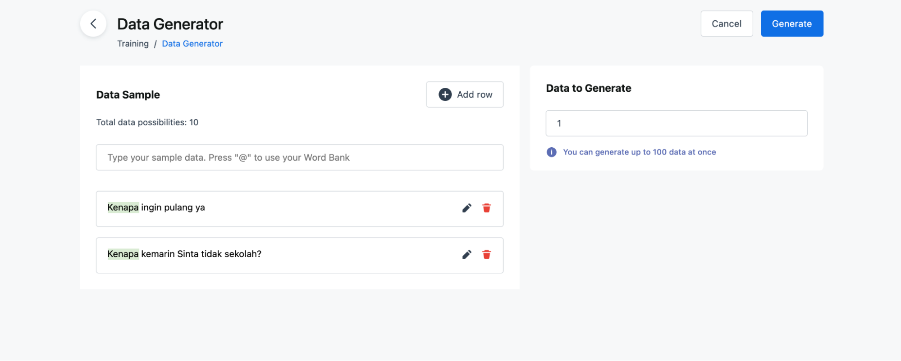

## What's New ⭐️

We released new features to help you generate training data automatically or it is called “Training Data Generator”. It was released with a bulk labeling feature too. Let’s dig deeper 😀

### What is a training data generator?

It is a feature to automate training data by creating a word bank and data sample. Word bank is a group of word variants or synonyms of a word. A data sample is a sentence that contains 1 word bank or multiple word banks.

Figure 1: Here is the word bank feature located
 

Figure 2: Here is the training data generator feature located
 

Figure 3: Here is the data sample feature located
 

### How does training data generators work?

It works by multiplying a data sample with added word banks. Here is a scenario where users create 1 word bank with 5 word variants and 1 data sample.

Figure 4: Create a word bank with 5 word variants.
 

Then, users create a data sample consisting of a word bank.

Figure 5: Create a data sample with a word bank.
 

Next, generate training data. You finally have training data prepared to train using the bulk labeling feature.

### What is the bulk labeling feature?

Bulk labeling helps you tag any words and sentences to train your prepared training data after being generated by our training data generator.

Figure 6: Bulk labeling feature located.
 

> **Important note**: You must have at least 1 entity and 1 label to do this.

There are several conditions for bulk labeling that are impacted by entity types:

-   If you’re using entity type “trait”, you can automatically tag all sentences.
-   If you’re using entity type “phrase”, then you can search for a word or use the “Words to Tag” feature to tag any words.
-   Entity type “dictionary” is similar to entity type “phrase”, but you cannot choose labels in this part. It's because “dictionary” has a different structure from “phrase”.

Furthermore, you can watch the [tutorial video](https://www.youtube.com/watch?v=vQ4u2FPrvlw&feature=emb_imp_woyt) or view our documentation [here](https://drive.google.com/file/d/1bpoS0gournepyEaymBxTYJrkAKIPYTCX/view?usp=sharing). We’re sorry for the inconvenience because our Kata Documentation currently has been on-going revamped.

## What's been fixed 🛠

-   Fixed inconsistent copy in CMS.
-   Fixed users cannot see the created deployment in real-time.
-   Improved downloaded file name YAML in flow revision into bot.yml.
