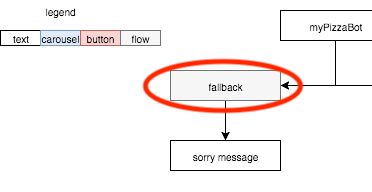
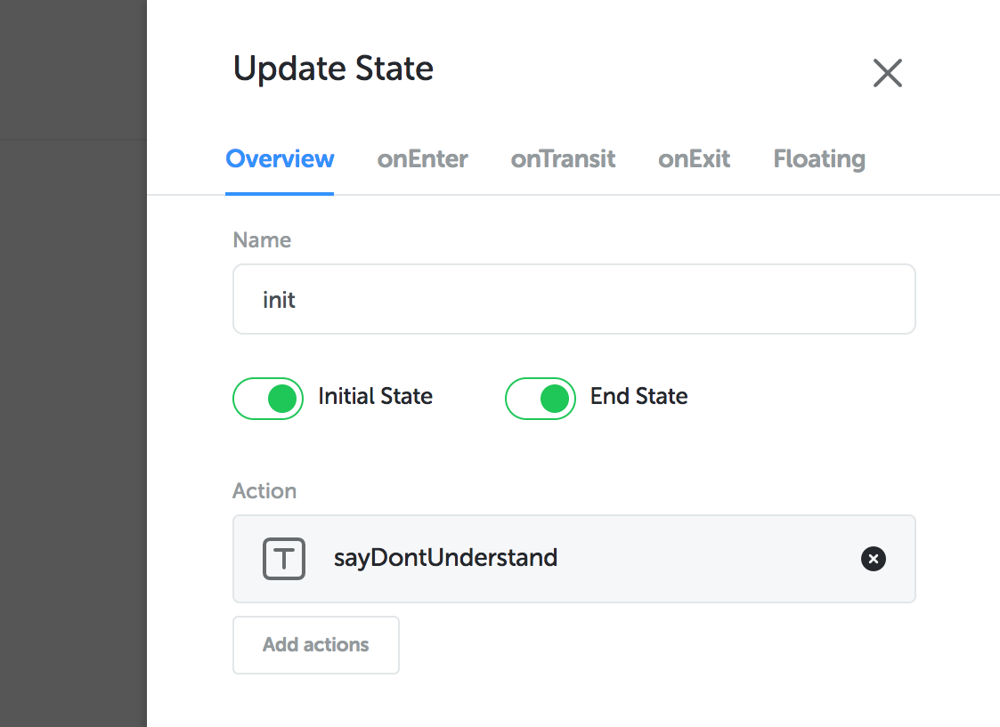
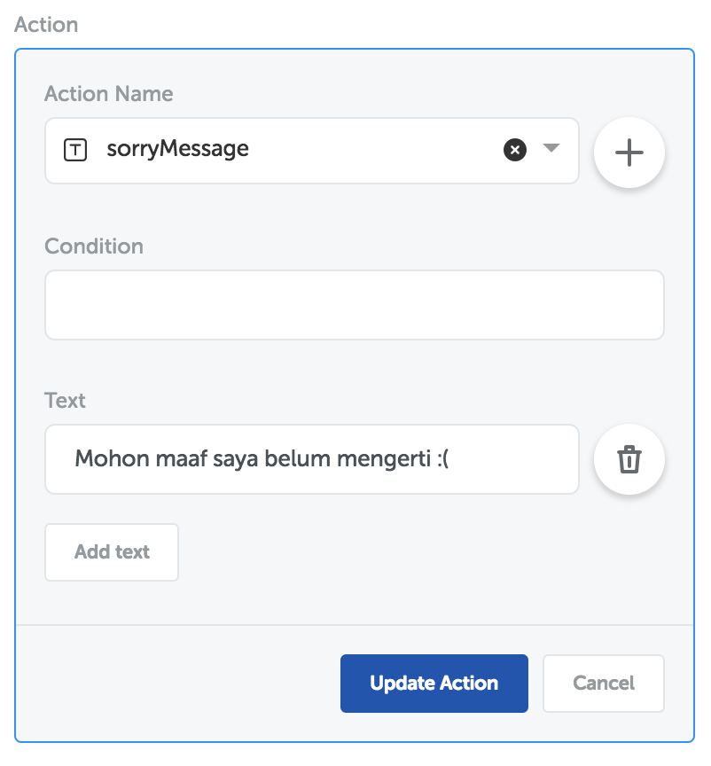
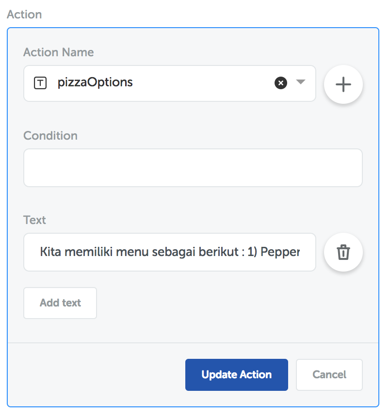
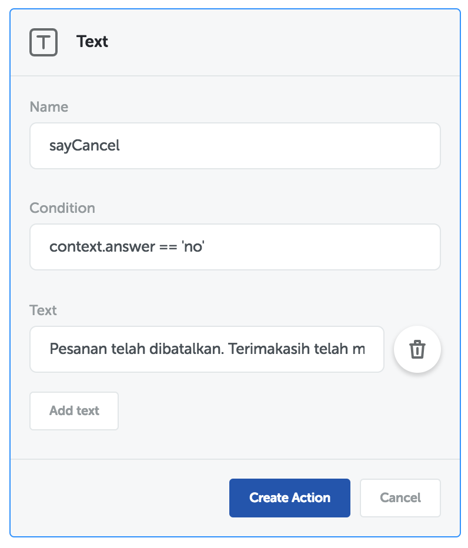
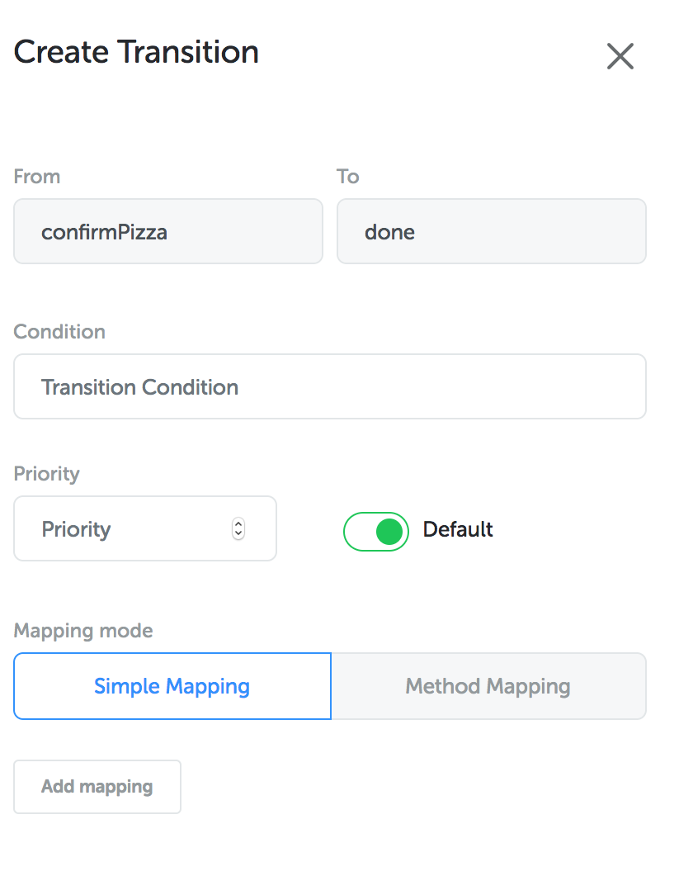
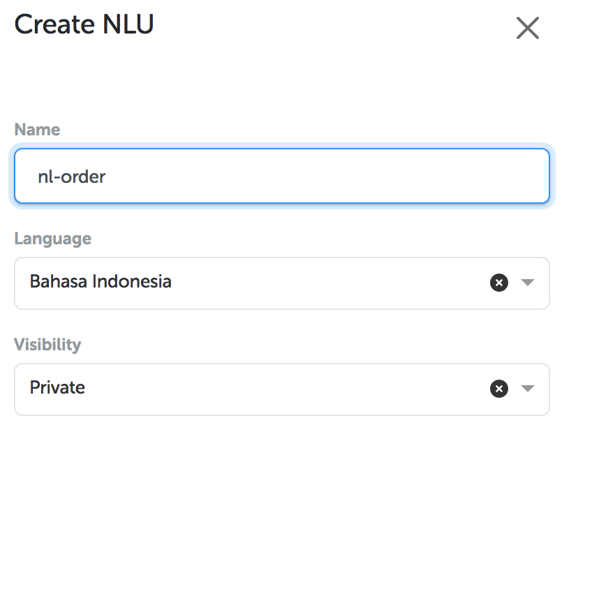
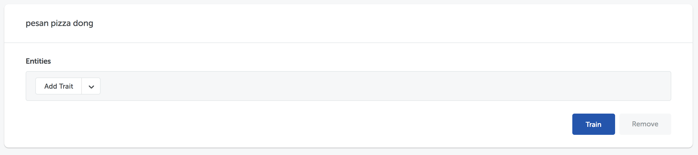
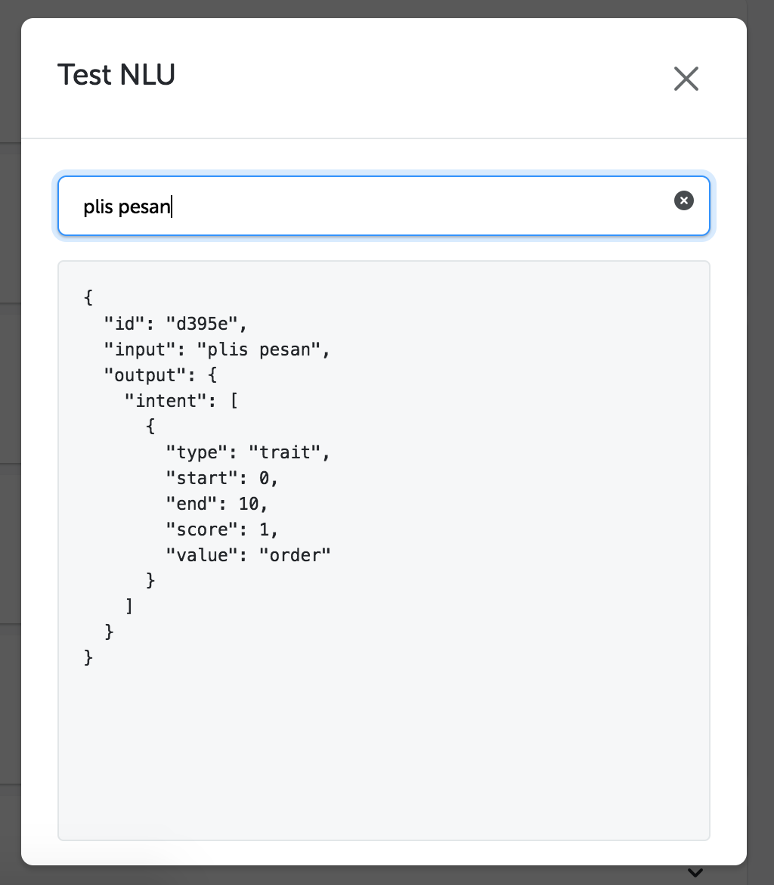
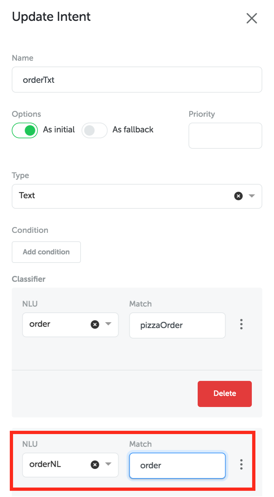

## Pendahuluan

Dalam tutorial kali ini, kita akan membuat sebuah bot percakapan sederhana untuk memesan pizza yang digunakan di platform LINE. Pembuatan bot dapat dilakukan dengan mudah dan cepat, bahkan dengan minimnya pengetahuan bahasa pemrograman, yaitu dengan menggunakan teknologi dari Kata platform.

Mari kita mulai dengan melihat diagram alur bot atau biasa disebut dengan “conversation tree”. Conversation tree dapat memetakan fungsionalitas bot dalam merespon pengguna.


## Mendaftar Akun Kata Platform

Sebelum masuk pada pembuatan bot percakapan, kamu harus mendaftarkan diri terlebih dahulu pada platform kami. Lewati tahapan ini jika kamu sudah memiliki akun sebelumnya.

Masuk terlebih dahulu pada tautan [berikut](http://platform.kata.ai/login) dan klik pada tautan “Sign up”


Kemudian, kamu akan diminta mengisi username dan email. Untuk mempercepat proses pendaftaran, lebih baik kamu sudah menyiapkan sejak awal untuk data-data seperti gambar dibawah ini. Pemilihan tipe akun bisa disesuaikan dengan kebutuhanmu mendatang. Klik “Sign Up” untuk melanjutkan pembuatan akun.


Kamu akan mendapatkan email konfirmasi terkait akunmu untuk verifikasi dari kami. Kamu dapat mengikuti petunjuk pada email kamu. Selamat, akunmu telah siap dan kamu dapat melanjutkan membuat bot percakapan.

## Tahapan Pembuatan Bot Percakapan

### Login ke Kata Platform

Masuk ke tautan http://platform.kata.ai/login seperti pada gambar terlampir.


Klik “Login” untuk melanjutkan

### Membuat bot baru

Setelah login, tampilan pertama dalam Kata platform adalah dashboard.


Menu pertama yang muncul adalah menu dashboard pada Bot. Disini kamu bisa melihat template-template bot yang sudah disediakan sebelumnya dan kamu bisa mencoba juga nantinya untuk membantu pemahaman.

Untuk membuat bot baru, klik “Create new bot” dan kamu akan diminta mengisi data seperti terlampir.


## Membuat Flow `Fallback`

### Membuat flow

Setelah bot percakapan sudah dibuat, kamu akan diarahkan pada sub-menu “Conversational Flows”. Sesuai dengan diagram alur diatas, kita akan membuat terlebih dahulu kondisi yang tidak masuk flow manapun.



Dalam 1 flow terdiri dari **intent, state dan action**. Pada gambar dibawah ini, kamu dapat melihat 1 flow yang sudah dibuat otomatis oleh sistem, yaitu `default` flow. Kita akan menghapus flow yang sudah ada sebelumnya dengan menekan tombol “more” dan kemudian “Delete”.


Selanjutnya, klik tombol “Create Flow” untuk membuat flow dan beri nama `fallback`. Flow ini berfungsi untuk menangani input dari pengguna yang tidak dapat diterima oleh flow manapun. Atur flow menjadi active, persistent dan default sehingga isian akan seperti dibawah ini


### Membuat intent `fallback`

Setelah membuat flow, kita akan masuk ke dalam intent dengan menekan tab “Intents” pada sub-menu (gambar dibawah). Hapus intent dengan menekan simbol “more” dan klik teks “Delete”. Selanjutnya, kita akan membuat intent baru untuk `fallback`.


Klik tombol “Create Intent” dan isi isian seperti terlampir. Atur intent yang dibuat menjadi fallback dengan klik “as fallback”


Sehingga intent yang dibuat akan menjadi gambar dibawah ini


### Membuat state `init`

Setelah langkah diatas berhasil, selanjutnya kita akan membuat state `init`. Hapus state yang sebelumnya disediakan dengan menekan state dan klik “Delete”. Lalu, klik tombol “+” yang berada di bagian kanan bawah halaman kamu.

Isi state dengan nama “init” pada tab “Overview” dan atur state tersebut menjadi initial state dan end state (seperti pada gambar dibawah). Fungsi “initial state” berguna untuk menjadikan state `init` sebagai yang pertama dicek pada flow dan “end state” berguna untuk menjadikan state `init` sebagai yang terakhir.



### Menambahkan action untuk state `init`

Pada tahap ini kita akan membuat lanjutan conversation tree setelah fallback, yaitu action `sorryMessage`. Action ini akan menampilkan pesan permohonan maaf dikarenakan input pengguna tidak masuk pada flow manapun. Pertama-tama, hapus terlebih dahulu action yang sudah ada dengan cara menekan simbol “x” pada bagian kanan action. Kemudian, kita mulai untuk menambahkan action. Klik tombol “Add action” pada bagian action.

Klik simbol “+” untuk menambahkan action. Lalu akan muncul tampilan pilihan-pilihan action yang dapat dilakukan oleh suatu state. Pada tutorial ini kita akan membuat tipe teks sesuai dengan diagram alur diatas. Isi konten action sesuai dengan gambar dibawah ini. Klik tombol “Update Action” untuk menyimpan action.



Tampilan setelah action sudah ditambahkan adalah sebagai berikut


### Menambahkan transition `fallback` pada `init` state

Setelah action pada state sudah ditambah, selanjutnya kita akan membuat transition `fallback`. Klik pada state yang sudah kamu buat, dan pada tab “Transition” masukkan data-data seperti dibawah ini


Klik “Update” untuk memperbaharui state dengan penambahan transisi.

## Membuat Flow `Order`

Kamu telah berhasil membuat flow `fallback` , selanjutnya kita akan masuk pada flow `order`.


#### Membuat NLUs `order`

Alur untuk memesan pizza dimulai dengan menerima input order dari pengguna. Nah, untuk memahaminya kita akan memasukkan kata-kata seperti pesan, pesen, pesen pitza, pizza dan lainnya dengan mendefinisikan NLU. NLU berfungsi agar bot memahami masukkan dari pengguna.

Untuk memulai, klik sub-menu “NLUs” pada menu Bot dan klik “Create NLU” untuk membuat NLU pertama kamu. Sesuai dengan penjelasan diatas, masukkan kata-kata yang berhubungan dengan memesan pizza. Dengan kata lain, NLU ini merupakan tipe “keyword”. Kamu juga bisa berkreasi sebanyak mungkin, minimal kata-katanya seperti pada gambar dibawah ini.


#### Menambahkan flow `order`

Setelah mempersiapkan NLU untuk mengklasifikasikan masukkan dari pengguna, selanjutnya adalah kita akan menambahkan flow baru. Untuk membuat flow baru, kita harus masuk ke sub-menu “Conversation Flow” kemudian klik “Create Flow”.

Masukkan isian dengan nama `order`


#### Membuat intent `ordertxt`

Setiap flow membutuhkan sebuah intent yang diatur sebagai “initial”, oleh karena itu pada flow `order` kita akan menggunakan intent `orderTxt` yang akan mengecek masukkan pemesan pizza.

Intent ini memiliki tipe text dan menggunakan NLU yang sudah kita buat sebelumnya. Pilih NLU yang sudah dibuat pada bagian “classifier” untuk mengklasifikasi masukkan dari pengguna apakah termasuk dalam lingkup pesanan.


#### Membuat state `init` pada flow `order`

Sesuai dengan pembuatan flow `fallback` kita harus membuat terlebih dahulu state `init`. Perbedaan dengan flow `fallback`, pada state ini hanya diatur sebagai initial saja.


### Membuat state `showpizza`

#### Membuat state `showPizza`

Kita akan menyesuaikan dengan conversation tree yaitu menampilkan menu pizza dan menanyakan menu yang diinginkan.


Untuk memulai, klik tombol “+” pada sub-menu “Conversation Flow” dan beri nama state dengan `showPizza`.

#### Menambahkan action `pizzaMenu` dan `askOptions` pada state `showPizza`

Kemudian, pada state `showPizza` tambahkan action `pizzaOptions` yang menampilkan **teks informasi **menu Pepperoni dan Veggie Lovers.



Lalu tambahkan juga action untuk menanyakan menu pada pengguna yang akan kita beri nama `askOptions` dengan menggunakan tipe action text


Sehingga hasilnya menjadi seperti gambar dibawah ini :


Selanjutnya, kita akan mencoba membuat tampilan menu pizza dengan menggunakan `carousel`. Hapus action `pizzaOptions` dari state `showPizza` dengan menekan simbol "x" yang berada pada sebelah kanan action.

Kemudian tambah action baru dengan nama `pizzaMenu` dan pilih action `carousel`


Kemudian isi konten seperti dibawah ini :

```
Title: Pepperoni
Text: Untuk pecinta pepperoni, mantap!
Thumbnail Image Url: https://cdn4.ruled.me/wp-content/uploads/2014/08/pepperonipizza.jpg
Actions:
     Label: Pepperoni
     Type: Postback
     Payload: {"type":"pizza","pizza":"Pepperoni"}
```

```
Title: Veggie Lovers
Text: Untuk pecinta sayur nihh
Thumbnail Image Url: https://www.calcuttaweb.com/store/image/data/calcutta/pizza/veggie-lovers-pizza-pihu-7.jpg
Actions:
     Label: Veggie Lovers
     Type: Postback
     Payload: {"type":"pizza","pizza":"Veggie Lovers"}
```


Klik “Create” untuk melanjutkan, pastikan datamu sama dengan gambar dibawah ini :


#### Membuat intent `pizzaChosen`

Intent dibuat untuk menangani masukkan dari pengguna setelah memilih menu pizza yang diinginkan, maka dari itu kita akan membuat intent bernama `pizzaChosen`.


#### Membuat intent `reenter`

Tambahkan intent `reenter`


#### Membuat transition antara state `init` dengan state `showPizza`

Untuk menghubungkan alur dari pengguna memesan hingga pilihan menu ditampilkan, kita akan membuat transisi antara kedua state yang sudah kita buat diatas. Cara menghubungkannya adalah kamu dapat menarik titik bulat hijau pada state `init` ke state `showPizza` hingga muncul pengaturan transisi di bagian kanan


### Membuat NLUS `quantity`

Alur selanjutnya adalah menangani pengguna hendak memesan jumlah pizza yang diharapkan.


Pada tahap ini kita akan membuat NLU dengan regex number. Bot diharapkan dapat memahami masukkan pengguna pada angka 1-9.


#### Membuat Intent `quantity`

Setelah membuat NLU, kita akan menambahkan intent yang akan menanggapi input kuantitas dari pengguna


#### Membuat state `pizzaQuantity`

Kemudian, kita akan membuat state `pizzaQuantity` yang akan menanyakan kuantitas pesanan pengguna dengan action `askQuantity` berupa teks untuk memberikan respon bot kepada pengguna.


#### Menambahkan transisi `showPizza` dengan `pizzaQuantity`

Pada transisi yang menghubungkan state `showPizza` dengan state `pizzaQuantity`, kita akan menghubungkan dengan menyimpan value `payload.pizza` ke dalam `context.pizza` ketika terjadi perpindahan flow


### Membuat NLU konfirmasi

Sesuai dengan conversation tree diatas, langkah selanjutnya adalah memberikan konfirmasi pemesanan.


Pertama-tama kita akan membuat NLU yang merupakan keyword dari kata-kata konfirmasi ya dan tidak dengan nama NLU `yesno` dan memiliki 2 keyword `yes` dan `no.`


#### Membuat state `confirmPizza`

Setelah membuat NLU, kita akan membuat state `confirmPizza` yang berfungsi untuk mengkonfirmasi pembelian. Selain itu, kita akan menyimpan value pilihan pizza dan informasi kuantitas


#### Membuat transisi dari `pizzaQuantity` menuju `confirmPizza`

Pada tahapan ini, kita akan membuat transisi dengan menyimpan value (mapping) kuantitas pizza **dan** konfirmasi tipe pizza yang dipilih


Kemudian, pada state `confirmPizza` buatlah sebuah mapping ketika melakukan transit seperti gambar dibawah dengan cara memperbaharui state yang sudah dibuat.


####Membuat intent `yesno`
Sebelumnyakita sudah membuat NLU yang berisikan konfirmasi ya dan tidak. NLU tersebut akan digunakan pada tahap ini. Agar bot dapat mengerti pernyataan konfirmasi dari pengguna, kamu dapat membuat intent untuk menampung masukkan yang menggunakan NLU `yesno` classifier.

Pertama-tama, kita akan membuat intent untuk keyword `yes`


Lalu, kita akan membuat intent untuk keyword `no`


#### Membuat state `done`

Pada state `done`, kita akan menyelesaikan pemesanan dengan mengucapkan terimakasih dan menjadikan state yang paling akhir.


Terdapat suatu kondisi dimana pengguna membatalkan pesanan. Maka dari itu, kita akan menambahkan condition pada action `sayThanks` dan `sayCancel`




Sehingga, hasil akhir dari state done adalah sebagai berikut


#### Membuat transisi dari `confirmPizza` menuju `done`

Selanjutnya adalah kita akan menghubungkan state `confirmPizza` menuju state `done`. Dikarenakan done adalah state terakhir, maka transisi yang dibuat adalah default transition



## Simpan bot percakapan

Setelah semua tahapan dilakukan, bot kamu seharusnya akan ditampilkan seperti ini


Untuk menyimpan, kamu dapat mengakses tombol biru yang berada di sebelah kanan atas.


Push versi terakhir yang kamu buat dengan menekan pilihan “Patch”

## Deployment Bot

Pada tahap ini, kamu telah selesai membuat bot percakapan. Sekarang kita akan mencoba melakukan deployment pada salah satu channel yaitu **LINE**.

### Membuat deployment

Pertama-tama kita harus membuat sebuah deployment terlebih dahulu. Cari menu “Deployment” pada sidebar kiri kamu.


Buatlah sebuah deployment dengan nama pizzaChat dan pilih versi 0.0.1. Kamu juga dapat mengikuti gambar dibawah ini


### Mendaftar akun LINE

Untuk mendaftar akun LINE, kamu harus masuk dalam console developer dari LINE (https://developers.line.me/console/)x


### Pengaturan channel

Setelah kamu mendaftarkan akun LINE, kamu terlebih dahulu harus masuk dalam console dengan memasukkan username dan password


Kemudian, kamu harus membuat provider yang dapat diakses pada tautan ini https://developers.line.me/console/register/provider/ dan masukkan nama provider yang kamu inginkan.


Setelah kamu membuat provider, klik tombol “MessagingAPI” yang berada di kanan halaman.


Fitur ini berguna untuk menambahkan channel baru. Isi informasi mengenai channel sesuai dengan keinginanmu.


Mohon diperhatikan bahwa saat mengisi **plan** yang kamu pilih adalah **Developer Trial**.


Setelah data-data di halaman MessagingAPI sudah kamu isi, tampilan bot akan berubah menjadi terlampir.


Untuk melihat detail channel, kamu bisa menekan tombol channel. Kemudian, pada detail channel kamu akan melihat Messaging Settings. Pada bagian tersebut, kamu harus melakukan “enable Webhooks” dan klik tombol Issues pada channel access token.


Tampilan setelah tahapan diatas dilakukan adalah sebagai berikut


Pada bagian “Using LINE Features”, kamu perlu melakukan nonaktif beberapa fitur pada LINE seperti gambar dibawah ini


Sekarang channel kamu telah siap dan dapat diintegrasikan dengan bot.

### Deployment pada channel

Pada menu “Deployment”, klik tombol “View channel” untuk melihat list channel yang sudah diintegrasikan. Jika belum ada apapun, berarti bot kamu belum pernah diintegrasikan sebelumnya.

Untuk menambah channel baru, klik tombol “+” pada pojok kanan bawah dari halamanmu. Masukkan nama line dan pilih channel line


Terdapat isian kosong yang harus kamu isi, maka dari itu kamu harus membuka kembali LINE developer console untuk memasukkan data-data didalamnya.

Channel Access Token dapat kamu temukan disini


Channel Secret dapat kamu temukan disini


Kemudian, klik “create” untuk membuat channel dan tampilan akhirnya akan seperti terlampir


Tahapan terakhir adalah memasukkan webhook yang dibuat dari bot ke LINE. Caranya adalah klik simbol mata pada kolom Action untuk melihat detail dari channel yang dibuat dan salin webhook yang ditampilkan.


Kemudian, tempel webhook URL tersebut pada LINE console. Klik tombol “verify” untuk mengecek sukses tidaknya keterhubungan dengan channel dalam bot seperti pada gambar dibawah ini.


Kamu sekarang sudah dapat melakukan percakapan dengan bot. Pada halaman yang sama, cari gambar QR code. Nantinya QR code ini dapat digunakan untuk menambahkan bot buatanmu sebagai teman.


Setelah kamu sudah menambahkan bot sebagai teman, kirim sebuah pesan yang mengandung kata “pesan”


Selamat ! Sekarang chat bot mu sudah selesai. Selanjutnya, kita akan mencoba membuat bot dengan NLU yang menggunakan NLStudio

## Menambahkan NLU menggunakan NLStudio

Sebelum memulai, kamu dapat melihat tutorial lebih lengkap dalam membuat NLStudio pada tautan (link tutorial NLStudio). Pada bagian ini, kamu akan membuat NLModel yang dapat mengolah perintah pemesanan pizza. Mari kita mulai.

### Membuat NLU baru

Pada menu utama, klik menu NLU yang berada pada sebelah kiri layar. Kemudian, tampilan menu akan seperti dibawah ini


Lalu, klik tombol “+” untuk membuat NLU baru dan isi dengan data terlampir



### Membuat entity `intent`

Setelah kamu membuat NLU baru, kamu harus memasukkan entity. Klik tombol “+” untuk membuat sebuah entity


Kemudian, buatlah entity dengan data seperti dibawah ini


Setelah kamu membuat entity, langkah selanjutnya adalah kamu harus melakukan training data dengan memasukkan beberapa kalimat dengan klasifikasi berupa `intent:order`.

### Melakukan data training

Langkah pertama adalah kamu harus masuk terlebih dahulu pada sub-menu “Training”


Kemudian, pada kolom untuk memasukkan kalimat, masukkan sebuah kalimat seperti “Pesan pizza dong”



Kemudian, pilih trait `intent:order` dan klik tombol "Train" untuk melatih NLModel yang kamu buat. Tampilan akhir akan seperti dibawah ini


NLModel akan semakin tepat dalam pemahaman masukkan pengguna dengan melakukan training beberapa kali. Kamu dapat memasukkan kalimat-kalimat seperti dibawah ini untuk melatih NLModel yang kamu buat


Jika kamu merasa sudah cukup banyak melakukan training dan dirasa NLModel sudah memahami masukkan dari pengguna, kamu dapat mencoba melakukan pengujian dengan menekan tombol “Test NLU” yang berada pada kanan bawah halaman.



### Integrasi dengan bot studio

Setelah kamu yakin bahwa NLModel yang kamu buat telah menangkap informasi pengguna dengan baik, kamu dapat memulai integrasi NLModel dengan bot yang sudah dibuat sebelumnya.

Untuk memulai, masuk pada menu “Bot” dan klik sub-menu “NLU”. Buat NLU baru dan isikan data seperti gambar terlampir


Langkah selanjutnya, masuk pada sub-menu “Conversation Flows” dan klik pada tab “Intents”. Pilih “orderTxt” yang sudah kamu buat sebelumnya untuk menangani masukkan dari pengguna dan tambahkan classifier baru seperti dibawah ini



Klik “Update” untuk menyimpan intent yang sudah diperbaharui.

Selanjutnya, kamu harus mempublikasikan integrasi NLStudio ini dan mengganti versi pada menu “Deployment” untuk mencoba langsung pada perangkat kamu.

---
