## Introduction

In this tutorial, we will create a simple conversation bot to order the pizza used on the LINE platform. Making bots can be done easily and quickly, even with the lack of knowledge of programming language which using technology from Kata platform.

Let's start by looking at a bot plot diagram or commonly called a "conversation tree". Conversation tree could map bot functionality in user response.

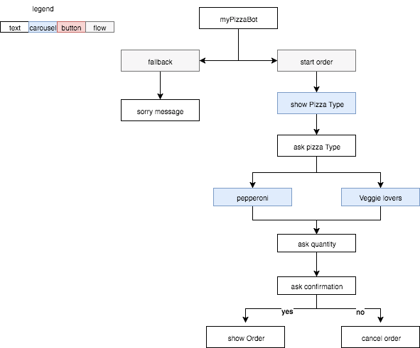

## Sign up for Kata Platform Account

Before entering conversation bot, you must register on our platform. Skip this step if you already have an account before.

Sign in first at https://platform.kata.ai/login and click on the link "Sign up".

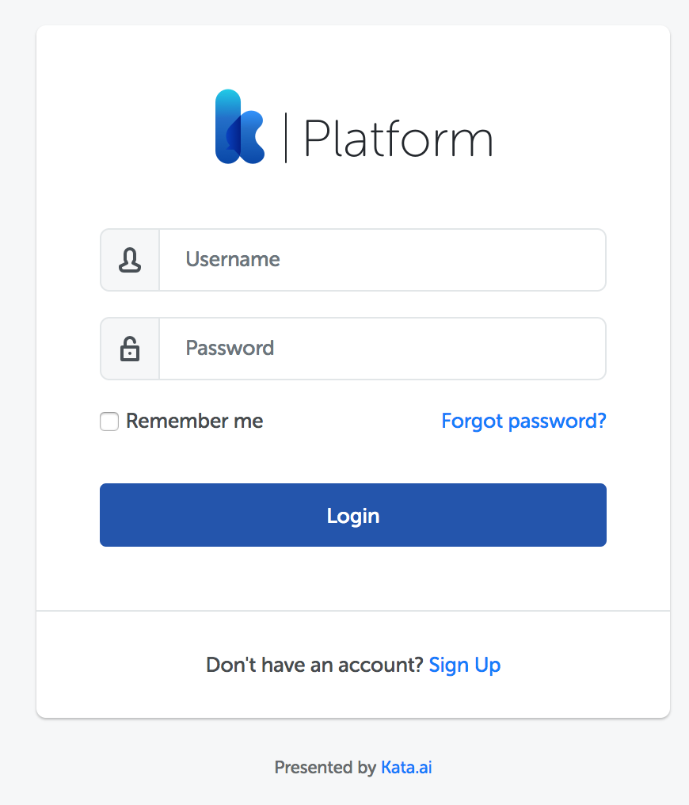

Then, you will be prompted to fill in your username and email. To speed up the registration process, you better have prepared early for your account data as shown below. The selection of account types could be tailored to your future needs. Click "Sign Up" to continue creating your account.

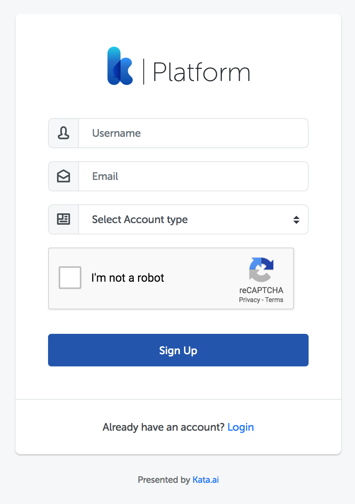

You will get a confirmation email regarding your account for verification from us. You may follow the instructions in your email. Congratulation, your account is ready and you're now ready to make chat bot.

## Create Conversation Bot

### Login to Kata Platform

Go to the [will change it later] link http://new-platform.katalabs.io/login as in the attached picture.


Click "Login" to continue

### Create a new bot

After login, the first view in Kata platform will be the dashboard.


Here you may see the bot templates (first section) that provided before and also you may try later for better understanding. To create a new bot, click on "Create new bot" and you will be prompted to fill in data as attached.

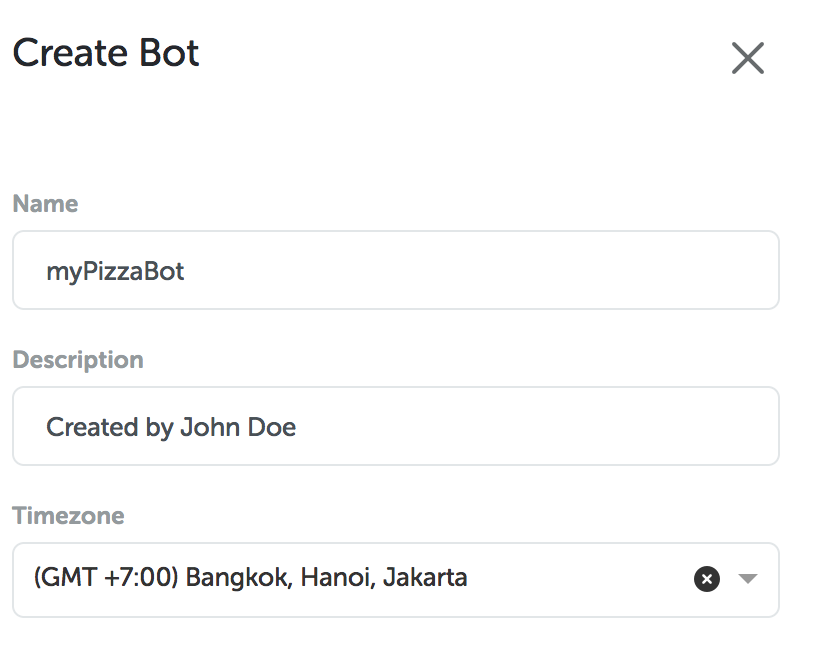

## Create `Fallback` Flow

### Create a Flow

Once your bot created, you will be redirected to sub-menu "Conversational Flows". In accordance with flow diagram above, we will create a flow that does not match any flow (simply called as “else condition” state)


A flow consists of **intent, state and action.** In the picture below, you may see a flow that created automatically by the system or `default` flow. We will delete existing flow by pressing "more" button and then "Delete".

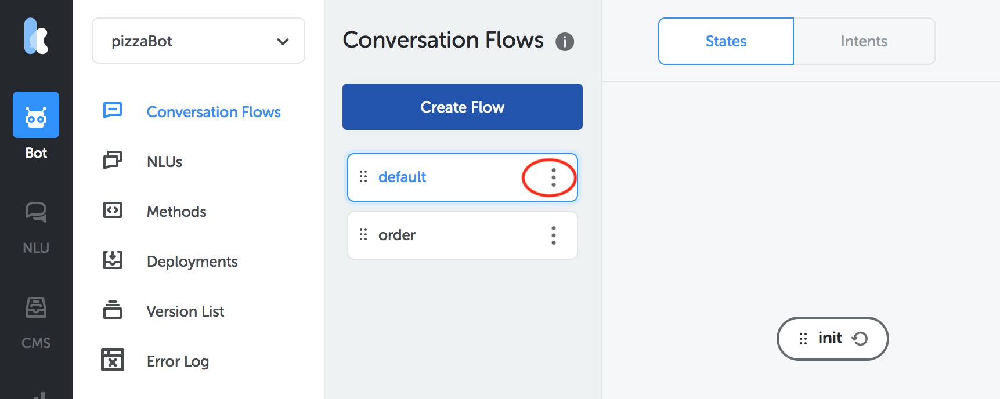

Next, click "Create Flow" button to create a flow and name it `fallback`. This flow works to handle input from users that can not be accepted by any flow. Set flow to active, persistent and default so the fields will show as below

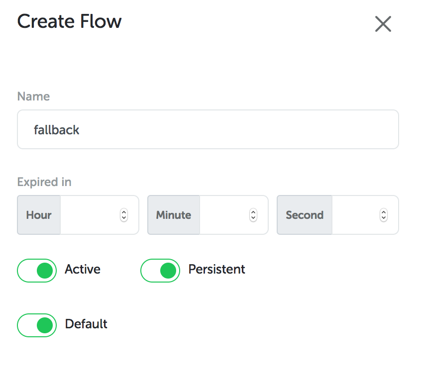

### Create intent `fallback`

After created `fallback` flow, we will enter intent by pressing the "Intents" tab on the sub-menu (picture below).
Remove intent by pressing "more" symbol and click on "Delete" text. Next, we will create a new intent for `fallback`.


Click "Create Intent" button and fill in the contents as attached. Set the intent made to default by click "as fallback"


So, your created intent will show as below


### Create a state `init`

After the above step, we will create state named `init`. Delete previously provided state by pressing state and clicking "Delete". Then, click the "+" button at the bottom right of your page.

Fill state with name `init` on "Overview" tab and set a state to initial state and end state (as shown below). "Initial state" function is useful for making init state as first checked for flow and "end state" is useful for making init state as the last.


### Add action to state `init`

At this point, we will continue our conversation tree after created fallback, i.e. `sorryMessage` action. This action will display an apology message because user input is not matched with any flow. First of all, delete existing action by pressing the "x" symbol on right side of action dropdown. Then, we start to add action. Click the "Add action" button in the action section.

Click the "+" symbol to add an action. Then, action type options that possible completed by a state will appear. In this tutorial, we will create a text type according to the conversation tree. Fill action content according to the picture below. Click the "Update Action" button to save created action.

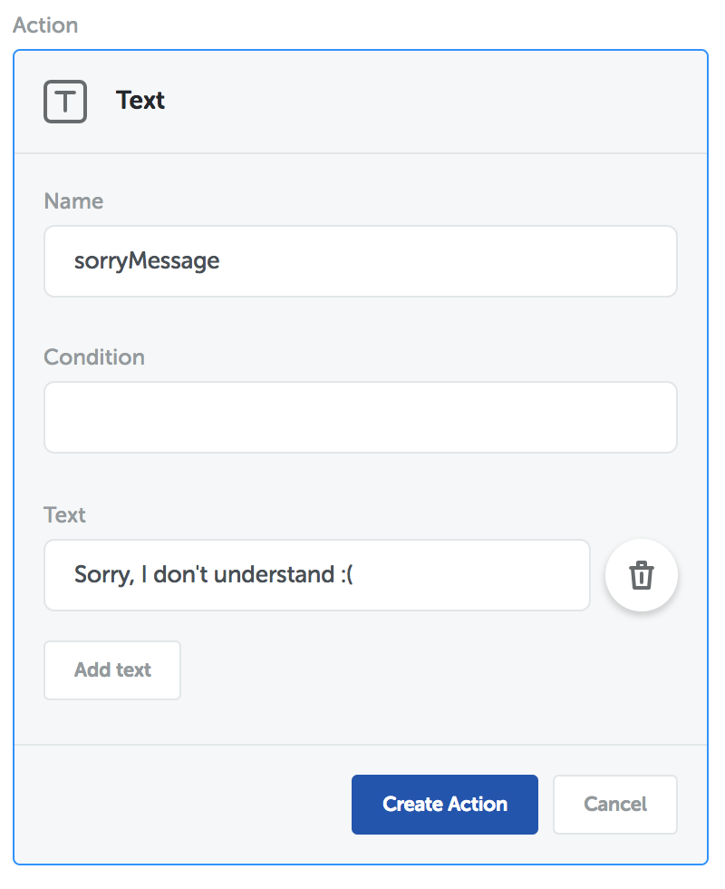

After above action is added, it will appear as follow


### Create transition `fallback` to `init` state

After `sorryMessage` action on `init` state has been added, then we will make transition fallback. Click on `init` state and open “Transition” tab. Then, input the data as follows


Click “Update” to update the transition.

## Create `Order` Flow

### Create NLUs from `order`

You have successfully made a `fallback` flow, then we will enter the flow `order`.


#### Create NLUs `order`

The plot for ordering pizza begins by accepting input order from the user. For better understanding, we will include words such as “order”, “pls order”, “orde pza”, “order pitza” and others by defining NLU. NLU is useful for bot to understand user input.

First of all, click the "NLUs" sub-menu on the Bot menu and click "Create NLU" to create your first NLU. According to above explanation, enter the words associated with ordering pizza. In other words, NLU is a "keyword" type. You can also create as much as possible, at least the words as in the picture below.

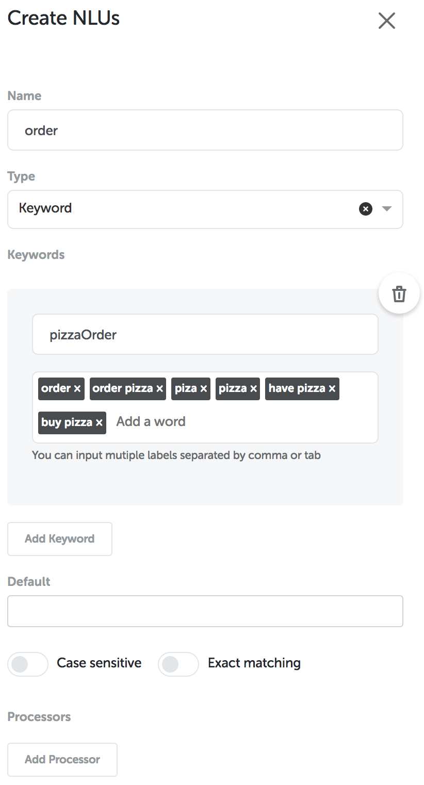

#### Add flow `order`

After preparing NLU to classify user input, then we will add a new flow. To create a new flow, we must go to sub-menu "Conversation Flow" then click "Create Flow".

Enter name order in name field


#### Create `ordertxt` intent

Each flow requires an intent which is set as "initial". Therefore in the flow order, we will use intent `orderTxt` which will check input from customer.

This intent has a text type and uses NLU we created. Select NLUs that created in the "classifier" section to classify the input of the user whether included in the order scope or not.


#### Create a state `init` in the flow `order`

Similar with `init` state in `fallback` flow, we must create `init` state as first state.


Then add a self transition in `init` state


### Create pizza menu action

#### Create a state `showPizza`

Next, we will continue to display pizza menu and ask desired menu.


To get started, click the "+" button on Conversation Flow sub-menu and named `showPizza`.

#### Adding `pizzaMenu` and `askOptions` action to state `showPizza`

On `showPizza` state, add a `pizzaOptions` action that displays information **text** about Pepperoni and Veggie Lovers menus.

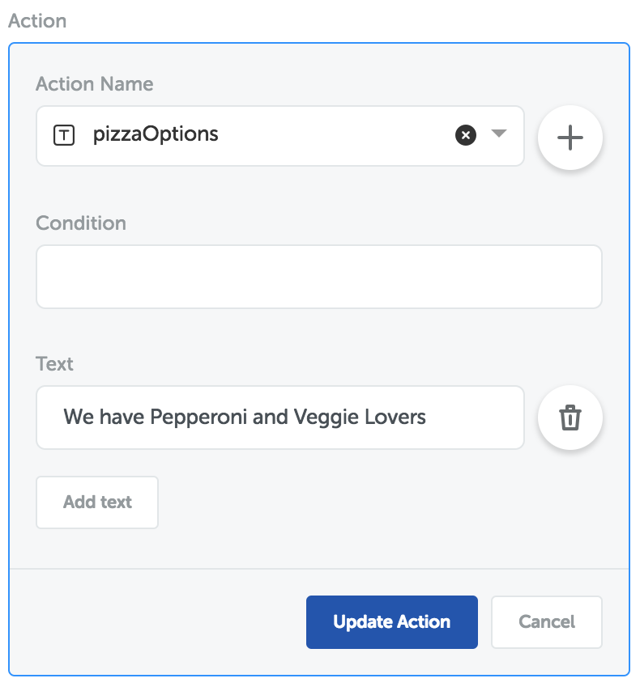

Then, also add ask menu action to user which handled by `askOptions` by using the action text type


So the result is shown below :


Next, we will make a pizza menu display by using carousel. Remove `pizzaOptions` action from the state by pressing symbol "x" located on the right.

Then add a new action and select the action carousel


Fill carousel name with `pizzaMenu` and fill in content as below:

```
Title: Pepperoni
Text: This is the favorite of Peps
Thumbnail Image Url: https://www.wikihow.com/images/thumb/a/a7/Make-Pepperoni-Pizza-Step-19-Version-2.jpg/aid1074004-v4-728px-Make-Pepperoni-Pizza-Step-19-Version-2.jpg.webp
Actions :
     Label: Pepperoni
     Type: Postback
     Payload: {"type":"pizza","pizza":"Pepperoni"}
```

```
Title: Veggie Lovers
Text: Vegie vegie stay healthy
Thumbnail Image Url: https://www.calcuttaweb.com/store/image/data/calcutta/pizza/veggie-lovers-pizza-pihu-7.jpg
Actions:
     Label: Veggie Lovers
     Type: Postback
     Payload: {"type":"pizza","pizza":"Veggie Lovers"}
```


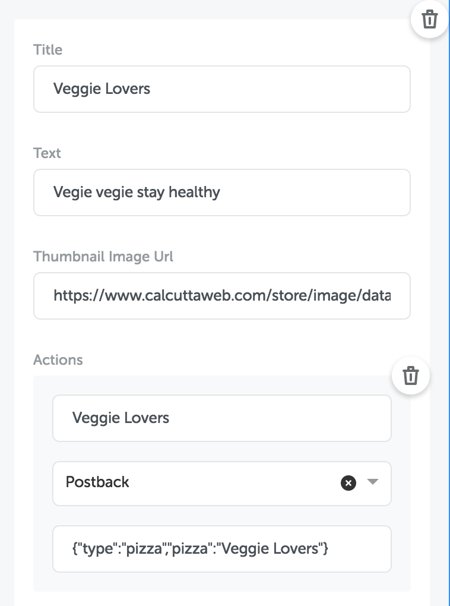

Click "Create" to continue, make sure your data is as same as picture below:


#### Make `pizzaChosen` intent

Intent is made to handle user input after selecting pizza, therefore we will create an intent named `pizzaChosen`.

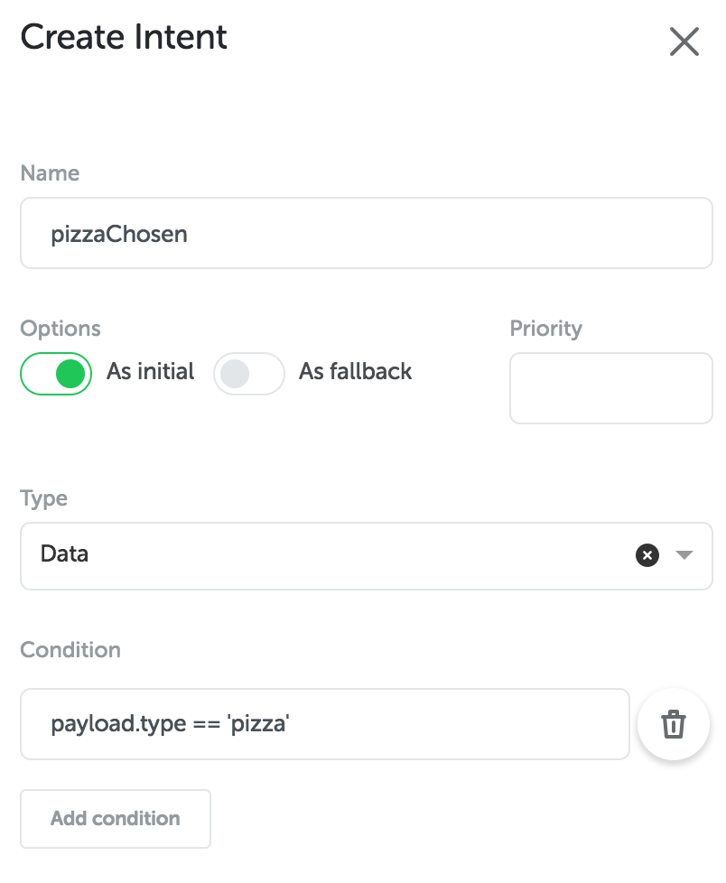

#### Creating intent `reenter`

Next, we will add intent `reenter` that useful for showing repetition message if user's input is not match with bot understanding.


#### Create a transition between state `init` and state `showPizza`

To connect the flow from order to the menu display, we will make a transition between two states that we created before. You can drag the green round dot on the `init` state to `showPizza` state until the transition drawer appears on the right

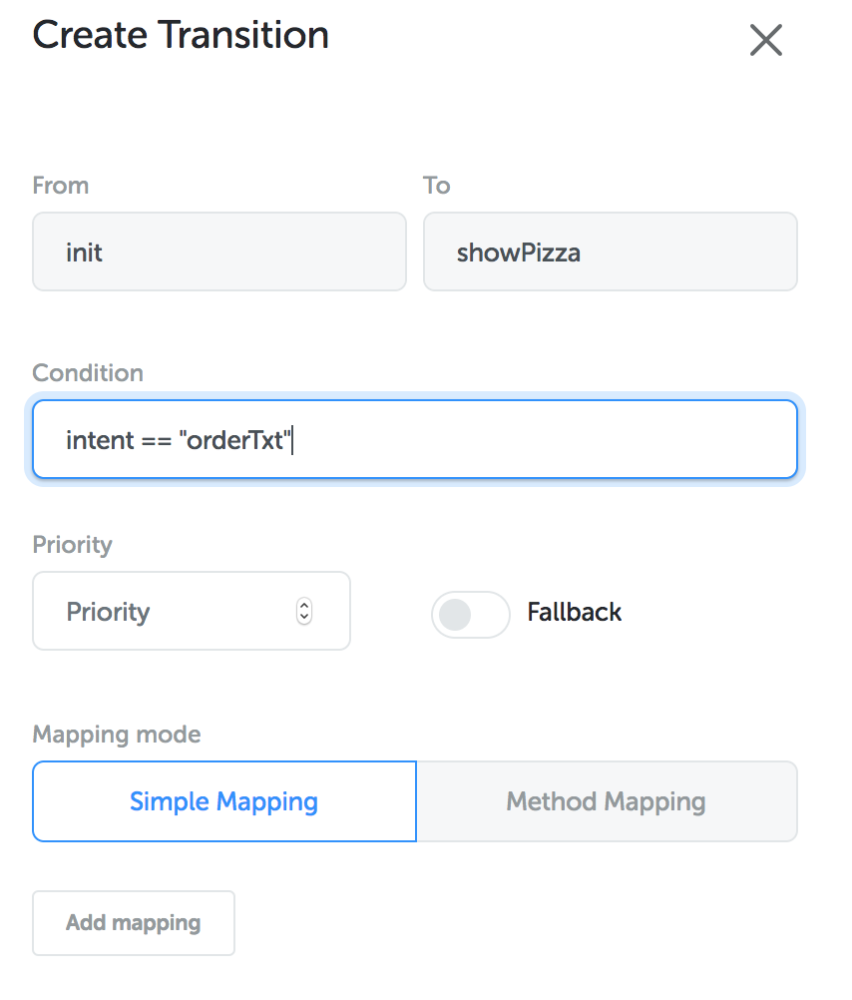

### Create NLUs `quantity`

The next path is to handle expected number of ordered pizzas.

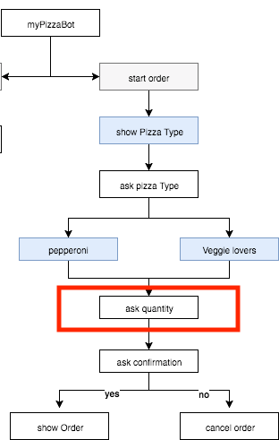

#### Create NLUs for `quantity`

At this stage, we will create NLU with regex number. Bot is expected to understand user input by numbers 1-9.


#### Create Intent `quantity`

After creating NLU, we will add an intent that respond to the user quantity input.


#### Create a `pizzaQuantity` state

Then, we will create a `pizzaQuantity` state that will ask for a user order quantity with a text and `askQuantity` action to provide a bot response to the user.


#### Add a `showPizza` transition with pizzaquantity

We will connect `showPizza` state to `pizzaQuantity` state and also, storing the`payload.pizza` value into `context.pizza` when flow movement occurs.


### Create NLUS confirmation

The next step is to provide order confirmation


First of all, we will create NLU which is keywords from confirmation words such as `yes` and `no` with the name NLU `yesno`


#### Create `confirmPizza` state

After creating a NLU, we will create a `confirmPizza` state that useful to order confirmation. In addition, we will store chosen pizza and quantity information.


#### Make a transition from `pizzaQuantity` to `confirmPizza`

At this stage, we will make a transition by storing value (mapping) from pizza quantity **and** chosen pizza type.

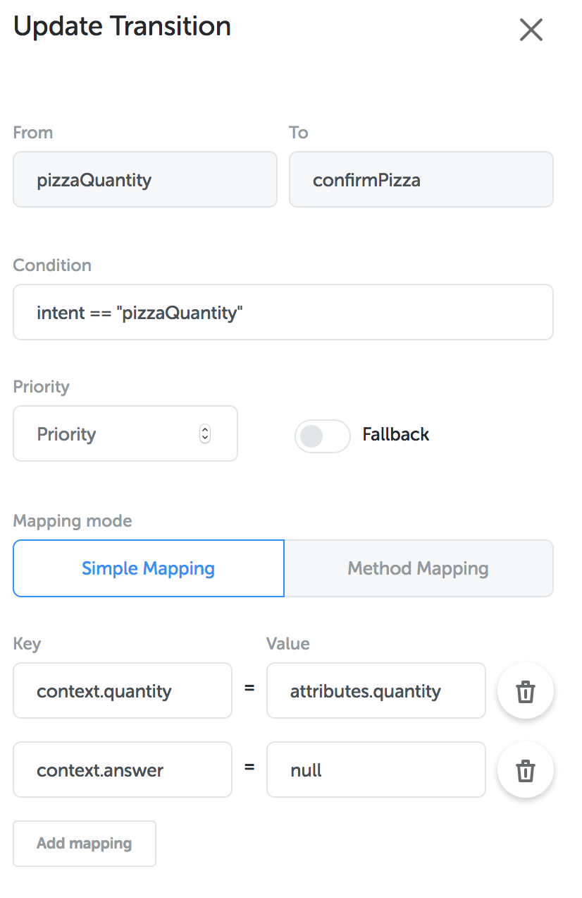

Then, in state `confirmPizza` create a mapping when transiting as shown below by updating created state.


#### Make intent `yesno`

Previously, we already made NLU containing confirmation yes and no. The NLU will be used at this stage. In order to understand confirmation statement from a user, you can create an intent to accommodate entries that use NLU `yesno` classifier.

First of all, we will create an intent for the keyword `yes`


Then, we will create an intent for keyword `no`


#### Create `done` state

In `done` state, we will complete the order by saying thank you and ended bot conversation. There is a condition when user cancelling order. Therefore, we will add condition to `done` action which are `sayThanks` and `sayCancel`

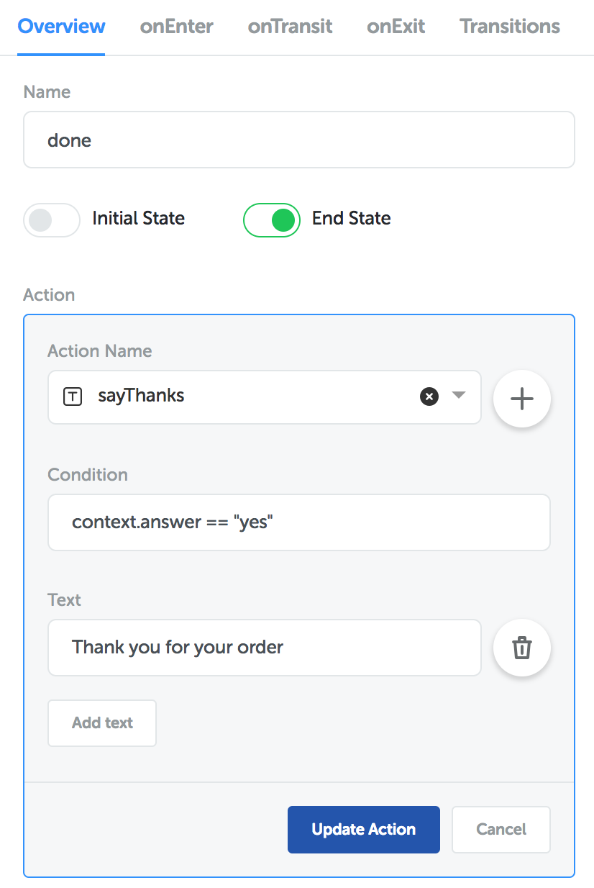

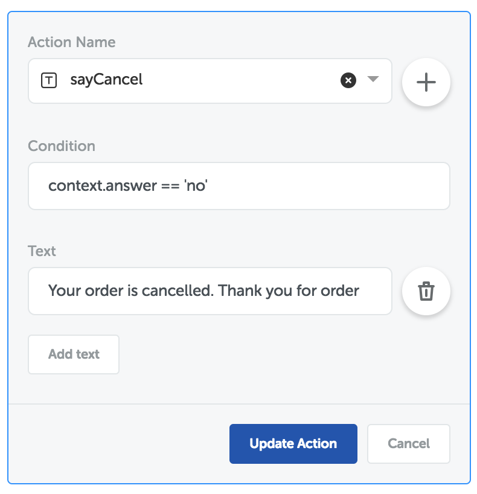

Thus, the final result of state `done` is as follows


#### Make the transition from `confirmPizza` to `done`

Next, we will connect `confirmPizza` state to `done` state. Because `done` is the last state, so that created transition will be a default transition


## Publish the Chatbot

After all the steps are done, your bot should be shown like this


To save your work, you can access the blue button located on top right.


Push the last version you created by pressing the "Patch" option

## Deploy The Chatbot

At this point, you have finished making conversation bot. Now we will try to deploy on one channel which is LINE

### Create the deployment

First of all, we have to create a deployment first. Find the "Deployment" menu on your left sidebar.


Make a deployment with `pizzaChat` name and select version 0.0.1. You can also follow the picture below


### Register LINE account

To sign up for a LINE account, you must signed in [LINE developer console](https://developers.line.me/console/)


### Channel settings

Once you registered your LINE account, you must enter the console by entering your username and password


Then, you're going to create a provider by clicked [this link](https://developers.line.me/console/register/provider/) and enter provider name.


Once you created the provider, click on "MessagingAPI" button in upper section.


This feature is useful for adding new channels. Fill in channel information.


Please note that when you filling the **plan** you must choose **Developer Trial**

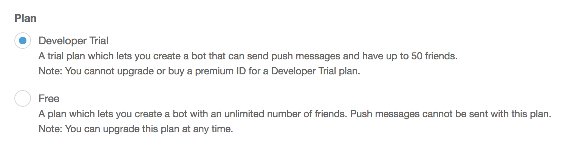

Once you filled in data on MessagingAPI, bot display will change as below


To view channel details, you can hit the channel button. Then, in detail channel, you will see Messaging Settings. In this section, you must do "enable Webhooks" and click the Issues button on access token channel.

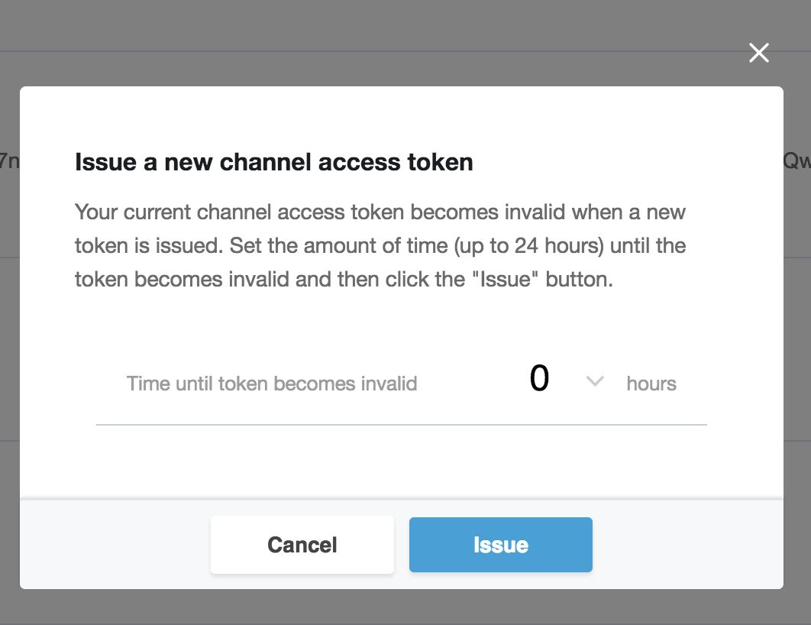

If you completed above step, you will see


In "Using LINE Features" section, you need to disable some features on LINE as shown below


Voila, your channel is ready and you are able to integrate your bot.

### Deployment on channel

In the "Deployment" menu, click on "View channel" button to see integrated channels. If there is none data, your bot is never integrated before.

To add a new channel, click on "+" button in lower right corner of your page. Enter line name and select channel line


There is an empty field that you must to fill, so you must re-open the LINE developer console to enter the data in it.

Access Token Channel can be found here


Channel Secret can be found here


Then, click "create" to create channel and will be as attached


The final step is to insert a webhook created from the bot to LINE. You can click eye symbol on the Action column to see channel detail and copy the link.


Then, paste URL's webhook in LINE console. Click "verify" button to check connection whether success or failure to the channel.


Now, you have a conversation with the bot. On the same page, look for QR code images. Later this QR code can be used to add your artificial bot as a friend. Once you've added a bot as a friend, send a message containing the word "order"

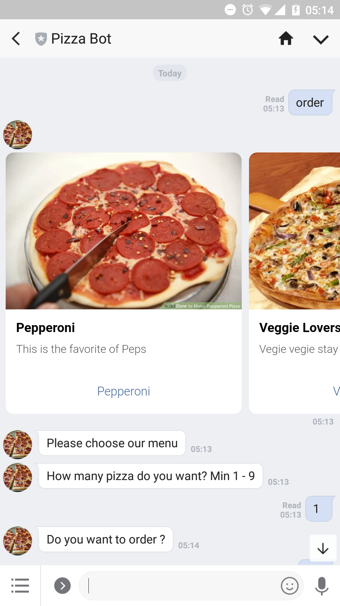

Congratulations! Now your chat bot is done. Next, we will try to make a bot with NLU using NLStudio.

## Improving NLUs using NLStudio

Before you begin, you can see our NLStudio full tutorial on links (link tutorial NLStudio). In this section, you will create a NLModel which able to process pizza ordering orders. Let's start.

### Create new NLU

In the main menu, click the NLU menu located on the left of the screen. Then, the menu will look like below


Then, click the "+" button to create a new NLU and fill NLU data as follow


### Create an `intentOrder` entity

After created a new NLU, you must enter the entity. Click the "+" button to create an entity

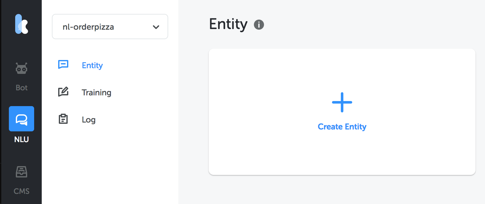

Then, create an entity with the data as below


After you created the entity, the next step is data training. You have to enter a few sentences with the classification of `intentOrder: order`

### Conduct training data

The first step is you have to enter "Training" sub-menu

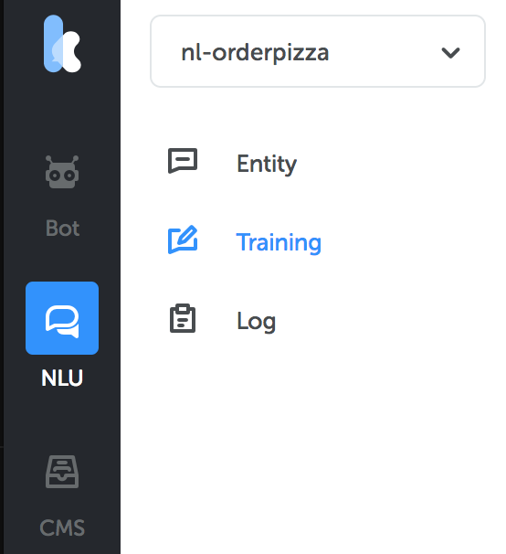

Then, in the box which to enter a sentence, fill a sentence like "I want pizza"


Then, select `intentOrder:order` and click "Train" button to train the NLModel you created. The final display will look like this

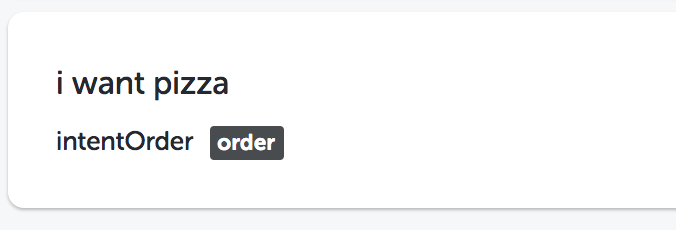

NLModel will be more precise in understanding by doing the training in several times. You may enter following sentences to train the NLModel you have created

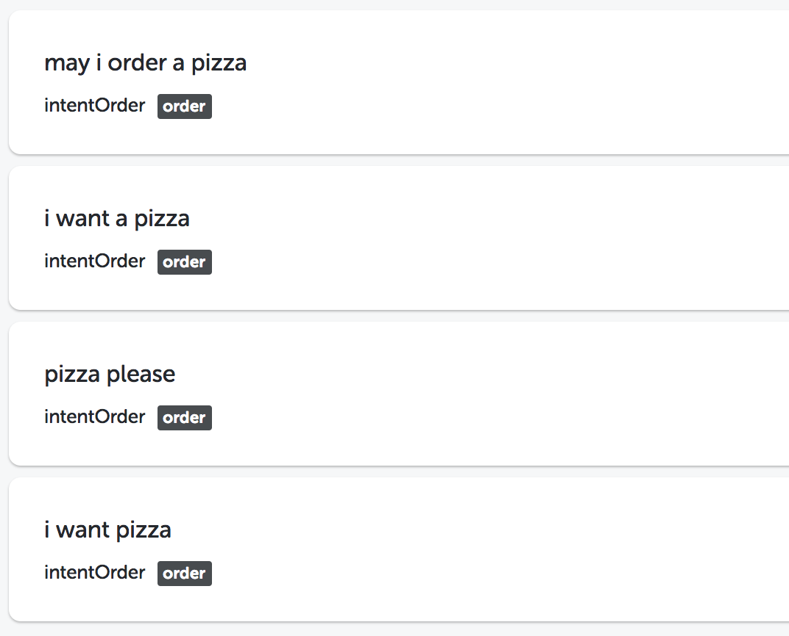

If you think you've done enough training and feel that NLModel already understands user input, you can try testing by pressing the "Test NLU" button at the bottom right of the page.

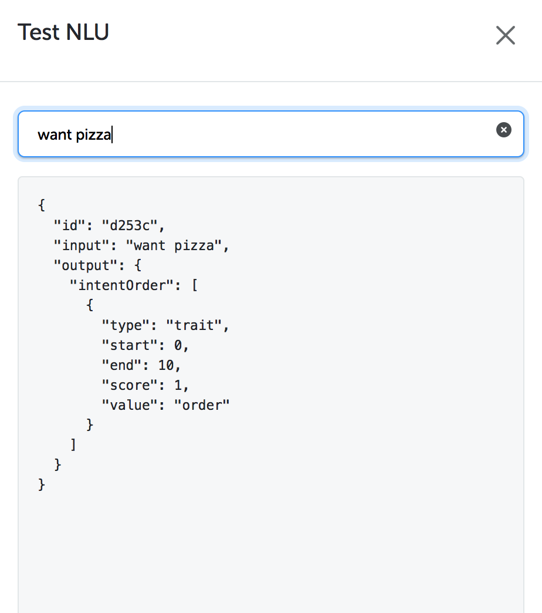

### Integration with bot studio

Once you are sure that the NLModel you created has captured user information well, you may start the NLModel integration with your bot.

To get started, go to the "Bot" menu and click the "NLU" sub-menu. Create a new NLU and fill in the data as attached picture

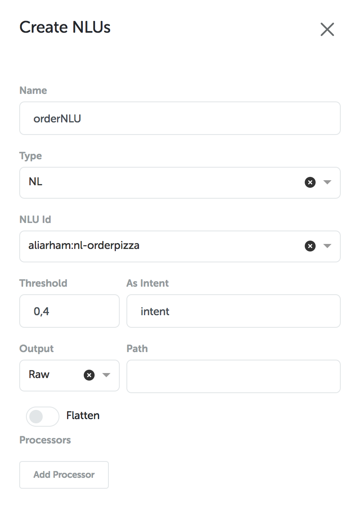

Next, go to the sub-menu "Conversation Flows" and click on the tab "Intents". Select "orderTxt" you've created earlier to handle user input and add a new classifier as below


Click "Update" to save the updated intent.

Next, you have to publish this NLStudio integration and replace the version on "Deployment" menu to try directly on your device.

---
