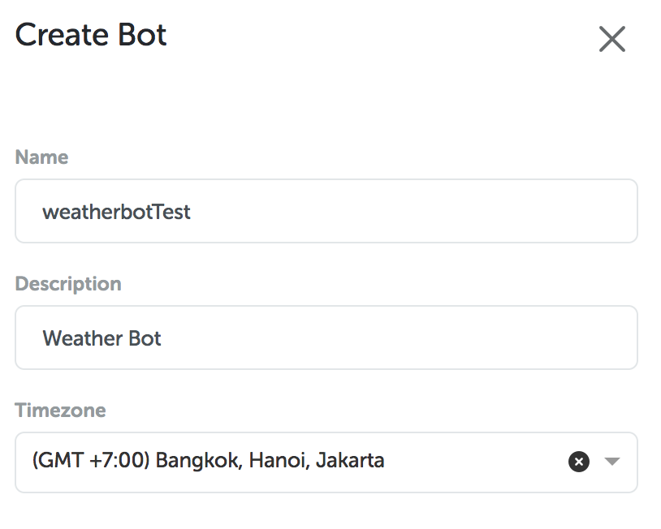
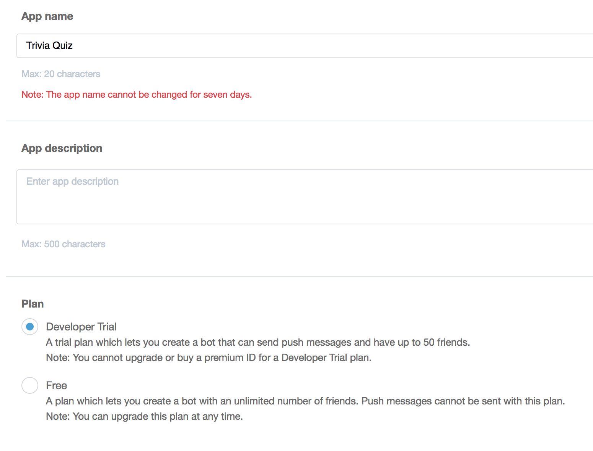
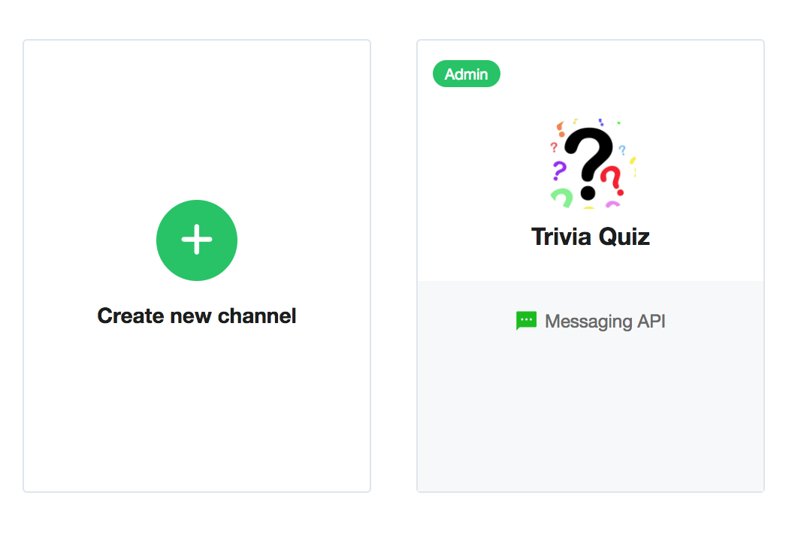
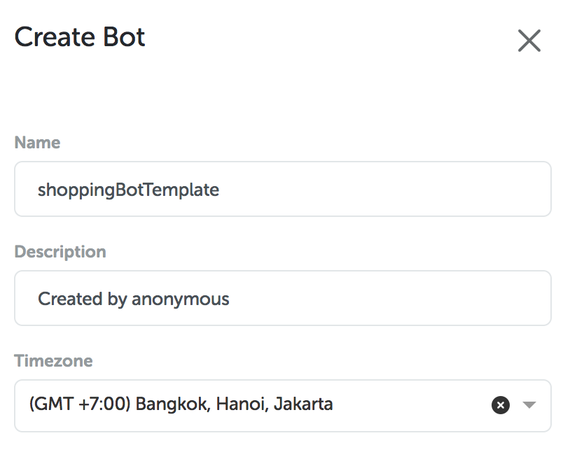
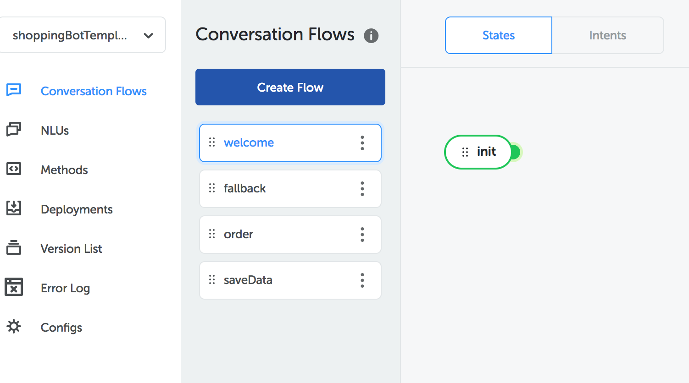
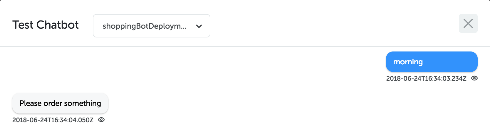
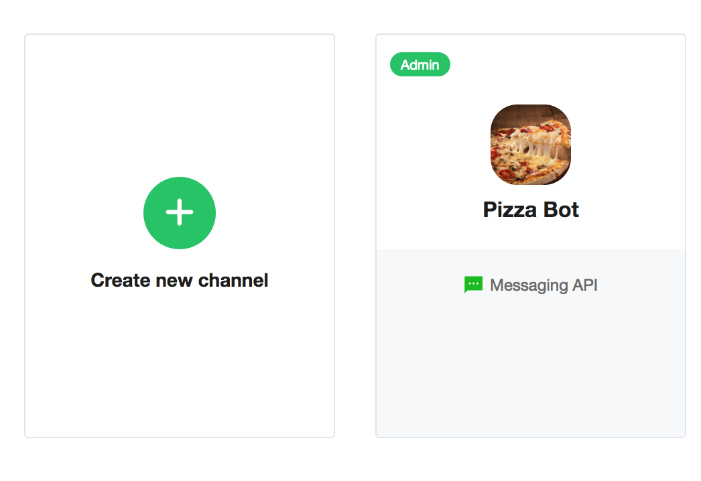

Secara garis besar, Kata platform memiliki 3 template yaitu API bot, Button Bot dan Shopping Bot. Kita akan menjelaskan satu per satu dimulai dari API Bot.

## API Bot Template

Fungsi dari bot ini adalah untuk memberikan contoh integrasi dengan API. Pada template ini, contoh yang diambil adalah bagaimana bot menjawab pertanyaan dari user yang menanyakan terkait cuaca kota. Kita akan menggunakan API

```
https://api.openweathermap.org/data/2.5/weather?q=$(context.location)&appid=beb536b6a3f98bb2bfde28ac6d99c6fc
```

Sebelum masuk pada tutorial, kita akan melihat conversation tree dari template ini.


### Membuat Bot baru

Pertama-tama, klik “Create with This Template” dan perbaharui nama bot dan sesuaikan timezone dengan lokasimu.



Setelah kamu membuat template, cari bot dengan nama “weatherbotTest” dan klik untuk melihat detail


Langkah selanjutnya adalah pada pojok kanan atas terdapat tombol “Publish”. Klik tombol tersebut untuk melakukan push version.


Untuk melakukan pengujian di emulator, kamu harus melakukan deployment pada chat bot yang kamu buat. Klik pada sub-menu “Deployment” yang terdapat di sisi kiri halaman. Kamu dapat mengisikan nama “weatherBotDeployment” pada isian nama


Setelah kamu berhasil menambahkan deployment, kamu dapat melakukan pengujian pada emulator untuk mengecek apakah chat bot kamu berjalan dengan baik atau tidak. Klik “Test chatbot” yang terletak di pojok kanan bawah.


Untuk memulai, masukkan kata “info cuaca”


Selamat, bot yang dibuat sudah bisa diuji dengan baik pada emulator. Sekarang, saatnya mencoba pada platform LINE.

### Pengaturan pada LINE Developer Console

Pertama-tama, kamu harus membuat akun LINE. Untuk mendaftar akun LINE, kamu harus masuk dalam console developer dari LINE (https://developers.line.me/console/).


Setelah kamu mendaftarkan akun LINE, kamu terlebih dahulu harus masuk dalam console dengan memasukkan username dan password


Kemudian, kamu harus membuat provider yang dapat diakses pada tautan ini https://developers.line.me/console/register/provider/ dan masukkan nama provider yang kamu inginkan.


Setelah kamu membuat provider, klik tombol “MessagingAPI” yang berada diatas halaman. Fitur ini berguna untuk menambahkan channel baru. Isi informasi mengenai channel sesuai dengan keinginanmu. Mohon diperhatikan bahwa saat mengisi **plan** yang kamu pilih adalah **Developer Trial**.


Setelah data-data di halaman MessagingAPI sudah kamu isi, tampilan bot akan berubah menjadi terlampir.


Untuk melihat detail channel, kamu bisa menekan tombol channel. Kemudian, pada detail channel kamu akan melihat Messaging Settings. Pada bagian tersebut, kamu harus melakukan “enable Webhooks” dan klik tombol Issues pada channel access token.


Tampilan setelah tahapan diatas dilakukan adalah sebagai berikut


Pada bagian “Using LINE Features”, kamu perlu melakukan nonaktif beberapa fitur pada LINE seperti gambar dibawah ini


Sekarang channel kamu telah siap dan dapat diintegrasikan dengan bot.

Pada menu “Deployment”, klik tombol “View channel” untuk melihat list channel yang sudah diintegrasikan. Jika belum ada apapun, berarti bot kamu belum pernah diintegrasikan sebelumnya.

Untuk menambah channel baru, klik tombol “+” pada pojok kanan bawah dari halamanmu. Masukkan nama `line` dan pilih channel `line`


Terdapat isian kosong yang harus kamu isi, maka dari itu kamu harus membuka kembali LINE developer console untuk memasukkan data-data didalamnya.

Channel Access Token dapat kamu temukan disini


Channel Secret dapat kamu temukan disini


Kemudian, klik “create” untuk membuat channel dan tampilan akhirnya akan seperti terlampir


Tahapan terakhir adalah memasukkan webhook yang dibuat dari bot ke LINE. Caranya adalah klik simbol mata pada kolom Action untuk melihat detail dari channel yang dibuat dan salin webhook yang ditampilkan.


Kemudian, tempel webhook URL tersebut pada LINE console. Klik tombol “verify” untuk mengecek sukses tidaknya keterhubungan dengan channel dalam bot seperti pada gambar dibawah ini.


Kamu sekarang sudah dapat melakukan percakapan dengan bot. Pada halaman yang sama, cari gambar QR code. Nantinya QR code ini dapat digunakan untuk menambahkan bot buatanmu sebagai teman.

### Pengujian pada LINE

Setelah kamu sudah menambahkan bot sebagai teman, kirim sebuah pesan yang mengandung kata “info cuaca”


Selamat ! Sekarang chat bot mu dengan template API Bot sudah selesai

## Button Bot Template

Pada template ini, kita akan mempelajari bagaimana membuat bot dengan menggunakan action button. Konsep yang digunakan adalah pengguna akan diberikan soal dengan pertanyaan “Siapa nama presiden Indonesia sekarang?”, kemudian pengguna harus memilih jawaban dengan menekan tombol pilihan yang disediakan. Seperti diatas, kita akan melihat conversation tree terlebih dahulu dari template ini.


### Membuat bot baru

Pertama-tama, klik “Create with This Template” dan perbaharui nama bot dan sesuaikan timezone dengan lokasimu.


Setelah kamu membuat template, cari bot dengan nama “buttonBotTemplate” dan klik untuk melihat detail


Langkah selanjutnya adalah pada pojok kanan atas terdapat tombol “Publish”. Klik tombol tersebut untuk melakukan push version.


Untuk melakukan pengujian di emulator, kamu harus melakukan deployment pada chat bot yang kamu buat. Klik pada sub-menu “Deployment” yang terdapat di sisi kiri halaman. Kamu dapat mengisikan nama “buttonBotDeployment” pada isian nama


### Pengaturan pada LINE Developer Console

Pertama-tama, kamu harus membuat akun LINE. Untuk mendaftar akun LINE, kamu harus masuk dalam console developer dari LINE (https://developers.line.me/console/).


Setelah kamu mendaftarkan akun LINE, kamu terlebih dahulu harus masuk dalam console dengan memasukkan username dan password


Kemudian, kamu harus membuat provider yang dapat diakses pada tautan ini https://developers.line.me/console/register/provider/ dan masukkan nama provider yang kamu inginkan.


Setelah kamu membuat provider, klik tombol “MessagingAPI” yang berada diatas halaman. Fitur ini berguna untuk menambahkan channel baru. Isi informasi mengenai channel sesuai dengan keinginanmu. Mohon diperhatikan bahwa saat mengisi **plan** yang kamu pilih adalah **Developer Trial**.



Setelah data-data di halaman MessagingAPI sudah kamu isi, tampilan bot akan berubah menjadi terlampir.



Untuk melihat detail channel, kamu bisa menekan tombol channel. Kemudian, pada detail channel kamu akan melihat Messaging Settings. Pada bagian tersebut, kamu harus melakukan “enable Webhooks” dan klik tombol Issues pada channel access token.


Tampilan setelah tahapan diatas dilakukan adalah sebagai berikut


Pada bagian “Using LINE Features”, kamu perlu melakukan nonaktif beberapa fitur pada LINE seperti gambar dibawah ini


Sekarang channel kamu telah siap dan dapat diintegrasikan dengan bot.

Pada menu “Deployment”, klik tombol “View channel” untuk melihat list channel yang sudah diintegrasikan. Jika belum ada apapun, berarti bot kamu belum pernah diintegrasikan sebelumnya.

Untuk menambah channel baru, klik tombol “+” pada pojok kanan bawah dari halamanmu. Masukkan nama `line` dan pilih channel `line`


Terdapat isian kosong yang harus kamu isi, maka dari itu kamu harus membuka kembali LINE developer console untuk memasukkan data-data didalamnya.

Channel Access Token dapat kamu temukan disini


Channel Secret dapat kamu temukan disini


Kemudian, klik “create” untuk membuat channel dan tampilan akhirnya akan seperti terlampir


Tahapan terakhir adalah memasukkan webhook yang dibuat dari bot ke LINE. Caranya adalah klik simbol mata pada kolom Action untuk melihat detail dari channel yang dibuat dan salin webhook yang ditampilkan.


Kemudian, tempel webhook URL tersebut pada LINE console. Klik tombol “verify” untuk mengecek sukses tidaknya keterhubungan dengan channel dalam bot seperti pada gambar dibawah ini.


Kamu sekarang sudah dapat melakukan percakapan dengan bot. Pada halaman yang sama, cari gambar QR code. Nantinya QR code ini dapat digunakan untuk menambahkan bot buatanmu sebagai teman.

### Pengujian pada LINE

Setelah kamu sudah menambahkan bot sebagai teman, kirim sebuah pesan yang mengandung kata “main”


Selamat ! Sekarang chat bot mu dengan template API Bot sudah selesai

## Shopping Bot Template

Kamu dapat mencoba shopping bot template untuk membuat konsep sederhana untuk melakukan pemesanan dari konsumen ke bot. Seperti diatas, kita akan melihat conversation tree terlebih dahulu dari template ini.



### Membuat bot baru

Pertama-tama, klik “Create with This Template” dan perbaharui nama bot dan sesuaikan timezone dengan lokasimu.



Setelah kamu membuat template, cari bot dengan nama “shoppingBotTemplate” dan klik untuk melihat detail


Langkah selanjutnya adalah pada pojok kanan atas terdapat tombol “Publish”. Klik tombol tersebut untuk melakukan push version.


Untuk melakukan pengujian di emulator, kamu harus melakukan deployment pada chat bot yang kamu buat. Klik pada sub-menu “Deployment” yang terdapat di sisi kiri halaman. Kamu dapat mengisikan nama “shoppingBotDeployment” pada isian nama


Setelah kamu berhasil menambahkan deployment, kamu dapat melakukan pengujian pada emulator untuk mengecek apakah chat bot kamu berjalan dengan baik atau tidak. Klik “Test chatbot” yang terletak di pojok kanan bawah.



Untuk memulai, masukkan kata “morning”


Selamat, bot yang dibuat sudah bisa diuji dengan baik pada emulator. Sekarang, saatnya mencoba pada platform LINE.

### Pengaturan pada LINE Developer Console

Pertama-tama, kamu harus membuat akun LINE. Untuk mendaftar akun LINE, kamu harus masuk dalam console developer dari LINE (https://developers.line.me/console/).


Setelah kamu mendaftarkan akun LINE, kamu terlebih dahulu harus masuk dalam console dengan memasukkan username dan password


Kemudian, kamu harus membuat provider yang dapat diakses pada tautan ini https://developers.line.me/console/register/provider/ dan masukkan nama provider yang kamu inginkan.


Setelah kamu membuat provider, klik tombol “MessagingAPI” yang berada diatas halaman. Fitur ini berguna untuk menambahkan channel baru. Isi informasi mengenai channel sesuai dengan keinginanmu. Mohon diperhatikan bahwa saat mengisi **plan** yang kamu pilih adalah **Developer Trial**.



Setelah data-data di halaman MessagingAPI sudah kamu isi, tampilan bot akan berubah menjadi terlampir.


Untuk melihat detail channel, kamu bisa menekan tombol channel. Kemudian, pada detail channel kamu akan melihat Messaging Settings. Pada bagian tersebut, kamu harus melakukan “enable Webhooks” dan klik tombol Issues pada channel access token.


Tampilan setelah tahapan diatas dilakukan adalah sebagai berikut


Pada bagian “Using LINE Features”, kamu perlu melakukan nonaktif beberapa fitur pada LINE seperti gambar dibawah ini


Sekarang channel kamu telah siap dan dapat diintegrasikan dengan bot.

Pada menu “Deployment”, klik tombol “View channel” untuk melihat list channel yang sudah diintegrasikan. Jika belum ada apapun, berarti bot kamu belum pernah diintegrasikan sebelumnya.

Untuk menambah channel baru, klik tombol “+” pada pojok kanan bawah dari halamanmu. Masukkan nama line dan pilih channel line


Terdapat isian kosong yang harus kamu isi, maka dari itu kamu harus membuka kembali LINE developer console untuk memasukkan data-data didalamnya.

Channel Access Token dapat kamu temukan disini


Channel Secret dapat kamu temukan disini


Kemudian, klik “create” untuk membuat channel dan tampilan akhirnya akan seperti terlampir


Tahapan terakhir adalah memasukkan webhook yang dibuat dari bot ke LINE. Caranya adalah klik simbol mata pada kolom Action untuk melihat detail dari channel yang dibuat dan salin webhook yang ditampilkan.


Kemudian, tempel webhook URL tersebut pada LINE console. Klik tombol “verify” untuk mengecek sukses tidaknya keterhubungan dengan channel dalam bot seperti pada gambar dibawah ini.


Kamu sekarang sudah dapat melakukan percakapan dengan bot. Pada halaman yang sama, cari gambar QR code. Nantinya QR code ini dapat digunakan untuk menambahkan bot buatanmu sebagai teman.

### Pengujian pada LINE

Setelah kamu sudah menambahkan bot sebagai teman, kirim sebuah pesan yang mengandung kata “hai”


Selamat ! Sekarang chat bot mu dengan template Shopping Bot sudah selesai

---

## Version log

- 1.0.0 Initial release, created by amanda@kata.ai
- 1.0.1 Adjustment for LINE deployment section
