Broadly speaking, Kata platform has 3 templates namely API bot, Button bot and Shopping Bot. We will explain them one by one starting from API Bot.

## API Bot template

The function of this bot is to provide an example to use API integration. In this template, we will learn how the bot answering a question from an user who inquires about city weather. We will use API which is :

```
https://api.openweathermap.org/data/2.5/weather?q=$(context.location)&appid=beb536b6a3f98bb2bfde28ac6d99c6fc
```

Before entering this tutorial, we should understand the conversation tree as below


### Create a new bot

Firstly, click on "Create with This Template" and update the bot name and adjust timezone depends on your location.


Once you've created a template, find your bot by searching "weatherbotTest" and click it to see details


Next, on top right corner click on "Publish" button. By clicking this button, it will push latest version

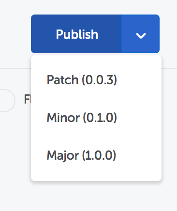

For emulator testing, you must deploy your chat bot. Click on "Deployment" sub-menu which located on left side of the page. You may put "weatherBotDeployment" in the name field

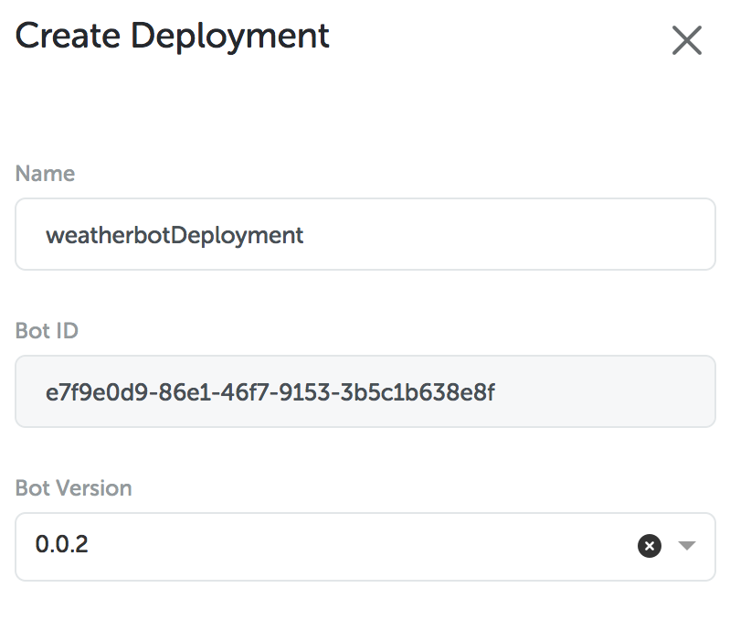

After you successfully add deployment, you are able to test the emulator to check whether your chat bot is working properly or not. Click "Test chatbot" located at the bottom right corner.

Enter the word "info cuaca" to get started


Congratulations, your bot is working successfully. You may continue to try it on LINE platform

### Settings on LINE Developer Console

First of all, you need to create a LINE account. To sign up for the account, you must enter LINE developer console (https://developers.line.me/console/).

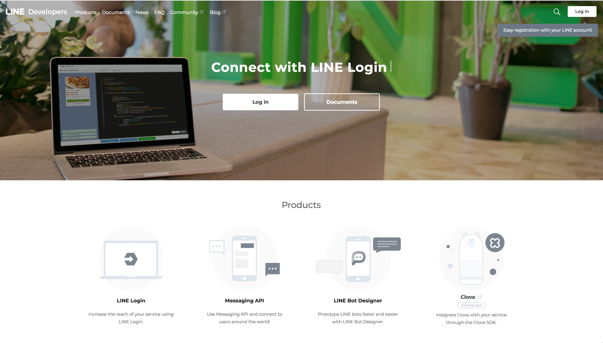

Once you have registered your LINE account, continue to log in to console by entering your username and password.


Then, you must create a provider by click this link https://developers.line.me/console/register/provider/ and enter provider name you want.


Once you have created your bot provider, click on "MessagingAPI" button above the page.


This feature is useful for adding new channels. Fill in all channel information based on your needs. Please note that you must choose “Developer Trial” in Plan section

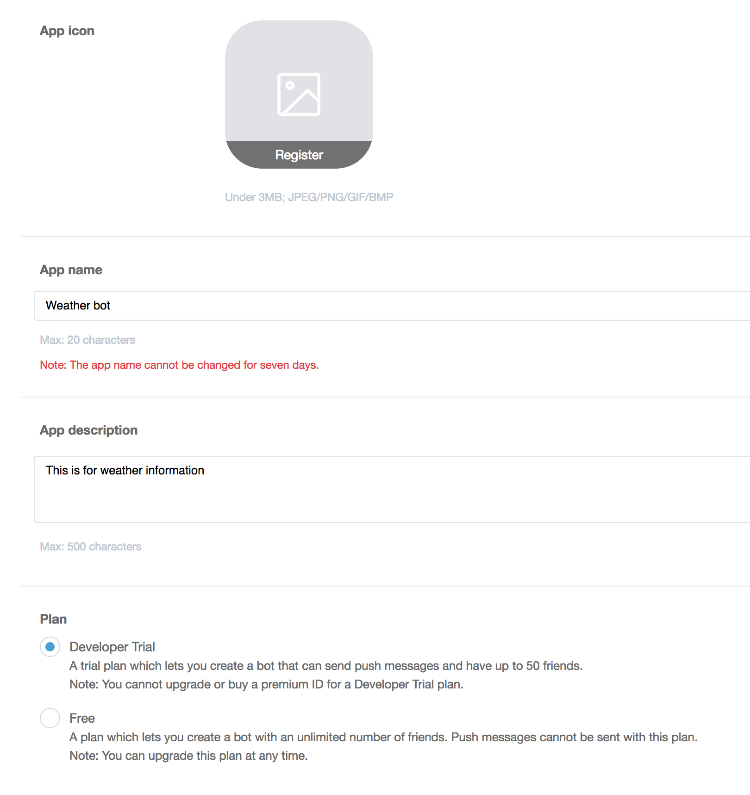

Afterwards, bot display will be changed as below

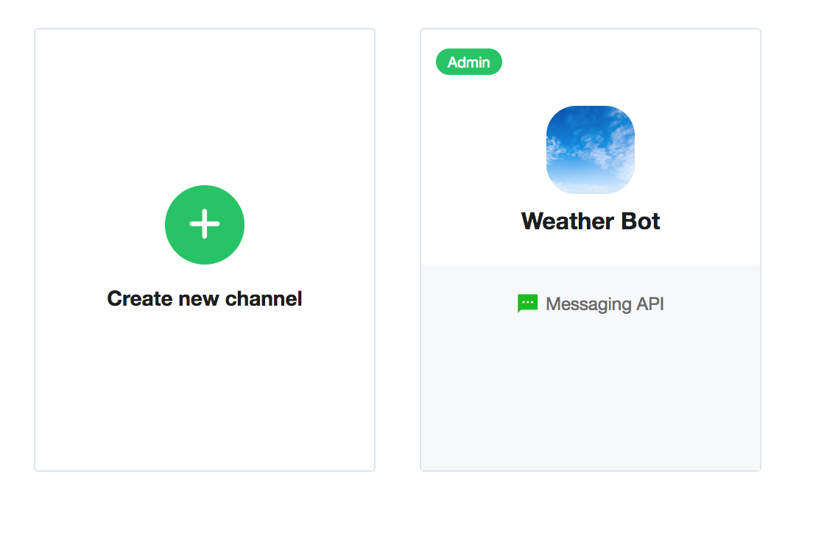

To view channel detail, you may hit the channel button. Then in detail channel, you will see Messaging Settings. In that section, you must do "enable Webhooks" and click Issues button on channel access token


You will find channel access token fill already filled by a link.


In "Using LINE Features" section, you need to disable some features on LINE as shown below


Now, your channel is ready and can be integrated with the chatbot.

In "Deployment" menu, click on "View channel" button to see integrated channels list. If you see nothing, your bot has never been integrated before.

To add a new channel, click on "+" button in the lower right corner of your page. Enter the `line` name and select channel `line`


There is an empty field that you have to fill, so you must reopen LINE developer console to enter the data on it.

Access Token Channel can be found here

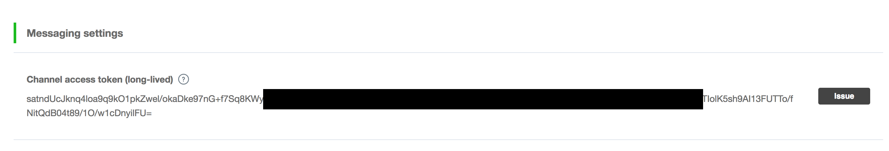

Channel Secret can be found here


Then, click "create" to create a channel and the final look shown as below


The final step is we must insert webhook that created from the bot to LINE. Click on eye symbol on Action column to see channel detail which created by you and copy the displayed webhook.


Then, paste URL's webhook in the LINE console. Click the "verify" button to connection check whether success or failure in your bot as shown below.


On the same page, look for QR code images. Then, this QR code can be used to add your artificial bot as a friend.

### Testing on LINE

After you added the chat bot as a friend, send a message containing the word "weather info"

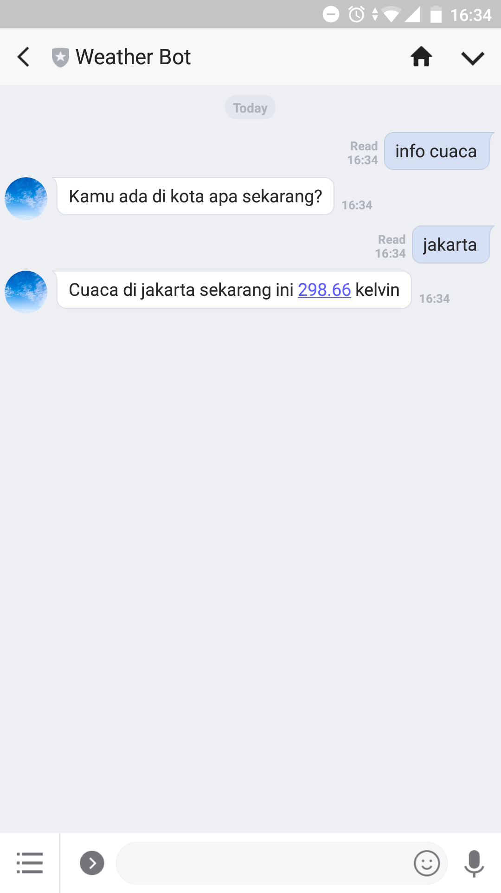

Congratulations! Now your bot using API template bot is done

## Button Bot Template

In this template, we will learn how to create bot using action button. The concept used is user will be given a question "Who is current president of Indonesia?", Then, a user must choose answers by pressing provided options button. As above, we will see the conversation tree first from this template.

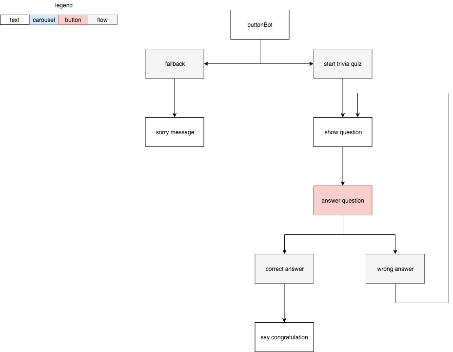

### Create a new bot

Firstly, click on "Create with This Template" and update the bot name and adjust timezone depends on your location.

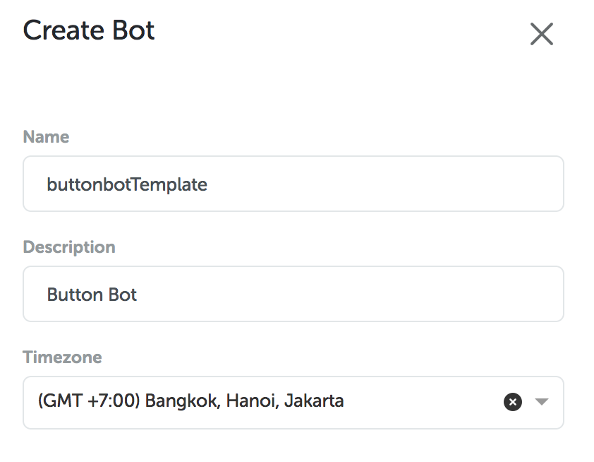

Once you've created a template, find your bot by searching “buttonBotTemplate" and click it to see details

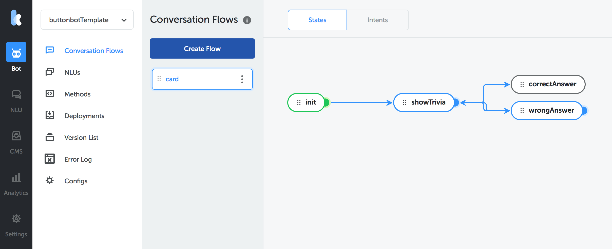

Next, on top right corner click on "Publish" button. By clicking this button, it will push latest version


For emulator testing, you must deploy your chat bot. Click on "Deployment" sub-menu which located on left side of the page. You may put "buttonBotDeployment" in the name field


### Settings on Line Developer Console

First of all, you need to create a LINE account. To sign up for the account, you must enter LINE developer console (https://developers.line.me/console/).


Once you have registered your LINE account, continue to log in to console by entering your username and password.


Then, you must create a provider by click this link https://developers.line.me/console/register/provider/ and enter provider name you want.


Once you have created your bot provider, click on "MessagingAPI" button above the page.


This feature is useful for adding new channels. Fill in all channel information based on your needs
Please note that you must choose “Developer Trial” in Plan section


Afterwards, bot display will be changed as below


To view channel detail, you may hit the channel button. Then, in detail channel you will see Messaging Settings. In that section, you must do "enable Webhooks" and click Issues button on channel access token


You will find channel access token fill already filled by a link.


In "Using LINE Features" section, you need to disable some features on LINE as shown below


Now, your channel is ready and can be integrated with the chatbot.

In "Deployment" menu, click on "View channel" button to see integrated channels list. If you see nothing, your bot has never been integrated before.To add a new channel, click on "+" button in the lower right corner of your page. Enter the `line` name and select channel `line`


There is an empty field that you have to fill, so you must reopen LINE developer console to enter the data on it.

Access Token Channel can be found here


Channel Secret can be found here


Then, click "create" to create a channel and the final look shown as below


The final step is we must insert webhook that created from the bot to LINE. Click on eye symbol on Action column to see channel detail which created by you and copy the displayed webhook.


Then, paste URL's webhook in the LINE console. Click the "verify" button to connection check whether success or failure in your bot as shown below.


You are now have a conversation with the bot. On the same page, look for QR code images. Then, this QR code can be used to add your artificial bot as a friend.

### Testing on LINE

After you added the chat bot as a friend, send a message containing the word "main”

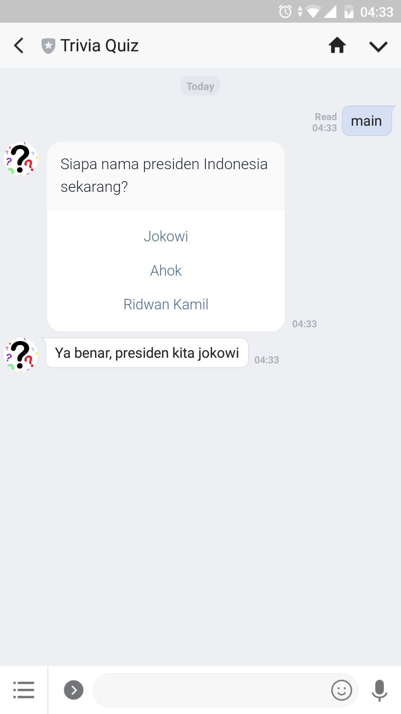

Congratulations! Now your bot using button bot template bot is done

## Shopping Bot Template

You could try shopping bot template to create a simple concept of place orders from consumers to bot. We will learn how to make a bot using action button. Similar with above image, we will see conversation tree first from this template.


### Create a new bot

Firstly, click on "Create with This Template" and update the bot name and adjust timezone depends on your location.

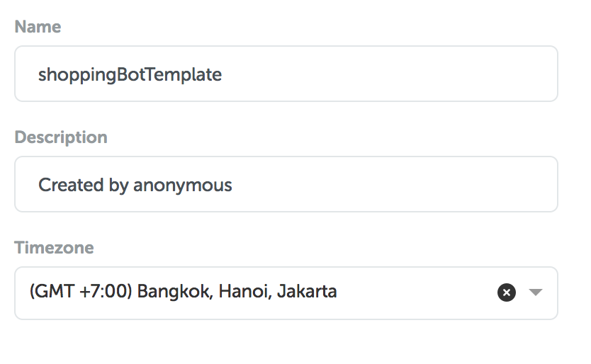

Once you've created a template, find your bot by searching “shoppingBotTemplate" and click it to see details


Next, on top right corner click on "Publish" button. By clicking this button, it will push latest version


For emulator testing, you must deploy your chat bot. Click on "Deployment" sub-menu which located on left side of the page. You may put "shoppingBotDeployment" in the name field


After you successfully add deployment, you are able to test the emulator to check whether your chat bot is working properly or not. Click "Test chatbot" located at the bottom right corner.

Enter the word "morning" to get started


Congratulations, your bot is working successfully. You may continue to try it on LINE platform

### Settings on LINE Developer Console

First of all, you need to create a LINE account. To sign up for the account, you must enter LINE developer console (https://developers.line.me/console/).


Once you have registered your LINE account, continue to log in to console by entering your username and password.


Then, you must create a provider by click this link https://developers.line.me/console/register/provider/ and enter provider name you want.


Once you have created your bot provider, click on "MessagingAPI" button above the page. This feature is useful for adding new channels. Fill in all channel information based on your needs. Please note that you must choose “Developer Trial” in Plan section


Afterwards, bot display will be changed as below


To view channel detail, you may hit the channel button. Then, in detail channel you will see Messaging Settings. In that section, you must do "enable Webhooks" and click Issues button on channel access token


You will find channel access token fill already filled by a link.


In "Using LINE Features" section, you need to disable some features on LINE as shown below


Now, your channel is ready and can be integrated with the chatbot.

In "Deployment" menu, click on "View channel" button to see integrated channels list. If you see nothing, your bot has never been integrated before.

To add a new channel, click on "+" button in the lower right corner of your page. Enter the `line` name and select channel `line`


There is an empty field that you have to fill, so you must reopen LINE developer console to enter the data on it.

Access Token Channel can be found here


Channel Secret can be found here


Then, click "create" to create a channel and the final look shown as below


The final step is we must insert webhook that created from the bot to LINE. Click on eye symbol on Action column to see channel detail which created by you and copy the displayed webhook.

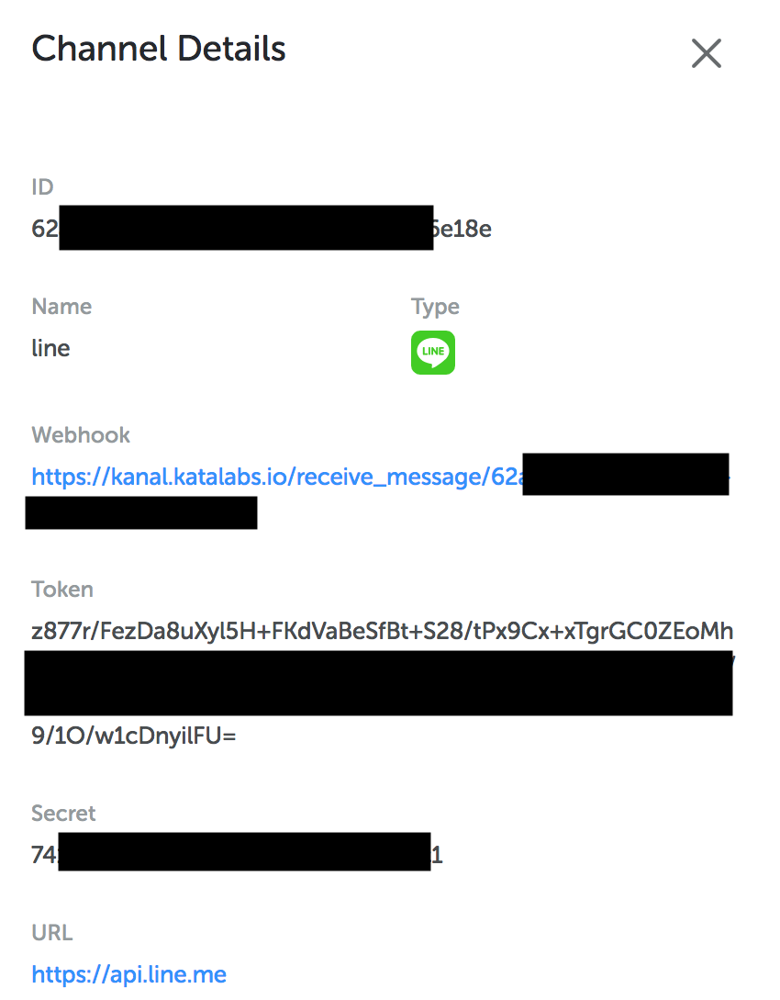

Then, paste URL's webhook in the LINE console. Click the "verify" button to connection check whether success or failure in your bot as shown below.


You are now have a conversation with the bot. On the same page, look for QR code images. Then, this QR code can be used to add your artificial bot as a friend.

### Testing on LINE

After you added the chat bot as a friend, send a message containing the word "hi”

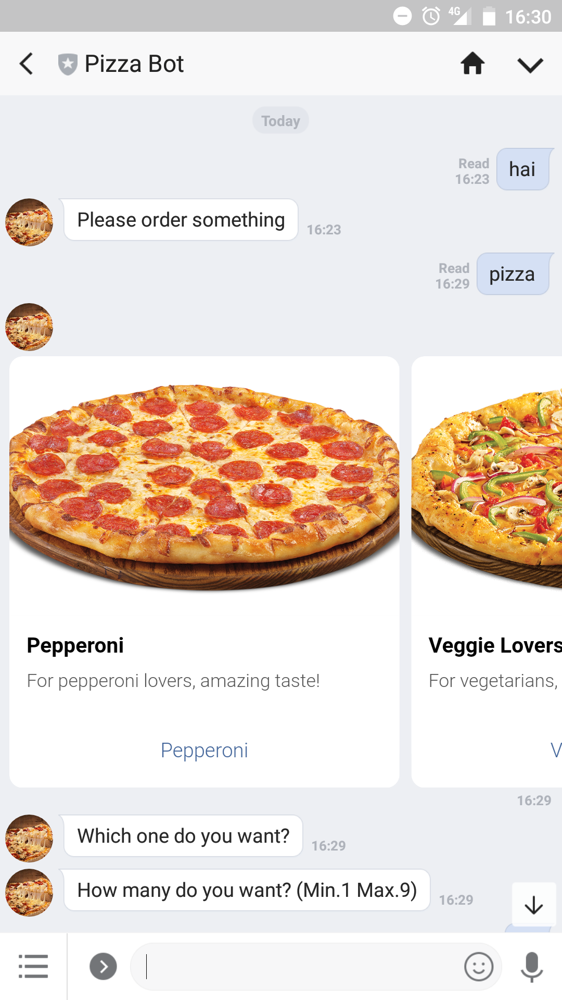

Congratulations! Now your bot using Shopping bot template is done

---

## Version log

- 1.0.0 Initial release, created by amanda@kata.ai
- 1.0.1 Adjustment deployment section to LINE platform
