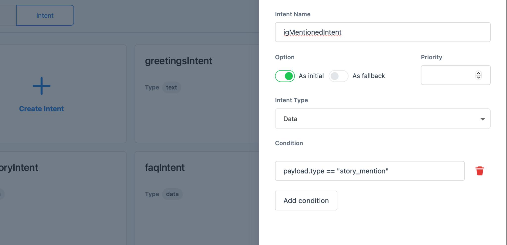
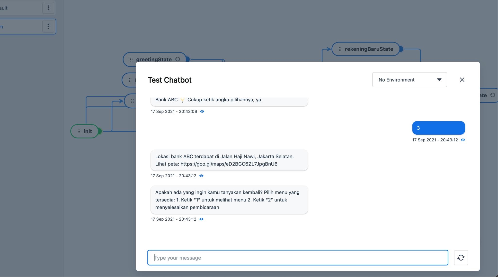

Kata Platform ([platform.kata.ai](https://platform.kata.ai)) is a platform to create chatbots and train them with Natural Language Processing (NLP). You can create any chatbots for any use-cases, such as FAQ, campaign, customer service, handover to human agents, and more.

Currently, we’ve launched Instagram chatbot with various features, such as End-users can receive automated replies by creating an Instagram story that mentioned brand, receive automated replies by replying to brand Instagram story, receive bot responses in image, text, quick reply, ice breaker (for first-time users only) and generic template (similar with a carousel in other messaging platforms). Learn more about [Instagram DM Automation](/channels/instagram-messaging/).

In this tutorial, we will create an Instagram chatbot that is able to send conversations to human agents, also known as "Agent Handover''. We will use the Kata Omnichat dashboard to connect chatbots with human agents. Learn more about [Omnichat](/kata-omnichat).

# Chatbot Flow

Before we jump into the tutorial, let’s see the scenario for the conversation. We will create a chatbot using _keywords_.

## Conversation Flow Table

Conversation flow table details can be seen [here](https://drive.google.com/file/d/1rh5XvmGvbNyXZetG6v-tjAr8LvXjU-aj/view)

# Create Project

## Objective: Register your new account and login to the Platform

1. Go to [platform.kata.ai](https://platform.kata.ai) and click **Sign Up** to create new account

2. Input required fields in sign up page: **Username, email address, role and captcha**

3. Go to your registered email inbox. You will receive an email to verify your account and input your password

4. When you click the **Confirm Email** button in the verification email, you will be redirected to set up a password. Insert your password and confirm the password.

5. You will be redirected to the Login **Page**. Input your username and password to continue.

## Objective: Create new chatbot project

### _Login to Kata Platform and create a project_

1. Open your browser, then open the URL [platform.kata.ai/login](https://platform.kata.ai/login) and enter your username & password.

2. Click **"Login"** to continue.

3. Click on **"Create Project"** and fill in the form. Each project contains one bot design, one NL, and one CMS.

# Create Handover Flow

## Objective: Define a flow

### Create a flow name "handover". We will use 1 flow for this simple bot

1. Click **"Create Flow"** button on the Conversation Flow screen

2. Create flow "handover", other fields are left blank. Then, click **Create**.

### Create "init" state

1. Click **"+"** icon in the bottom right to create a new state

2. Create state "init" and click the toggle to turn on “Initial State” and other fields are left blank. Then, click **Create**.

# Create Greetings State to Respond End-User’s who Greet Bot via Direct Message

In this part, we are going to create a greeting flow to respond to end-users who greet the brand's bot via direct message, **but** **not** via Ice Breaker. For example, the end-user says "hi" to the bot and does not want to choose via Ice Breaker. Learn more about [Ice Breaker](/channels/instagram-messaging).

## Objective: Create greetings state to define how to respond

### _Create "greetingsState" as bot response to show keywords menu_

1. Create another state by clicking the **"+"** icon in the bottom right to create a new state named “greetingsState”

2. Click **"Add action"**, then click **“+”** in the action box to create a new action

3. When all actions available are shown, then choose "Text"

4. Input action name "greetingsText"

5. Next, click the **Add Variant** button to fill in with this text:

```
Halo, selamat datang di layanan CS Bank ABC 😊 \n\nUntuk memulai, pilih menu yang tersedia: \n\nKetik "1" untuk melihat FAQ \nKetik “2” untuk melihat promo yang tersedia \nKetik “3” untuk melihat lokasi Bank ABC \nKetik “4” untuk berbicara dengan CS Bank ABC \n\n💡 Cukup ketik angka pilihannya, ya
```

6. Click **Create Action**

### Set the state into self-transition

The self-transition will make the actions under state will be repeatedly shown if end-users give an incorrect answer

1. Go to tab **Transitions**

2. Turn on on the Self Transition toggle

3. Then, click Create to finalize the state

## Objective: Catch end-users messages when greeting the bot

### _Create "greetings" keywords to build understanding in chatbots when end-users greet the bot. We will use the NLUs feature to create the keywords._

1. Go to the menu **"NLUs"** which is placed under the “Conversation Flows” menu. Your screen will be switched to create NLUs

2. Click **Create NLU**

3. Then, fill in the fields as follow

```
NLU Name: greetings
NLU Type: Keyword
```

4. Next, click **"Add Keyword"** to define any words to trigger the bot. Fill in the main keyword as follow

```
Main keyword: greetings
```

5. Add a new word by pressing "enter" on your keyboard. Every time you write a new word, press “enter” on your keyboard to save words. Add these words


6. Click **"Create"** to save the NLUs

### Create "greetingsIntent" intent to catch user’s input

1. Click the Intent tab which is placed next to the Conversation Flows sidebar.

2. Click **Create Intent** button

3. Fill in the intent as follows. The choice of "Intent type" is text, which means it will catch incoming messages with text only. We also set up the intent into “As Initial”, which means the intent will be executed for the first time. On classifier, use “greetings” NLUs that we’ve created in the previous step to connect the intent with creating keywords for greetings.


## Objective: Connect "init" and “greetingsState” states by creating a transition

### Create a transition to connect "init" and “greetingsState” states. The transition will define in which condition the greetings state, including the actions’ state, will be executed.

1. Pull a line from the "init" state and drag it to the “greetingsState” state. If you succeed, then it will show a **Create Transition** drawer

2. Fill in the transition condition as follow

```
intent == "greetingsIntent"
```

3. Click **"Create Transition"**

# Create Greetings State to Respond End-User’s who Greet Bot via Instagram Story Mention

In this part, we are going to create a greeting flow to respond to end-users who mentioned the brand’s Instagram account in the end-users Instagram Stories. End-user will receive an automatic message in a direct message. Learn more about [Instagram Story Mention](/channels/instagram-messaging).

## Objective: Catch end-users who mentioned the brand’s in the end-users Instagram Story

### Create "igMentionedIntent" intent to catch user’s input

1. Click the Intent tab which is placed next to the Conversation Flows sidebar.

2. Click **Create Intent** button

3. Fill in the intent as follows. We set up the intent into "As Initial", which means the intent will be executed for the first time. Choose intent type into data, because we will use a payload named story_mention.



4. Then, click **Create**.

## Objective: Create greetings state to define how to respond

### Create "igMentionedState" as bot response to show keywords menu

1. Create another state by clicking the **"+"** icon in the bottom right to create a new state named “_igMentionedState_”

2. Click **"Add action"**, then click **“+”** in the action box to create a new action

3. When all actions available are shown, then choose "Text"

4. Input action name "igMentionedText"

5. Next, click the **Add Variant** button to fill in with this text:

```
Halo, terima kasih telah menyapa Bank ABC di Instagram Story Anda 😊 \n\nUntuk memulai, pilih menu yang tersedia: \n\nKetik "1" untuk melihat FAQ \nKetik “2” untuk melihat promo yang tersedia \nKetik “3” untuk melihat lokasi Bank ABC \nKetik “4” untuk berbicara dengan CS Bank ABC \n\n💡 Cukup ketik angka pilihannya, ya
```

6. Click **Create Action**

### Set the state into self-transition

The self-transition will make the actions under state will be repeatedly shown if end-users give an incorrect answer

1. Go to tab **Transitions**

2. Turn on on the Self Transition toggle

3. Then, click Create to finalize the state

## Objective: Connect "init" and “igMentionedState” states by creating a transition

### Create a transition to connect "init" and “igMentionedState” states. The transition will define in which condition the greetings state, including the actions’ state, will be executed.

1. Pull a line from the "init" state and drag it to the “greetings” state. If you succeed, then it will show a **Create Transition** drawer

2. Fill in the transition as follow


3. Click **"Create Transition"**

# Create Greetings State to Respond End-User’s who Greet Bot via Instagram Story Reply

In this part, we are going to create a greeting flow to respond to end-users who reply to the brand's Instagram Story. Learn more about [Instagram Story Reply](/channels/instagram-messaging).

## Objective: Catch end-users who reply to the brand’s Instagram Story

### Create "replyStoryIntent" intent to catch user’s input

1. Click the Intent tab which is placed next to the Conversation Flows sidebar.

2. Click **Create Intent** button

3. Fill in the intent as follows. We set up the intent into "As Initial", which means the intent will be executed for the first time. Choose intent type into data, because we will use a payload named story_reply.


5. Then, click **Create**.

## Objective: Create greetings state to define how to respond

### Create "igStoryReplyState" as bot response to show keywords menu

1. Create another state by clicking the **"+"** icon in the bottom right to create a new state named “igStoryReplyState”

2. Click **"Add action"**, then click **“+”** in the action box to create a new action

3. When all actions available are shown, then choose "Text"

4. Input action name "igStoryReplyText"

5. Next, click the **Add Variant** button to fill in with this text:

```
Halo, terima kasih telah menyapa Instagram Story Bank ABC 😊 \n\nUntuk memulai, pilih menu yang tersedia: \n\nKetik "1" untuk melihat FAQ \nKetik “2” untuk melihat promo yang tersedia \nKetik “3” untuk melihat lokasi Bank ABC \nKetik “4” untuk berbicara dengan CS Bank ABC \n\n💡 Cukup ketik angka pilihannya, ya
```

6. Click **Create Action**

### Set the state into self-transition

The self-transition will make the actions under state will be repeatedly shown if end-users give an incorrect answer

1. Go to tab **Transitions**

2. Turn on on the Self Transition toggle

3. Then, click Create to finalize the state

## Objective: Connect "init" and “igStoryReplyState” states by creating a transition

### Create a transition to connect "init" and “igStoryReplyState” states. The transition will define in which condition the greetings state, including the actions’ state, will be executed.

1. Pull a line from the "init" state and drag it to the “igStoryReplyState” state. If you succeed, then it will show a **Create Transition** drawer

2. Fill in the transition as follow


3. Click **"Create Transition"**

# Create Quick Replies

In this step, we will create bot responses named quick reply. Learn more about [Quick Reply for Instagram Messaging](/channels/instagram-messaging).

## Objective: Show available FAQ topics to end-user

### Create "faqState" state

1. Click **"+"** icon in bottom right to create a new state

2. Fill in the state name with "_faqState_"

### Create quick reply response type

1. Click **"+"** in action box to create a new action

2. When all actions available are shown, then choose "Quick Reply"

3. Input action name "qrText"

4. Fill in the Message field with:

```
Pilih topik yang kamu inginkan 😊
```

5. Next, click **Add action** button

6. Fill in the fields as follow


7. Click button Create Action

### Set the state into self-transition

The self-transition will make the actions under state will be repeatedly shown if end-users give an incorrect answer

1. Go to tab **Transitions**

2. Turn on on the Self Transition toggle

3. Then, click Create to finalize the state

## Objective: Connect all greetings states to FAQ state

### Connect greetings via direct message to FAQ state

1. Pull transition line which starts from "greetingState" to “faqState”

2. Fill in the **Condition** field:

```
content == "1"
```

3. Click Create

### Connect greetings via Instagram story mention to FAQ state

1. Pull transition line which starts from "igMentionedState" to “faqState”

2. Fill in the **Condition** field:

```
content == "1"
```

3. Click Create

### Connect greetings via Instagram story reply to FAQ state

1. Pull transition line which starts from "igStoryReplyState" to “faqState”

2. Fill in the **Condition** field:

```
content == "1"
```

3. Click Create

## Objective: Show bot response after end-user choose "Daftar rekening baru"

### Create "rekeningBaruState" state

1. Click **"+"** icon in the bottom right to create a new state

2. Fill in the state name with "rekeningBaruState"

### Create bot response

1. Click **"+"** in action box to create a new action

2. When all actions available are shown, then choose "Text"

3. Input action name "rekeningBaruText"

4. Fill in Message field with:

```
Untuk mendaftar rekening baru, kamu harus menyiapkan KTP, KK asli dan foto diri
```

5. Click button Create Action

### Create bot action command to trigger next state to be executed

In this section, the bot will send the "next" command whenever this state is executed. The “next” command will be caught later into an intent for executing another state to confirm end-users whether they want to restart and show the menu or end the conversation.

1. Click **"+"** in action box to create a new action

2. When all actions available are shown, then choose "Command"

3. Input action name "nextCommand"

4. Fill in Command field with:

```
next
```

6. Click button Create Action

## Objective: Show bot response after end-user choose "Daftar kartu kredit"

### Create "kartuKreditState" state

1. Click **"+"** icon in the bottom right to create a new state

2. Fill in the state name with "kartuKreditText"

### Create bot response

3. Click **"+"** in action box to create a new action

4. When all actions available are shown, then choose "Text"

5. Input action name "kartuKreditText"

6. Fill in Message field with:

```
Untuk mendaftar kartu kredit baru, kamu harus menyiapkan KTP, KK asli dan foto diri
```

7. Click the button Create Action

### Create bot action command to trigger next state to be executed

In this section, the bot will send the "next" command whenever this state is executed. The “next” command will be caught later into an intent for executing another state to confirm end-users whether they want to restart and show the menu or end the conversation. We already created this action in the previous step, so we will choose from available actions.

1. Click button **Add action** to add more action

2. In "Action name" dropdown, search “nextCommand” actions

3. Click "nextComman" action

4. Then, click **Create Action** button

5. Click **Create** to finalize the state

## Objective: Connect FAQ menu response to quick reply options

### Create transition to connect from faqState to rekeningBaruState

1. Pull transition line which starts from "faqState" to “rekeningBaruState”

2. Fill in the **Condition** field:

```
content == "Daftar rekening baru"
```

3. Click Save

### Create transition to connect from faqState to kartuKreditState

1. Pull transition line which starts from "faqState" to “kartuKreditState”

2. Fill in the **Condition** field:

```
content == "Daftar kartu kredit"
```

5. Click Save

# Create Generic Template (Carousel)

In this step, we will create bot responses named generic template. Learn more about [Generic Template for Instagram Messaging](/kata-omnichat).

## Objective: Show bot response of generic template ("carousel") to end-users

### Create carousel

1. Click **"+"** icon in the bottom right to create a new state

2. Fill in the state name with "carouselState"

### Create bot response for the first carousel: Buy 1 Get 1

1. Click **"+"** in the action box to create a new action

2. When all actions available are shown, then choose "Carousel"

3. Input action name "carousel"

4. Next, click the **Add Carousel** button and fill in with the following fields:

```
Title: Buy 1 Get 1
Text: Gratis 1 pancake di Kafe ABC
Thumbnail image URL: https://images.unsplash.com/photo-1630370939015-408e783fb273?ixlib=rb-1.2.1&ixid=MnwxMjA3fDB8MHxwaG90by1yZWxhdGVkfDF8fHxlbnwwfHx8fA%3D%3D&auto=format&fit=crop&w=900&q=60.jpg
```

5. Click the **Add action** button. The first action will trigger another state to execute. Fill in with the following fields:

```
Label: B1G1
Postback

Payload
Key: carousel
Value: b1g1
```

6. Then click the **Add action** button again to create another action. The second action will redirect to the open link. Fill in with the following fields:

```
Label: Lihat detail
URL
https://docs.kata.ai
```

### Create bot response for the second carousel: Diskon 10%

1. Next, click the **Add Carousel** button and fill in with the following fields:

```
Title: Diskon 10%
Text: Dapatkan di Mart ABC
Thumbnail image URL: https://images.unsplash.com/photo-1515706886582-54c73c5eaf41?ixid=MnwxMjA3fDB8MHxzZWFyY2h8MTR8fHNob3B8ZW58MHx8MHx8&ixlib=rb-1.2.1&auto=format&fit=crop&w=900&q=60.jpg
```

8. Click the **Add action** button. The first action will trigger another state to execute. Fill in with the following fields:

```
Label: Diskon
Postback

Payload
Key: carousel
Value: diskon
```

9. Then click the **Add action** button again to create another action. The second action will redirect to the open link. Fill in with the following fields:

```
Label: Lihat detail
URL
https://docs.kata.ai
```

10. Click **Create Action**

11. To finalize the state creation, click **Create** in the state drawer

### Set the state into self-transition

The self-transition will make the actions under state will be repeatedly shown if end-users give an incorrect answer

1. Go to tab **Transitions**

2. Turn on on the Self Transition toggle

3. Then, click Create to finalize the state

## Objective: Connect all greetings states to carouselState

### Connect greetings via direct message to carousel state

1. Pull transition line which starts from "greetingState" to “carouselState”

2. Fill in the **Condition** field:

```
content == "2"
```

3. Click Create

### Connect greetings via Instagram story mention to carousel state

1. Pull transition line which start from "igMentionedState" to “carouselState”

2. Fill in the **Condition** field:

```
content == "2"
```

3. Click Create

### Connect greetings via Instagram story reply to carousel state

1. Pull transition line which start from "igStoryReplyState" to “carouselState”

2. Fill in the **Condition** field:

```
content == "2"
```

3. Click Create

## Objective: Show bot response after end-users choose "Buy 1 Get 1"

### Create "b1g1State" state

1. Click **"+"** icon in the bottom right to create a new state

2. Fill in the state name with "b1g1State"

### Create bot response

1. Click **"+"** in the action box to create a new action

2. When all actions available are shown, then choose "Text"

3. Input action name "b1g1Text"

4. Fill in Text Response field with:

```
Kamu telah memilih promo "Buy 1 Get 1" dari Bank ABC. Silahkan mengunjungi Kafe ABC terdekat Anda dan tunjukkan pesan ini 😊
```

5. Click button Create Action

### Create bot action command to trigger next state to be executed

In this section, the bot will send the "next" command whenever this state is executed. The “next” command will be caught later into an intent for executing another state to confirm end-users whether they want to restart and show the menu or end the conversation. We already created this action in the previous step, so we will choose from available actions.

1. Click button Add action to add more action

2. In the "Action name" dropdown, search “nextCommand” actions

3. Click "nextCommand" action

4. Then, click Create Action button

## Objective: Show bot response after end-users choose "Disc 10%"

### Create "discState" state

1. Click **"+"** icon in the bottom right to create a new state

2. Fill in the state name with "discState"

### Create bot response

1. Click **"+"** in action box to create a new action

2. When all actions available are shown, then choose "Text"

3. Input action name "discText"

4. Fill in Text Response field with:

```
Kamu telah memilih promo "Diskon 10% di Mart ABC" dari Bank ABC. Silahkan mengunjungi Mart ABC terdekat Anda dan tunjukkan pesan ini 😊
```

6. Click button Create Action

### Create bot action command to trigger next state to be executed

In this section, the bot will send the "next" command whenever this state is executed. The “next” command will be caught later into an intent for executing another state to confirm end-users whether they want to restart and show the menu or end the conversation. We already created this action in the previous step, so we will choose from available actions.

1. Click button Add action to add more action

2. In the "Action name" dropdown, search “nextCommand” actions

3. Click "nextCommand" action

4. Then, click Create Action button

## Objective: Connect carousel menu response to postback options

### Create transition to connect from carouselState to b1g1State

1. Pull transition line which starts from "carouselState" to “b1g1State”

2. Fill in the **Condition** field:

```
content == "B1G1" || (intent == "carouselIntent" && payload.carousel == "b1g1")
```

3. Click Save

### Create transition to connect from faqState to kartuKreditState

1. Pull transition line which starts from "carouselState" to “discState”

2. Fill in the **Condition** field:

```
content == "Diskon" || (intent == "carouselIntent" && payload.carousel == "diskon")
```

3. Click Save

# Create Text Response

## Objective: Show bot response in the text to end-users

### Create text

1. Click **"+"** icon in the bottom right to create a new state

2. Fill in the state name with "locationState"

3. Click **"+"** in the action box to create a new action

4. When all actions available are shown, then choose "Text"

5. Input action name "locationText"

6. Next, click the **Add Variant** button and fill in with following fields:

```
Lokasi bank ABC terdapat di Jalan Haji Nawi, Jakarta Selatan. Lihat peta: https://goo.gl/maps/eD2BGC6ZL7JpgBnU6
```

8. Click Create Action

### Create bot action command to trigger next state to be executed

In this section, the bot will send the "next" command whenever this state is executed. The “next” command will be catched later into an intent for executing another state to confirm end-users whether they want to restart and show menu or end the conversation.

1. Click **"+"** in action box to create a new action

2. When all actions available are shown, then choose "Command"

3. Input action name "nextCommand"

4. Fill in Command field with:

```
next
```

5. Click button Create Action

6. Then, click Create to finalize the state

## Objective: Connect all greetings states to locationState

### Connect greetings via direct message to location state

1. Pull transition line which start from "greetingState" to “locationState”

2. Fill in the **Condition** field:

```
content == "3"
```

3. Click Save

### Connect greetings via Instagram story mention to carousel state

1. Pull transition line which start from "igMentionedState" to “locationState”

2. Fill in the **Condition** field:

```
content == "3"
```

3. Click Save

### Connect greetings via Instagram story reply to carousel state

1. Pull transition line which start from "igStoryReplyState" to “locationState”

2. Fill in the **Condition** field:

```
content == "3"
```

3. Click Save

# Create Handover to Human Agent Flow

Handover to human agent path is required to be implemented in Instagram Messaging and we will use Handover API template.

## Objective: Create a flow that end-user can request handover to human agents by using Handover API

### Create handover state

1. Click **"+"** icon in bottom right to create new state

2. Fill in the state name with "handover" and activate toggle “End state”

### Create bot response to inform end-user that the handover request has been received and waiting for agents to reply

1. Click **"+"** in action box to create new action

2. When all actions available are shown, then choose "Text"

3. Input action name "waitForAgent"

4. Next, click the **Add Variant** button to fill in with this text:

```
Mohon menunggu, ya. Sedang kami hubungkan ke CS Bank ABC yang tersedia! 😊
```

5. Click **Create Action**

### Use Handover API to send handover request to Omnichat

1. Create another action by clicking **"Add action"**

2. Click **"+"** in action box to create new action

3. Fill in action name with "handover"

4. When all actions available are shown, then choose "API"

5. Choose **Handover API**

6. Click **Create Action** button

7. To finalize this step when creating a new state, click the **Create** button in the state drawer

## Objective: Connect all greetings states to handoverState

### Connect greetings via direct message to handover state

1. Pull transition line which start from "greetingState" to “handoverState”

2. Fill in the **Condition** field:

```
content == "4"
```

3. Click Save

### Connect greetings via Instagram story mention to handover state

1. Pull transition line which start from "igMentionedState" to “handoverState”

2. Fill in the **Condition** field:

```
content == "4"
```

3. Click Save

### Connect greetings via Instagram story reply to handover state

1. Pull transition line which start from "igStoryReplyState" to “handoverState”

2. Fill in the **Condition** field:

```
content == "4"
```

3. Click Save

# Create Confirmation State

## Objective: Create a state that end-user will be asked to restart for showing all menu or end conversation

### Create "confirmState"

1. Click **"+"** icon in bottom left to create new state

2. Fill in the state name with "confirmState"

3. Click **"Add action",** then click “+” to create new action

4. Choose Text, then fill in the action name with "confirmText".

5. Next, click the **"Add Variant"** button and input the following text:

```
Apakah ada yang ingin kamu tanyakan kembali? Pilih menu yang tersedia:\n\n1. Ketik "1" untuk melihat menu\n2. Ketik “2” untuk menyelesaikan pembicaraan
```

### Set the state into self-transition

The self-transition will make the actions under state will be repeatedly shown if end-users give an incorrect answer

1. Go to tab **Transitions**

2. Turn on on the Self Transition toggle

3. Then, click Create to finalize the state

## Objective: Create an intent to catch command for executing next state

1. Click the Intent tab which is placed next to the Conversation Flows sidebar.

2. Click **Create Intent** button

3. Fill in the intent as follows. The choice of "Intent type" is command, which means it will catch command only. On condition, it fills in with content with “next” which is a command that is sent from bot after executed responses such as quick replies, carousel, and text.


4. Click Create to finalize

## Objective: Connect all bot responses states to confirmState

### Connect quick replies responses states to confirmation state

1. Pull transition line which starts from "rekeningBaruState" to “confirmState”

2. Fill in the **Condition** field:

```
intent == "nextIntent"
```

3. Click Save

4. Next, pull transition line which starts from "kartuKreditState" to “confirmState”

5. Fill in the **Condition** field:

```
intent == "nextIntent"
```

6. Click Save

### Connect carousel responses to confirmation state

1. Pull transition line which starts from "b1g1State" to “confirmState”

2. Fill in the **Condition** field:

```
intent == "nextIntent"
```

3. Click Save

4. Next, pull transition line which start from "discState" to “confirmState”

5. Fill in the **Condition** field:

```
intent == "nextIntent"
```

6. Click Save

### Connect "locationState" to “confirmState”

1. Pull transition line which start from "locationState" to “confirmState”

2. Fill in the **Condition** field:

```
intent == "nextIntent"
```

3. Click Save

## Objective: Create state to restart menu

### Create a "backToMenu" state to restart menu

1. Click **"+"** icon in bottom left to create a new state

2. Fill in the state name with "backToMenu"

3. Turn on toggle **End State**

4. Click **"Add action",** then click “+” to create a new action

5. Choose Command, then fill in the action name with "backToMenu".

6. Next, fill in the Command with:

```
toMenu
```

7. Click Create to finalize

### Create "toMenuIntent" intent

1. Click the Intent tab which is placed next to the Conversation Flows sidebar.

2. Click **Create Intent** button

3. Fill in the intent as follows. This intent will trigger show main menu as bot response


4. Then, click **Create**.

### Update transition condition from "init" to “greetingsState”

In this step, we will update transition condition and use toMenuIntent as one of the conditions. It is because this intent, if executed, will trigger a greeting response and showing the menu in bot.

1. Click transition between "init" and “greetingState”

2. Edit drawer will be shown

3. Update condition field into this

```
intent == "greetingsIntent" || intent == "toMenuIntent"
```

4. Click Save to update

## Objective: Create state to end conversation

### Create a "bye" state to end conversation and show thank you response

1. Click **"+"** icon in bottom left to create a new state

2. Fill in the state name with "bye"

3. Turn on toggle **End State**

4. Click **"Add action",** then click “+” to create a new action

5. Choose Text, then fill in the action name with "bye".

6. Click **Add Variant** button

7. Next, fill in the Text with:

```
Terima kasih sudah menghubungi Bank ABC 😊
```

8. Click **Create** to finalize

## Objective: Connect transition between confirmState to backToMenu and bye state

1. Pull transition line which starts from "confirmState" to “backToMenu”

2. Fill in the **Condition** field:

```
content == "1"
```

4. Click Save

5. Next, pull transition line which start from "confirmState" to “bye”

6. Fill in the **Condition** field:

```
content == "2"
```

7. Click Save

# Create Fallback Intent

1. Click the Intent tab which is placed next to the Conversation Flows sidebar.

2. Click **Create Intent** button

3. Fill in the intent as follows. We set up the intent into "As Fallback", which means the intent will be executed as fallback. It becomes a new layer of fallback in Handover flow, before literally fallback-ed to fallback flow.


4. Click Create to finalize

# Finalize Your New Bot

## Objective: Publish your bot to save the chatbot flow

1. Click on the **"Publish"** button which is placed on top right corner

2. Fill in the **changelog**. You can input "Initial version" in the changelog

3. Click **Publish** to save the changelog. Lastly, your final chatbot flow will be like this:


## Objective: Testing your bot in emulator

1. On the bottom of your right screen, there is a small button named **"Test Chatbot".** Click the **button** to start.

2. You can try to test your bot by inputting a message in the text bot. Say "hi" to your bot. If it succeeds, your bot will reply as follows




3. If you want to **restart** the session, click refresh icon which is placed at the bottom

## Objective: Deploy your bot

### Create new deployment

1. Go to the **"Deploy"** menu in the left sidebar

2. On this page, click on the **"New Deployment"** button which is placed in the top right corner. If you successfully clicked, it will show a create deployment drawer

3. Choose any deployment version you want to deploy and fill in the changelog. Or you can simply follow this screenshot


4. Click **Submit** to finish the deployment

### Create a new environment as prerequisites to deploy the bot to channel

1. Go to the **Environment** menu which is placed under the current menu ("Overview"). If you successfully entered the Environment menu, you will see a page like this. These 3 environments represent that your chatbot will be tested in development or staging first before go live as in Production stage.


2. Click the **Create Environment** button in the Development environment and you will see a drawer to create a new environment

3. Choose the **development version** you want to (in this tutorial we will use the 1.0.0 version)

4. Fill in the **environment URL**. This environment URL will be useful if you use our CMS feature, [learn more about CMS](https://docs.kata.ai/cms-studio/about/').

5. Click **Create** to finalize

6. You will notice the button is changed into the Create **Channel** button.

In this step, you will need an Omnichat ([https://kata-omnichat.kata.ai](https://omnichat.kata.ai)) account and an Omnichat inbox to deploy the bot. Let’s get started!

# Create Inbox in Omnichat

Follow these tutorials in Omnichat to continue:

1. Register a new Omnichat account in Omnichat. Learn more about how to [register account in Omnichat](/kata-omnichat/general-setup/#self-onboarding)

2. Create a new channel inbox. Learn more about [create inbox in Omnichat](/kata-omnichat/general-setup)

    1. For IGDM chatbot: Section **How to Set Up > Connect to Instagram Messaging**

    2. For WA chatbot: Section **How to Set Up > Connect to Whatsapp Messaging**

# Create Agent Bot in Omnichat

Follow the tutorial in Omnichat to continue. Continue to [create agent bot](/kata-omnichat/setup-agent-bot).

## Connect Bot to Omnichat

1. If you succeed to follow the above tutorials, you will see an access token generated in Omnichat that needs to be pasted into the Platform. The screenshot below


2. Next, open the Kata Platform URL ([https://platform.kata.ai](https://platform.kata.ai)) and do login

3. Click your project that already had a chatbot and deployed

4. Then, go to the menu: Deploy > Environment. You will see this screen.


5. Click Create Channel button to start to connect and you will see an empty channel table

6. Click "+" Create Channel” button in channel table list and drawer to set up the channel will be shown

7. Choose Omnichat in Channel Type

8. In the Access Token field, paste your access token that was generated from the Omnichat inbox.

9. Click Save to deploy your bot

10. Few steps to the final ✨ A created channel will generate a webhook URL. Copy the webhook URL in the Platform to Omnichat.

## Finalize Agent Bot in Omnichat

1. Go back to Omnichat ([https://omnichat.kata.ai](https://omnichat.kata.ai)) and do login

2. Go to menu: Settings > Integrations > Agent Bot. You will see this screen and information that you’re still in the first step to finalize


3. Click "Edit" button in the agent bot configuration

4. A drawer will appear to fill in the Platform webhook URL. Paste your chatbot webhook URL

5. Click Update and you will be redirected to agent bot list

6. Lastly, turn on the toggle in Activate Agent Bot. Your chatbot is already connected to the Omnichat inbox and ready to use!

# Update Instagram Bot to Use Ice Breaker

Ice Breaker is useful for first-time users can understand the available menu or topics in your Instagram bot. To use Ice Breaker, we need to create an Instagram inbox as a prerequisite. Learn more about [Ice Breaker](/channels/instagram-messaging/#sending-ice-breaker-reply).

Also, you need to successfully finish the Instagram bot until connect to agent bot Omnichat. Go back to the first step.

Before we jump to the tutorial, here is the general conversation flow for using Ice Breaker.

| Scenario Flow                                                                                                                                                                                   | Details <br /> (Each row represents 1 bubble message)                      | Component Details |
| ----------------------------------------------------------------------------------------------------------------------------------------------------------------------------------------------- | -------------------------------------------------------------------------- | ----------------- |
| First time end-users chat the brand's Instagram DM, then it will show Ice Breaker. Learn more about Ice Breaker). It will not show when using Instagram Story Mention or Instagram Story Reply. | Show ice breaker<br/>FAQ<br />Promo <br />Lokasi <br />Berbicara dengan CS |

## Objective: Create Ice Breaker in your Instagram inbox

Follow the tutorial on [how to set up Ice Breaker in Instagram Inbox](/kata-omnichat/how-to-use/#inbox-management).

## Objective: Create intent to trigger bot response if end-users click all Ice Breaker

### Create intent for FAQ menu

1. Click the Intent tab which is placed next to the Conversation Flows sidebar.

2. Click **Create Intent** button

3. Fill in the intent as follows. This intent will trigger the FAQ state to show FAQ response when end-user click "FAQ" in Ice Breaker feature


4. Then, click **Create**.

### Create intent for Promo menu

1. Click the Intent tab which is placed next to the Conversation Flows sidebar.

2. Click **Create Intent** button

3. Fill in the intent as follows. This intent will trigger the promo state to show promo response when end-user click "Promo" in Ice Breaker feature


5. Then, click **Create**.

### Create intent for "Lokasi" menu

1. Click the Intent tab which is placed next to the Conversation Flows sidebar.

2. Click **Create Intent** button

3. Fill in the intent as follows. This intent will trigger the location state to show location response when end-user click "Lokasi`" in Ice Breaker feature


4. Then, click **Create**.

### Create intent for "Berbicara dengan CS" menu

1. Click the Intent tab which is placed next to the Conversation Flows sidebar.

2. Click **Create Intent** button

3. Fill in the intent as follows. This intent will trigger the handover state to handover end-user to human agent when end-user click "Berbicara dengan CS" in Ice Breaker feature


4. Then, click **Create**.

## Objective: Create transition for mapping bot responses after end-users clicked the Ice Breaker

### Connect "init" to “faqState” to trigger FAQ response after end-users clicked “FAQ” in Ice Breaker

1. Pull transition line from "init" to “faqState”.

2. Create transition drawer will show.

3. Fill in condition as follow:

```
intent == "faqIceBreaker"
```

4. Click Create

### Connect "init" to “carouselState” to trigger generic template (“carousel”) response after end-users clicked “Promo” in Ice Breaker

1. Pull transition line from "init" to “carouselState”.

2. Create transition drawer will show.

3. Fill in condition as follow:

```
intent == "promoIceBreaker"
```

4. Click Create

### Connect "init" to “carouselState” to trigger text response after end-users clicked “Lokasi” in Ice Breaker

1. Pull transition line from "init" to “locationState”.

2. Create transition drawer will show.

3. Fill in condition as follow:

```
intent == "locationIceBreaker"
```

4. Click Create

### Connect "init" to “handoverState” to trigger handover to human agents after end-users clicked “Berbicara dengan CS” in Ice Breaker

1. Pull transition line from "init" to “handoverState”.

2. Create transition drawer will show.

3. Fill in condition as follow:

```
intent == "csIceBreaker"
```

4. Click Create

## Objective: Publish updated bot and deploy to Omnichat again

Follow the tutorial to [finalize your bot](/tutorial/create-igdm-bot-handover-from-chatbot-to-agent/#finalize-your-new-bot).

# Final Demo

We provide video tutorials and interaction demo for Instagram chatbot features. Check these out:

-   Create Instagram bot handover video tutorial

-   Ice Breaker interaction with end-users

-   Instagram Story Mention interaction with end-users

-   Instagram Story Reply interaction with end-users

-   Agent bot interaction with end-users

-   Handover to the human agent and hand-off to bot again

-   Takeover conversation between bot and end-user
