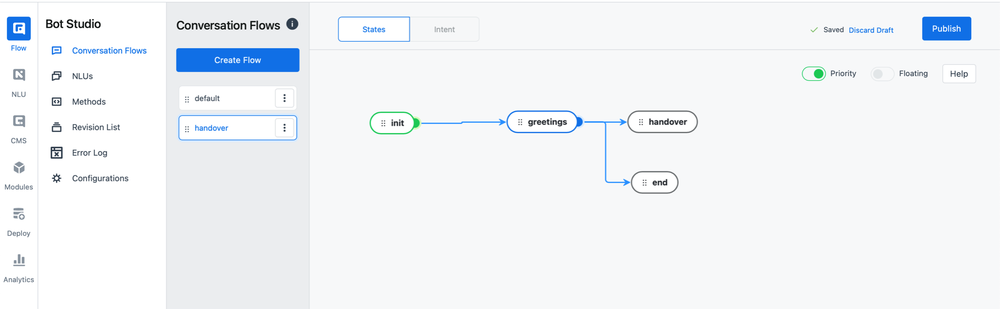

Kata Platform ([platform.kata.ai](www.platform.kata.ai)) is a platform to create chatbots and train them with Natural Language Processing (NLP). You can create any chatbots for any use-cases, such as FAQ, campaign, customer service, handover to human agents, and more.

In this tutorial, we will create a chatbot that is able to handoff conversations to human agents, also known as "Agent Handover''. We will use the Kata Omnichat dashboard to connect chatbots with human agents. Check this [documentation](/omnichat) for Kata Omnichat explanation.

# Simple Chatbot Flow

Before we jump into the tutorial, let’s see the scenario for the conversation. We will create a chatbot using _keywords_ which when customers enter "1" to end the conversation or “2” to do the handover.

## Conversation Flow Table

| Scenario Flow                                             | Details <br />(Each row represents 1 bubble message)                                                                                                                                                                        |
| --------------------------------------------------------- | --------------------------------------------------------------------------------------------------------------------------------------------------------------------------------------------------------------------------- |
| Greetings                                                 | Halo, selamat datang di layanan CS Bank ABC 😊 <br /><br />Apakah ingin dihubungkan ke CS Bank ABC yang sedang available? <br /><br />Ya -- lanjut<br />Tidak -- end session<br /><br />💡 Cukup ketik angka pilihannya, ya |
| End conversation if customer typing "2"                   | Terima kasih sudah menghubungi Bank ABC 😊                                                                                                                                                                                  |
| Customer typing “1” and chatbot request handover to agent | Mohon menunggu, ya. Sedang kami hubungkan ke CS Bank ABC yang tersedia! 😊                                                                                                                                                  |
| End session after handover done                           | Terima kasih sudah menghubungi Bank ABC 😊                                                                                                                                                                                  |

# Create Project

## Objective: Register your new account and login to the Platform

1. Go to [www.platform.kata.ai](www.platform.kata.ai) and click **Sign Up** to create new account

2. Input required fields in sign up page: **Username, email address, role and captcha**

3. Go to your registered email’s inbox. You will receive an email to verify your account and input your password

4. When you click the **Confirm Email** button in the verification email, you will be redirected to setup password. Insert your password and confirm the password.

5. You will be redirected to the Login **Page**. Input your username and password to continue.

## Objective: Create new chatbot project

### _Login to Kata Platform and create project_

1. Open your browser, then open the URL [www.platform.kata.ai/login](www.platform.kata.ai/login) and enter your username & password.

2. Click **"Login"** to continue.

3. Click on **"Create Project"** and fill in the form. Each project contains one bot design, one NL, and one CMS.

# Create Greetings Flow

## Objective: Define a flow

### _Create a flow name "Handover". We will use 1 flow for this simple bot_

1. Click **"Create Flow"** button in current screen

2. Create flow "Handover", other fields are left blank. Then, click **Create**.

## Objective: Create greetings state to define how to respond

### _Create "init" state_

1. Click "+" icon in bottom right to create new state

2. Create state "init" and click toggle to turn on “Initial State” and other fields are left blank. Then, click Create.

### _Create "greetings" as bot response to show keywords menu_

1. Create another state by clicking the **"+"** icon in the bottom right to create a new state named “greetings”

2. Click **"Add action"**, then click **“+”** in the action box to create a new action

3. When all actions available are shown, then choose "Text"

4. Input action name "greetings"

5. Next, click the **Add Variant** button to fill in with this text:

```
Halo, selamat datang di layanan CS Bank ABC 😊\n\n Apakah ingin dihubungkan ke CS Bank ABC yang sedang available?\n\n1. Ya\n2. Tidak\n\n💡 Cukup ketik angka pilihannya, ya
```

6. Click **Create Action**

7. To finalize the state creation, click **Create** in state drawer

## Objective: Catch end-user’s message when greet the bot

### _Create "greetings" keywords to build understanding in chatbots when end-user’s greet the bot. We will use the NLUs feature to create the keywords._

1. Go to the menu **"NLUs"** which is placed under the “Conversation Flows” menu. Your screen will be switched to create NLUs

2. Click **Create NLU**

3. Then, fill in the fields as follow

```
NLU Name: greetings
NLU Type: Keyword
```

4. Next, click **"Add Keyword"** to define any words to trigger the bot. Fill in the main keyword as follow

```
Main keyword: hi
```

5. Add a new word by pressing "enter" on your keyboard. Every time you write a new word, press “enter” on your keyboard to save the word. Add these words


6. Click **"Create"** to save the NLUs

### Create "greetings" intent to catch user’s input

1. Click the Intent tab which is placed next to the Conversation Flows sidebar.

2. Click **Create Intent** button

3. Fill in the intent as follows. The choice of "Intent type" is text, which means it will catch incoming messages with text only. On classifier, use “greetings” NLUs that we’ve created in previous step to connect the intent with create keywords for greetings


4. Then, click **Create**.

## Objective: Connect "init" and “greetings” states by creating a transition

### *Create a transition to connect "*init*" and “*greetings*” states. The transition will define in which condition the greetings state, including the actions’ state, will be executed.*

1. Pull a line from the "init" state and drag it to the “greetings” state. If you succeed, then it will show a **Create Transition** drawer

2. Fill in the transition as follow


3. Click **"Create Transition"**

# Catch End-user’s Typing when Choosing Menu

## Objective: Catch end-user’s message when choosing menu by typing "1" or “2”

### Create "menu" keywords

1. Go to the menu **"NLUs"** which is placed under the “Conversation Flows” menu. Your screen will be switched to create NLUs

2. Click **Create NLU**

3. Then, fill in the fields as follow

```
NLU Name: menu
NLU Type: Keyword
```

4. Next, click **"Add Keyword"** to define any words to trigger the bot. Fill in the main keyword as follow

```
Main keyword: satu
```

5. Add a new word by pressing "enter" on your keyboard. Every time you write a new word, press “enter” on your keyboard to save the word. Add these words. “satu” and “dua” as the main keywords mean they define what your end-users will be inputted when choose menu


6. Click **"Create"** to save the NLUs

### Create an intent "menu" to catch the end-user's input

1. Click the Intent tab which is placed next to the Conversation Flows sidebar.

2. Click **Create Intent** button

3. Fill in the intent as follows. This intent will catch the end-user's input after typing "1" or “2”. Adding a classifier with “menu” to define this intent will be executed whenever a sentence has the “menu” keyword. Add attributes and choose NLU “menu”, because we have 2 main keywords that need to be understood by the intent to execute the handover path or end conversation path.


4. Then, click **Create**.

# Create Handover to Human Agent Flow

## Objective: Create a flow that end-user can request handover to human agents by using Handover API

### Create handover state

1. Click **"+"** icon in bottom right to create new state

2. Fill in the state name with "handover" and activate toggle “End state”

### Create bot response to inform end-user that the handover request has been received and waiting for agents to reply

1. Click **"+"** in action box to create new action

2. When all actions available are shown, then choose "Text"

3. Input action name "waitForAgent"

4. Next, click the **Add Variant** button to fill in with this text:

```
Mohon menunggu, ya. Sedang kami hubungkan ke CS Bank ABC yang tersedia! 😊
```

5. Click **Create Action**

### Use Handover API to send handover request to Omnichat

1. Create another action by clicking **"Add action"**

2. Click **"+"** in action box to create new action

3. Fill in action name with "handover"

4. When all actions available are shown, then choose "API"

5. Choose **Handover API**

6. Click **Create Action** button

7. To finalize this step when creating a new state, click the **Create** button in the state drawer

### Create a transition to connect "greetings" and “handover” states

1. Pull a line from the "greetings" state and drag it to the “handover” state. If you succeed, then it will show a **Create Transitio**n drawer

2. Fill in the transition as follows. This condition means if the end-user's keyword is identified as "menu" _and_ they are typing “1”, then it will show the “handover” state including the actions’ state.


3. Click **Create**

# Create End Conversation Flow

## Objective: Create a flow that end-user doesn’t want to handover to agent and end the conversation

### Create "end" state to cancel handover agent and finish the conversation

1. Click **"+"** icon in bottom left to create new state

2. Fill in the state name with "end" and click toggle “End state” to set the state as the end of the flow.

3. Click **"Add action",** then click “+” to create new action

4. Choose Text, then fill in the action name with "end".

5. Next, click the **"Add Variant"** button and input the following text:

```
Terima kasih sudah menghubungi Bank ABC 😊
```

6. Click **Create** to finalize

### Create a transition to connect "greetings" and “end” states

1. Pull a line from the "greetings" state and drag it to the “end” state. If you succeed, then it will show a Create Transition drawer

2. Fill in the transition as follows. This condition means if the end-user's keyword is identified as "menu" _and_ they are typing “2”, then it will execute the “end” state


3. Click **Create**

# Finalize Your New Bot

## Objective: Publish your bot to save the chatbot flow

1. Click on the **"Publish"** button which is placed on top right corner

2. Fill in the **change log**. You can input "Initial version" in the change log

3. Click **Publish** to save the change log. Lastly, your final chatbot flow will be like this:



## Objective: Testing your bot in emulator

1. On the bottom of your right screen, there is a small button named **"Test NLU".** Click the **button** to start.

2. You can try to test your bot by inputting a message in the text bot. Say "hi" to your bot. If it succeeds, your bot will reply as follows


3. If you want to **restart** the session, click refresh icon which is placed at the bottom

## Objective: Deploy your bot

### Create new deployment

1. Go to the **"Deploy"** menu in the left sidebar

2. In this page, click on the **"New Deployment"** button which is placed in the top right corner. If you successfully clicked, it will show a create deployment drawer

3. Choose any deployment version you want to deploy and fill in the change log. Or you can simply follow this screenshot


4. Click **Submit** to finish the deployment

### Create new environment as prerequisites to deploy the bot to channel

1. Go to the **Environment** menu which is placed under the current menu ("Overview"). If you successfully entered the Environment menu, you will see a page like this. These 3 environments represent that your chatbot will be tested in development or staging first, before go live as in Production stage


2. Click the **Create Environment** button in the Development environment and you will see a drawer to create new environment

3. Choose the **development version** you want to (in this tutorial we will use the 1.0.0 version)

4. Fill in the **environment URL**. This environment URL will be useful if you use our CMS feature, [learn more about CMS](https://docs.kata.ai/cms-studio/about/').

5. Click **Create** to finalize

6. You will notice the button is changed into the Create **Channel** button.

In this step, you will need an Omnichat ([https://omnichat.kata.ai](https://omnichat.kata.ai)) account and Omnichat inbox to deploy the bot. Let’s get started!

# Create Inbox in Omnichat

Follow these tutorials in Omnichat to continue:

1. Register a new Omnichat account in Omnichat. Section **How to Set Up**

2. Create a new channel inbox.

    - For IGDM chatbot: Section **How to Set Up > Connect to Instagram Messaging**

    - For WA chatbot: Section **How to Set Up > Connect to Whatsapp Messaging**

# Create Agent Bot in Omnichat

Follow the tutorial below in Omnichat to continue: Section **How to Set Up Agent Bot**

## Connect Bot to Omnichat

1. If you succeed to follow the above tutorials, you will see an access token generated in Omnichat that needs to be pasted into the Platform. The screenshot below


2. Next, open the Kata Platform URL ([https://platform.kata.ai](https://platform.kata.ai)) and do login

3. Click your project that already had a chatbot and deployed

4. Then, go to the menu: Deploy > Environment. You will see this screen.


5. Click Create Channel button to start connect and you will see an empty channel table

6. Click "+ Create Channel" button in channel table list and drawer to set up the channel will be shown

7. Choose Omnichat in Channel Type

8. In the Access Token field, paste your access token that was generated from the Omnichat inbox.

9. Click Save to deploy your bot

10. Few steps to the final ✨ A created channel will generate a webhook URL. Copy the webhook URL in the Platform to Omnichat.

## Finalize Agent Bot in Omnichat

1. Go back to Omnichat ([https://omnichat.kata.ai](https://omnichat.kata.ai)) and do login

2. Go to menu: Settings > Integrations > Agent Bot. You will see this screen and information that you’re still in first step to finalize


3. Click "Edit" button in the agent bot configuration

4. A drawer will appear to fill in the Platform webhook URL. Paste your chatbot webhook URL

5. Click Update and you will be redirected to agent bot list

6. Lastly, turn on the toggle in Activate Agent Bot. Your chatbot is already connected to the Omnichat inbox and ready to use!


# Final Demo

We provide video tutorials and interaction demos for agent bot Omnichat features. Check these out:

-   Create simple bot handover video tutorial

-   Chatbot interaction with end-user and handover to human agent
