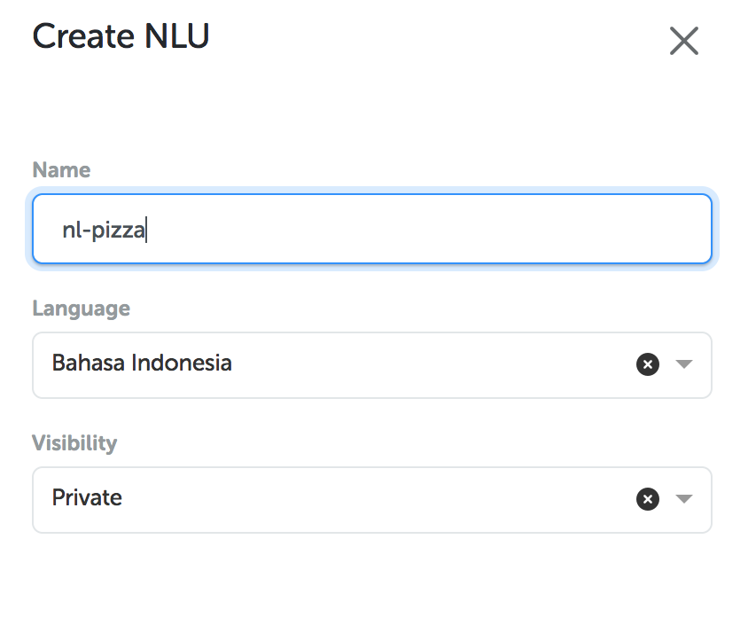
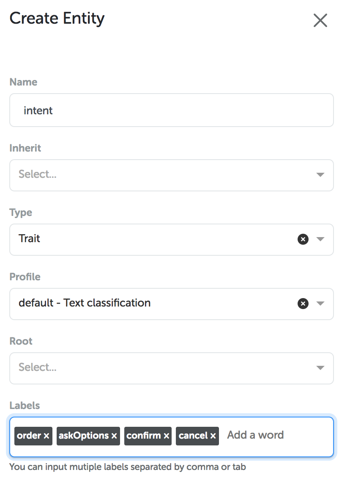
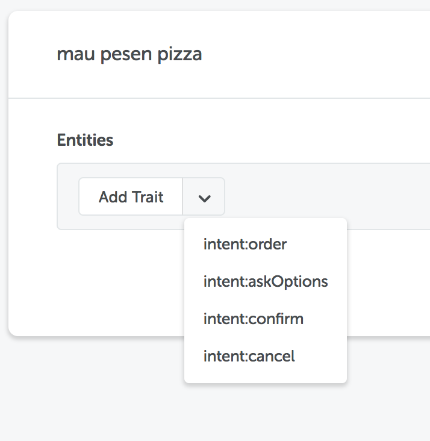
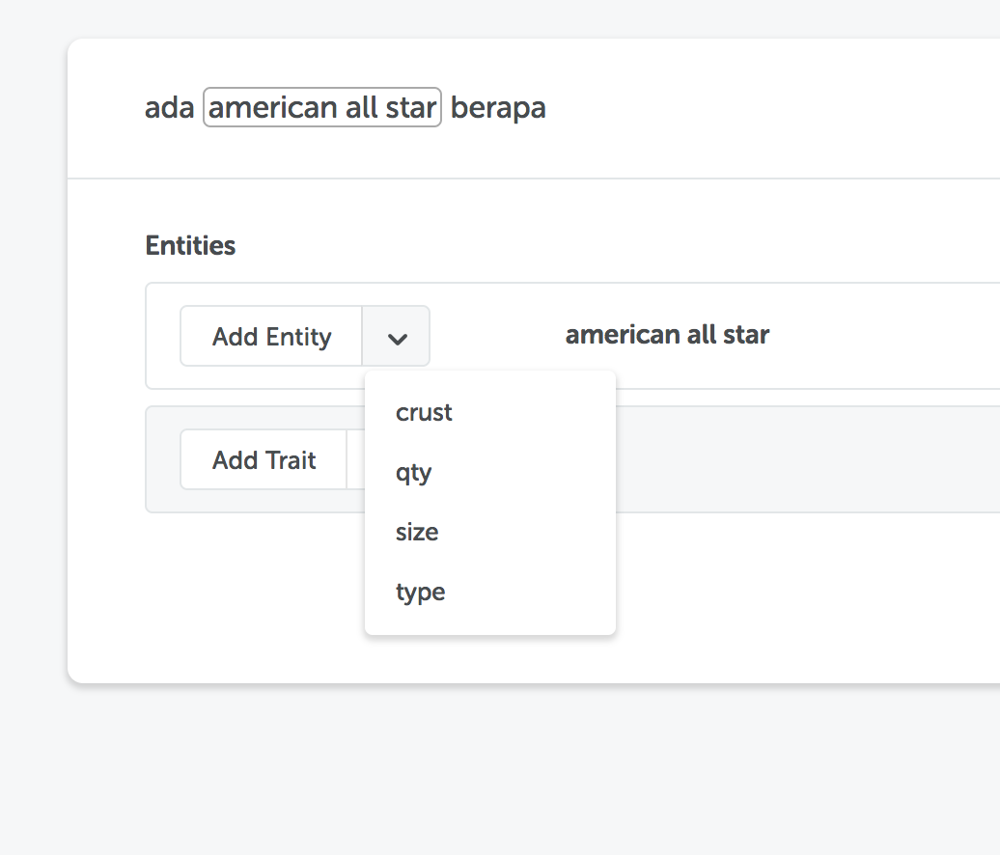
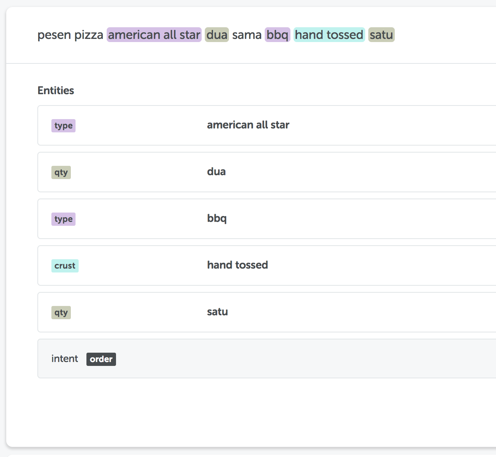
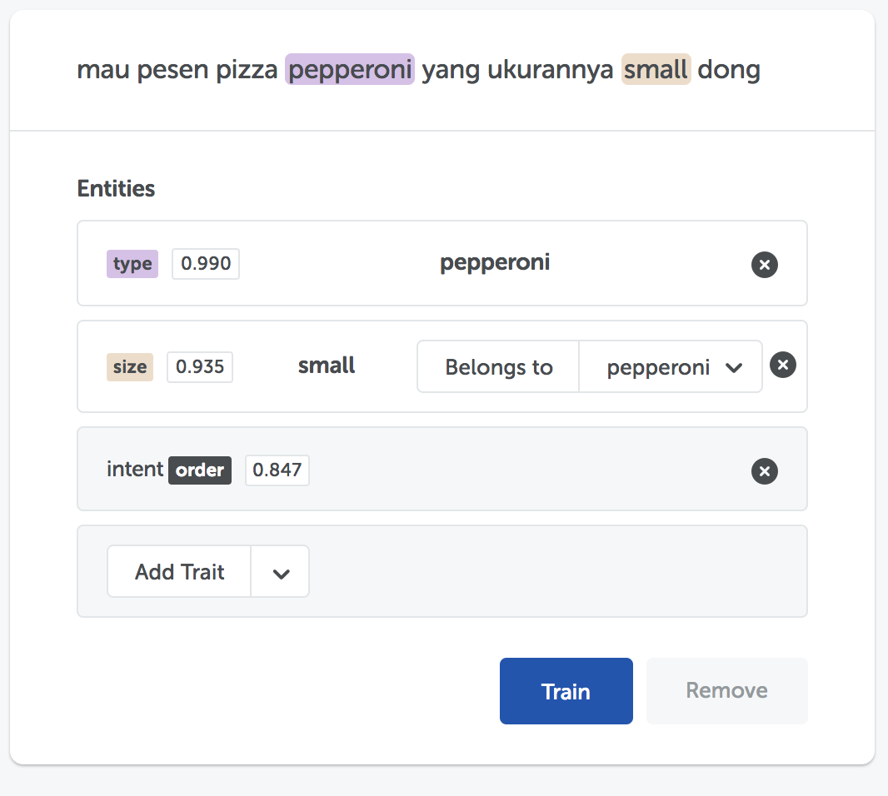
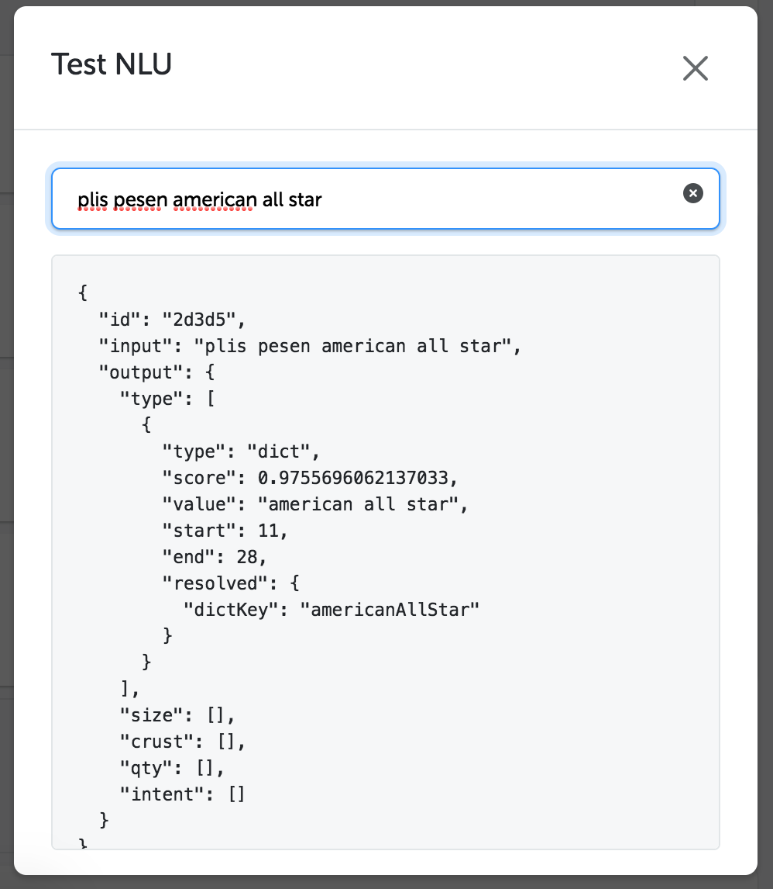
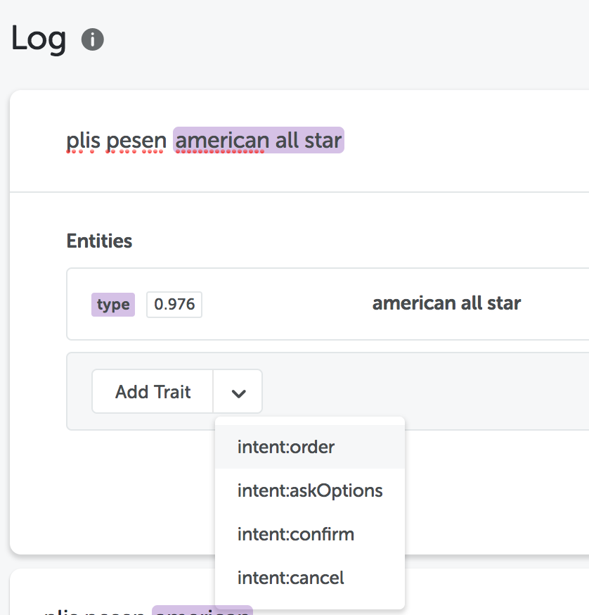
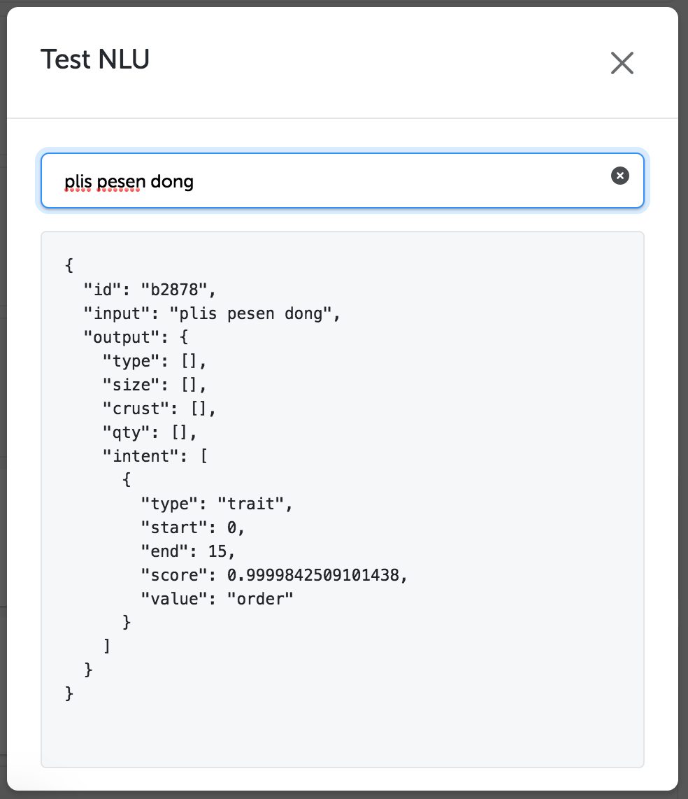

## Pendahuluan

Pada tutorial membuat pizza bot (link untuk pizza bot tutorial bahasa) kita telah membuat bot untuk memesan pizza. Selain itu, kita juga membuat NLU agar bot memahami percakapan dari pengguna. Akan tetapi, NLU yang dibuat memiliki keterbatasan yaitu data harus disiapkan sebanyak mungkin untuk dan aktivitas ini tentu tidak efektif. Oleh karena itu, pada Kata Platform kita telah menyiapkan menu NLU untuk membantu membuat Natural Language Model yang dapat disesuaikan dengan kebutuhan bisnis kamu.

Dengan sedikit dataset, NLU studio dapat membuat sebuah NL Model serta dapat menyesuaikan alur percakapan bot yang kamu buat. Tutorial yang akan kamu ikuti ini akan membuat sebuah NL Model dengan menggunakan NL Studio. Studi kasus yang akan dibuat adalah NL Model untuk pizza bot

## Membuat NL Model dengan NL Studio

### Masuk ke Kata platform

Mengikuti dengan tutorial pizzaBot sebelumnya, kita harus masuk terlebih dahulu pada Kata Platform dengan memasukkan username dan password yang sudah kamu miliki sebelumnya

Klik “Login” untuk melanjutkan

### Membuat NLU baru

Setelah kamu masuk dalam Kata Platform, klik menu NLU yang berada pada sebelah kiri layar. Kemudian, tampilan menu akan seperti dibawah ini

Lalu, klik tombol “+” untuk membuat NLU baru dan isi dengan data terlampir

### Membuat entity `intent`

Setelah kamu membuat NLU baru, kamu harus memasukkan entity. Entity akan membantu kita dalam mengklasifikasikan setiap masukkan dari pengguna. Klik tombol “+” untuk membuat sebuah entity

Pertama-tama, buatlah entity yang merupakan klasifikasi `intent` yang terdiri dari 4 intent (**order, askOptions, confirm, cancel**). Kamu dapat menyesuaikan pemilihan intent disesuaikan dengan kebutuhan. Pada contoh entity ini kita akan membuat 4 intent terlebih dahulu.

### Membuat entity `type`

Pada entity `type` ini, kita akan membuat NLU dengan tipe dictionary yang nantinya akan membatasi dan menangani pemilihan tipe dari pizza. Tambah entity baru dan isi data seperti dibawah ini

Lalu, lanjutkan pengisian dictionary dengan menambahkan kata-kata lainnya

### Membuat entity `size`

Entity `size` berfungsi untuk mengetahui ukuran dari pizza yang dipesan oleh pengguna. Pada entity ini kita akan menggunakan “Belongs to” yang memiliki fungsi untuk memberikan penanda bahwa sebuah entity berada di bawah entity lainnya. Entity `size` akan berada dibawah entity `type`. Cara penggunaannya akan ditampilkan pada gambar dibawah ini.

Pada bagian dictionary, masukkan keyword yang akan menjadi perkiraan masukkan dari pengguna

### Membuat entity `crust`

Selanjutnya, kita akan membuat entity crust yang berfungsi untuk mengetahui tipe crust pada pizza dan berada dibawah dari entity `type`. Kamu bisa memasukkan data sesuai dengan gambar dibawah ini :

### Membuat entity `qty`

Pada pizza bot yang kita buat sebelumnya, pengguna harus memasukkan jumlah pizza yang akan dibeli menggunakan intent regex. Entity `qty` akan dibuat menggunakan dictionary dengan memasukkan angka atau keyword yang berhubungan dengan jumlah pizza yang dipesan. Tambah entity pada dashboard NLU, kemudian isi data seperti dibawah ini

Kamu telah menyelesaikan pembuatan intent, selanjutnya mari kita coba untuk melakukan training dengan dataset.

### Training

Untuk melakukan training, kamu terlebih dahulu harus masuk ke menu “Training” yang terdapat di sisi kiri halaman

Kamu dapat memasukkan dataset untuk membuat NL Model pada halaman training. Masukkan kalimat sederhana seperti “mau pesen pizza” dan tekan “enter” pada keyboard

Kemudian, pada bagian ini kamu dapat melakukan tagging dan klasifikasi pada teks tersebut. Pada pilihan entities, pilih `intent: order`. Intent order berfungsi sebagai inisiasi pengguna dalam melakukan pemesanan.

Klik “Train” untuk mulai melakukan training. Kamu juga bisa menambahkan beberapa kalimat untuk dijadikan fitur dalam pembuatan NL Model. Kamu bisa mengikuti teks-teks dibawah ini

Kita perlu melatih banyak data untuk meningkatkan kompleksitas. Pada contoh selanjutnya, kita akan melakukan tagging secara parsial dengan memasukkan teks dan melakukan pemilihan teks pada kata yang ingin kita tag. Proses memilih teks (atau disebut “selecting”) dapat dilakukan dengan mem-block pada satu atau beberapa kata sekaligus menggunakan cursor.

Kamu dapat mencoba seperti pada gambar berikut ini. Pada kata “Ada american all star berapa”, pilih hanya pada kata “American all star”

Kemudian, pilih entity `type` untuk mengklasifikasikan. Berikut tampilan setelah keyword diatas sudah ditambahkan dalam entity `type`

Kita dapat memasukkan beberapa keyword seperti terlampir untuk berlatih lebih banyak lagi, salah satu nya kamu dapat memasukkan kalimat “pesen pizza american all star dua sama bbq hand tossed satu”

Kemudian, kita akan mencoba kalimat selanjutnya.

Untuk menyamakan dengan intent yang pernah dibuat, masukkan parent dari entity ini dengan memilih tombol “belongs to” dan pilih “Pepperoni” dikarenakan kata “small” merupakan referensi ukuran dari Pepperoni. Pada opsi “add trait”, pilih `intent order` untuk mengklasifikasikan sebagai pesanan

Sama dengan gambar sebelumnya, kata “dua” dan “medium” memiliki kepemilikan yang berbeda. Kata “dua” dimiliki tipe pizza “bbq” dan “medium” dimiliki tipe pizza “pepperoni”. Kamu juga dapat memasukkan kata-kata lainnya. Jangan lupa untuk menambahkan`intent order` pada susunan kalimat yang merupakan struktur pemesanan pizza

### Menguji pada Test NLU

Untuk menguji apakah dataset yang dibuat sudah tepat, kamu bisa melakukan pengujian NLU seperti terlampir

Kemudian, masukkan kata “mau pesan pizza aas dua”. Kamu bisa melihat hasil training data yang dilakukan sebelumnya seperti terlampir

Selamat, kamu telah menyelesaikan cara membuat NL model menggunakan NL studio.

## Memperbaiki dataset

Saat melakukan percobaan pengujian NLU, terkadang hasil yang ditampilkan tidak sesuai dengan harapan kita. Seperti contoh dibawah ini (mohon diingat hasil akan berbeda pada setiap NLStudio, bergantung pada data training)

Pada gambar diatas, dengan susunan kalimat memiliki kata “pesen” seharusnya termasuk dalam `intent order`. Oleh karena itu kita akan memperbaiki hasil untuk menjadi data training dari NLModel.

### Masuk pada menu log

Pertama-tama, kamu harus berada dalam sub-menu “Log” dari NLU.

Pada halaman ini kamu akan melihat masukkan-masukkan saat kamu melakukan training sebelumnya.

### Memperbaiki prediksi

Pada pesan “plis pesen american all star”, kita akan memperbaiki dataset. Klik pada “add trait” dan pilih `intent:order`.

Kemudian tampilannya akan seperti ini

Klik “Train” untuk melatih NLModel dan kamu akan menerima pemberitahuan seperti dibawah ini

### Test NLU dengan data yang sudah diperbaiki

Kemudian, kita akan mencoba menguji dataset setelah melakukan training diatas. Klik “Test NLU” dan masukkan kalimat “plis pesen dong”.

Selamat, kamu telah memahami bagaimana melatih NLModel yang kita buat dengan dataset yang kamu miliki
