## Introduction

In the previous tutorial which is making pizza bot (link for pizza bot tutorial language), the purpose is helping users to order. Moreover, we also make a NLU for bot to understand user conversations. However, created NLUs have limitations such as data should be prepared as much as possible. Therefore, in Kata Platform we have set up NLU menu to help create Natural Language Model that can be customised to your business needs.

Started to a few datasets, NLU studio possible to create NL Model and able to adapt your own flow. The tutorial as follow will create a NL Model using NL Studio. Case study to be made is NL Model for pizza bot

## Creating a NL Model with NL Studio

### Login to Kata platform

Following with previous `pizzaBot` tutorial, we must enter Kata Platform by entering username and password you previously had

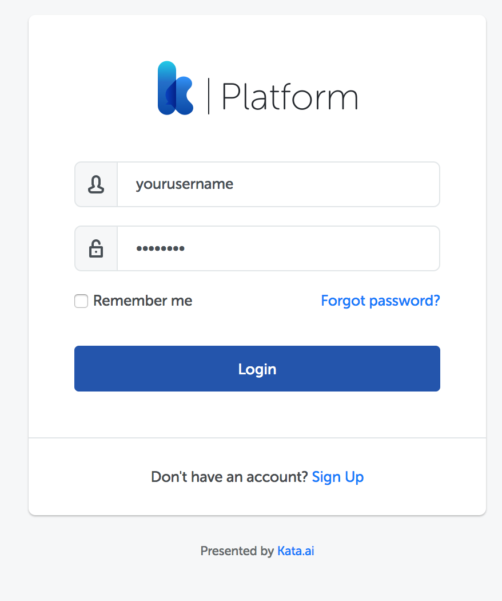

Click "Login" to continue

### Create new NLU

After you entered to Kata Platform, click NLU menu where located on left screen. Then, the menu will look like this

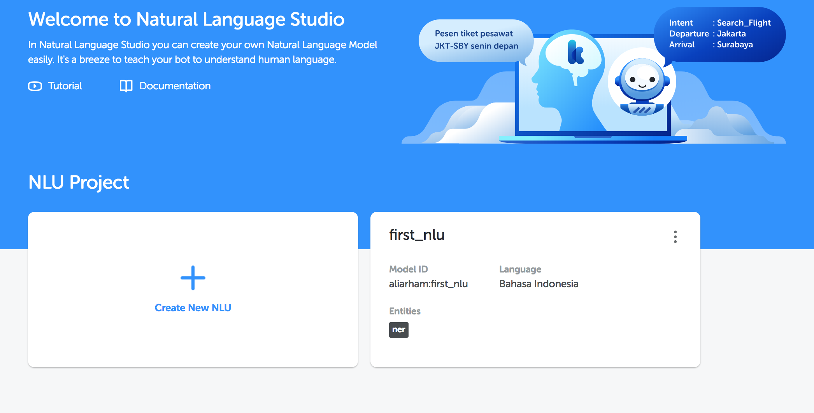

Then, click "+" button to create a new NLU and fill in as follow

### Create an `intent` entity

After you created a new NLU, you must enter the entity. The entity will help us in classifying every input from users. Click the "+" button to create an entity

First of all, create an entity that is an `intent` classification consisting of 4 `intents` (**order, askOptions, confirm, cancel**). You can customize the intent selection to match your needs. In this entity example we will create 4 `intent` first.

### Create entity `type`

In this entity `type`, we will create a NLU with dictionary type which will be limiting and handles pizza type selection. Add new entity and fill in the data as below

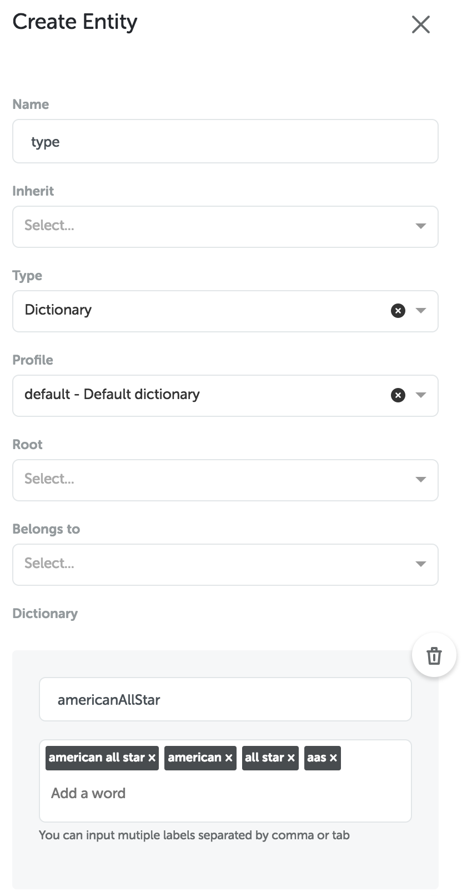

Then, continue filling the dictionary by adding other words

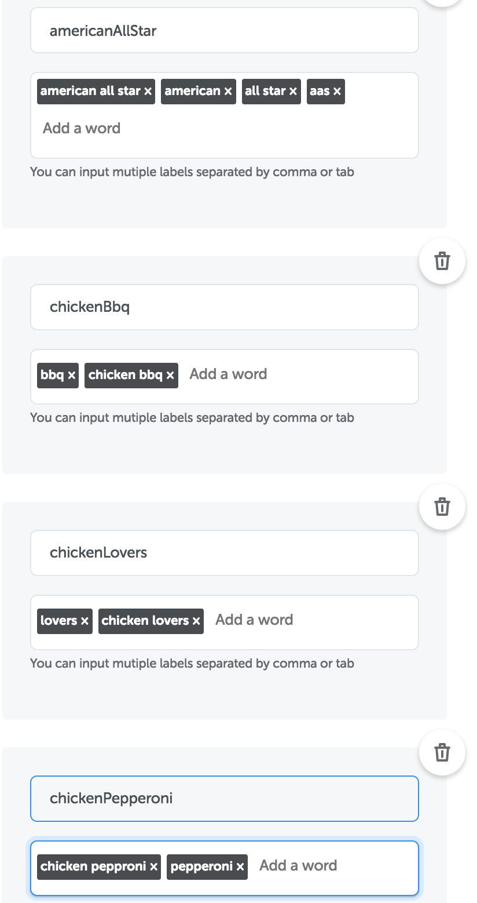

### Create entity `size`

Entity `size` serves to determine pizzas size which ordered by users. In this entity, we will use "Belongs to” which used to provide a marker which entity is under another entity. The entity`size` will be under entity `type`. How to use it will be shown in the picture below.

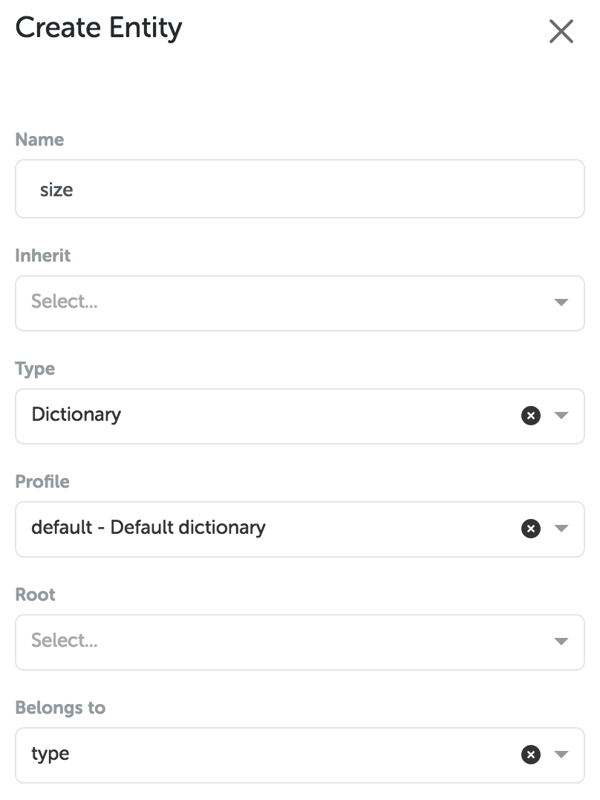

In dictionary section, enter a keyword that will be a prediction input from users

### Create entity `crust`

Next, we will create an entity named `crust` that works to find out crust type on pizza. It is under entity `type`. You can enter data according to image below:

### Create entity `qty`

In pizza bot which we created earlier, user must enter pizza number to be purchased using intent `regex`. Entity `qty` will be created using dictionary by entering numbers or keywords related to the number of pizzas ordered. Add entity to NLU dashboard, then fill in the data as below

You have completed intent creation, then let's try to do dataset training

### Training

In order to data training, you must enter to "Training" menu located on the left side

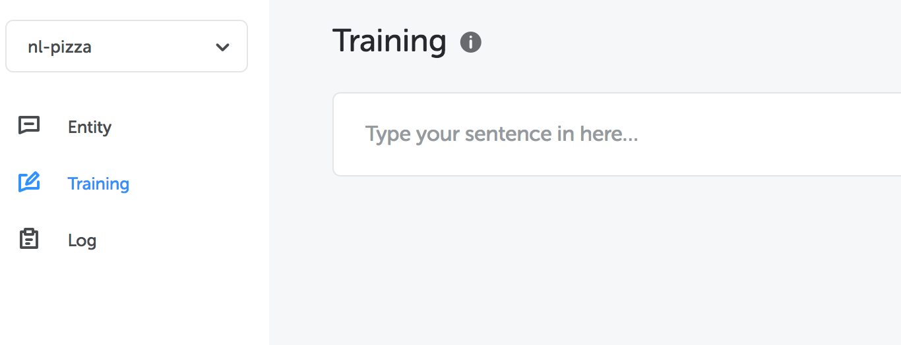

You may enter the dataset to create a NL Model on training page. Enter a simple phrase like "want pizza" and press "enter" on the keyboard

Then, in this section you can do tagging and text classification. In entities option, select`intent: order`. Intent order is useful as a user initiation in ordering pizza.

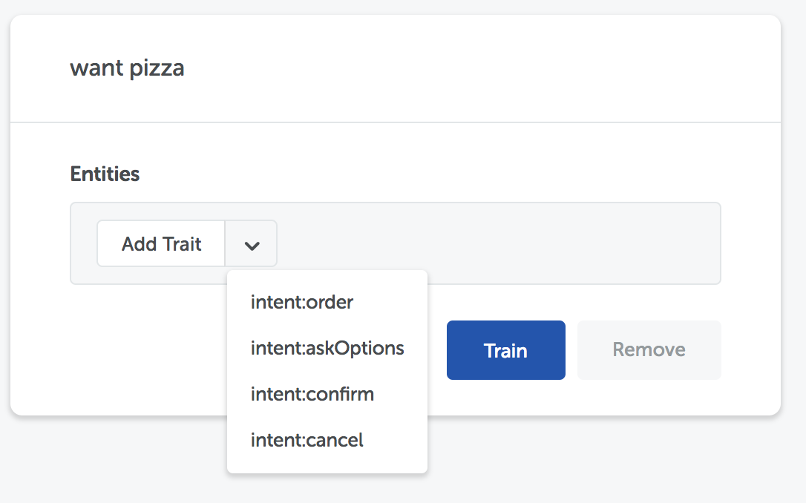

Click "Train" to start training. You can also add a few sentences to train more data in making NL Model. You may follow the text below

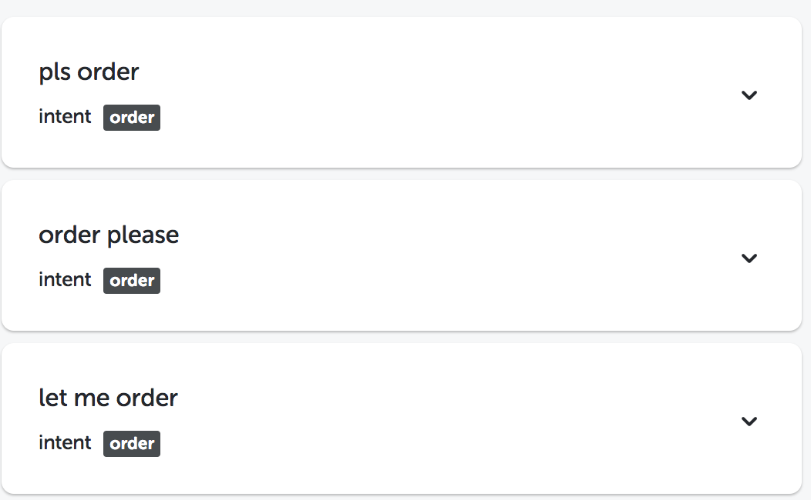

We need to train a lot of data to increase complexity. In our next example, we will do partial tagging by entering text and doing text selection on the word we want to tag. The process of selecting text can be done by blocking one or more words at a time using a cursor.

You can try as in the following picture. In the words "how much american all star", select only on the word "American all star"

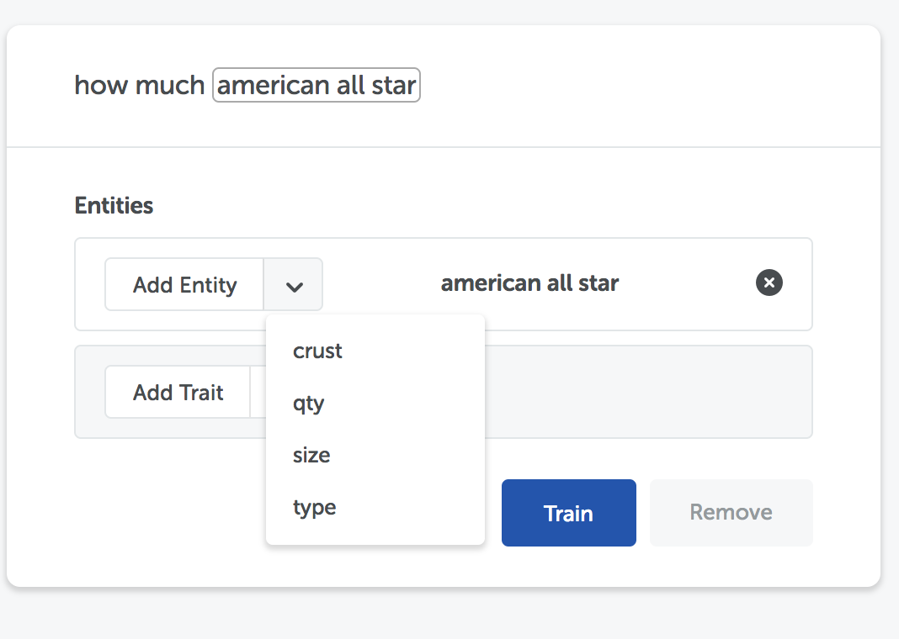

Then, select entity `type` to classify as below.

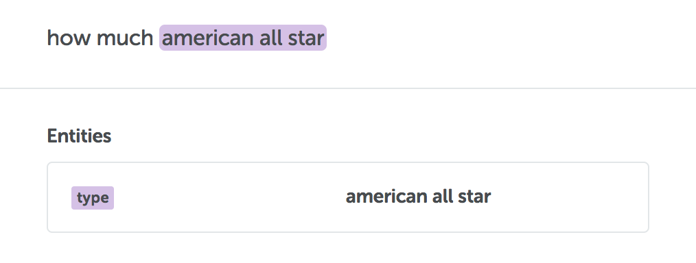

We may include some keywords as attached to practice more, you can also enter a phrase "I want American all star pizza, two and bbq hand tossed one"

Then, we will try the next sentence.

To match with created intent, enter the parent of this entity by selecting "belongs to" button and selecting "Pepperoni" because the word "small" is a Pepperoni size reference. In "add trait" option, select `intent:order` to classify as an order

Similar to previous image, the words "two" and "medium" have different ownership. The word "two" owned by the "bbq" and "medium" owned by "pepperoni" pizza type. You can also enter other words. Do not forget to add `intent:order` for order sentence structure

### Test on Test NLU

To test whether dataset is created right, you are able to do NLU testing as attached

Then, enter the word "i want two aas". You can see the results of previous training data as attached

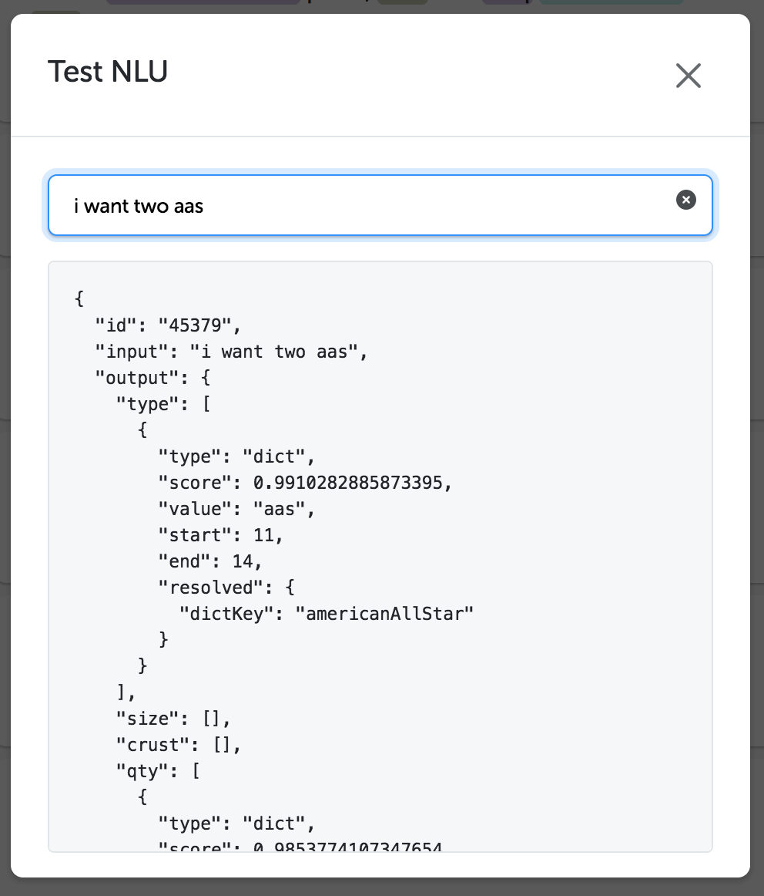

Congratulations, you have completed how to create NL model using NL studio.

## Adjusting the dataset

When performing NLU testing, sometimes the results displayed is not match with our expectations. As the example below (please note the results will differ on each NLStudio, depending on the training data).

In the picture above, the sentence has a prediction to order and must be included in `intent:order`. Therefore, we will improve the result from NLModel.

### Enter log menu

First of all, you should be in the "Log" sub-menu of NLU.

On this page, you will see dataset when you do previous training.

### Fix the prediction

In the "do you sell american all star" message, we will adjust the dataset. Click on "add trait" and select `intent:order`.

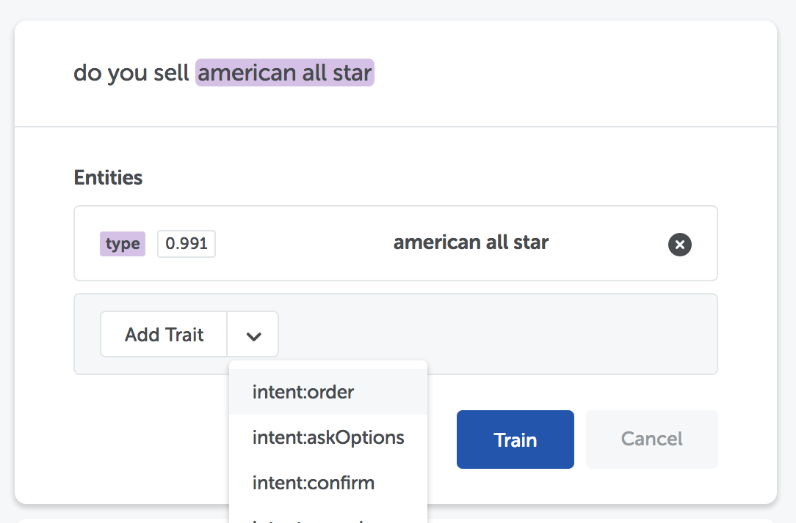

Then it will look like as below

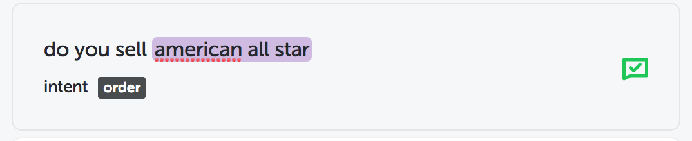

Click "Train" to train NLModel and you will receive a notice like below

### Test NLU with data that has been fixed

Then we will try to test the dataset after doing training above. Click "Test NLU" and enter a phrase "hi, do you sell aas".

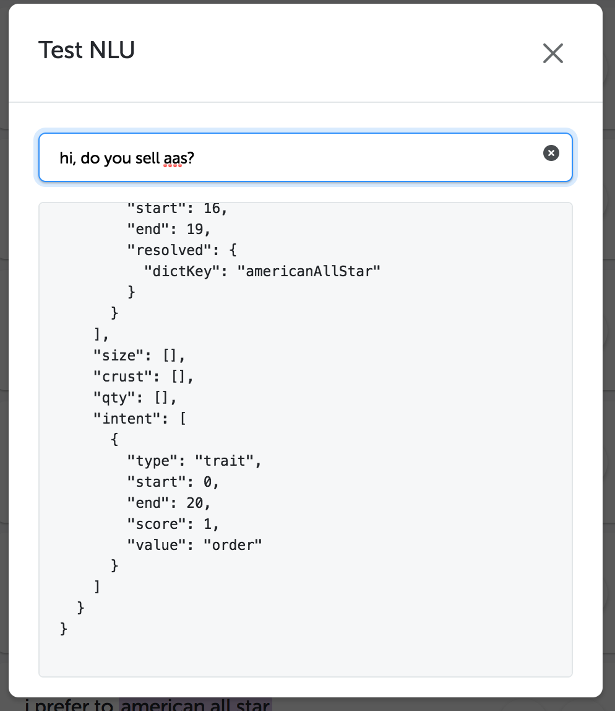

Congratulations, now you have understood how to train NLModel with your dataset
