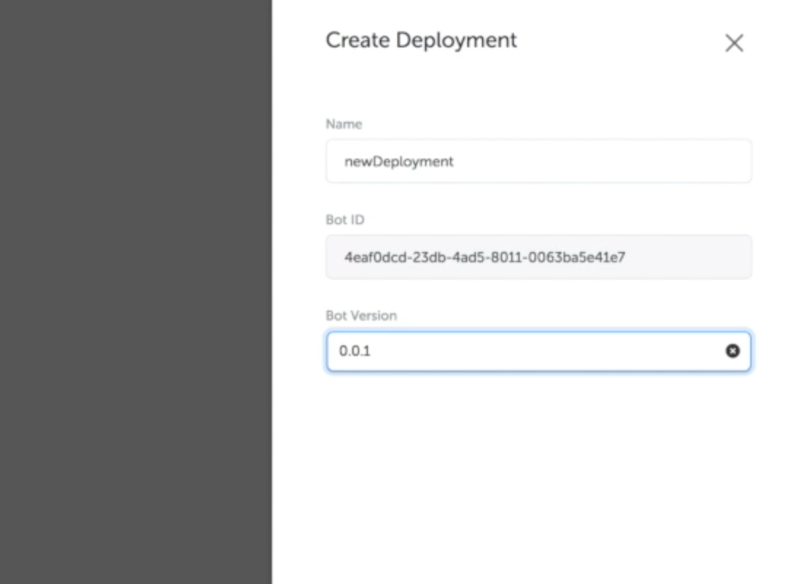
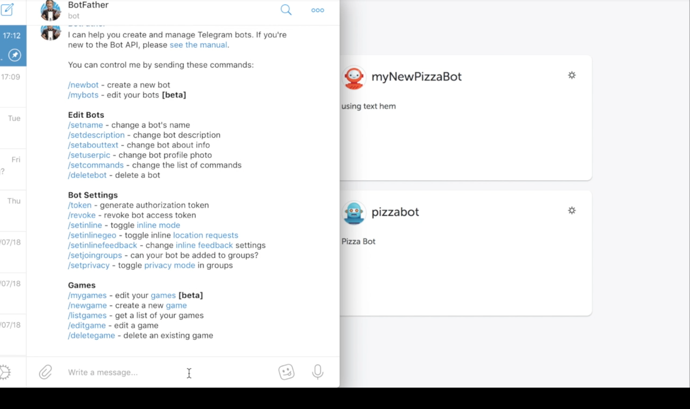
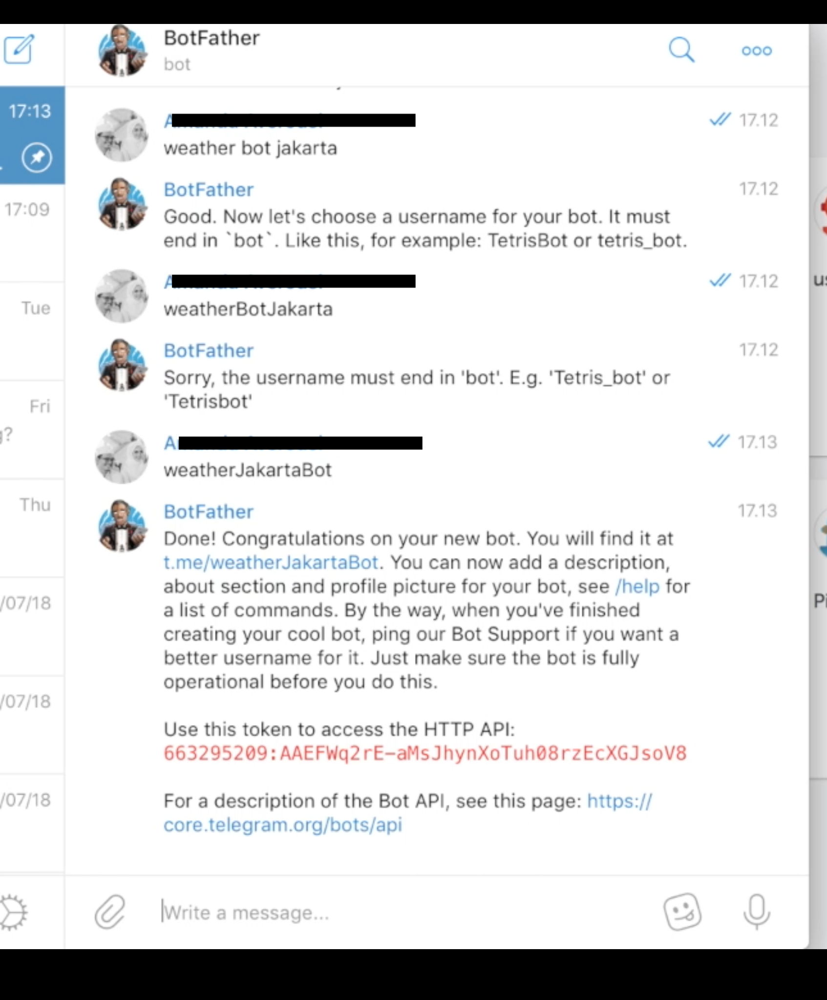
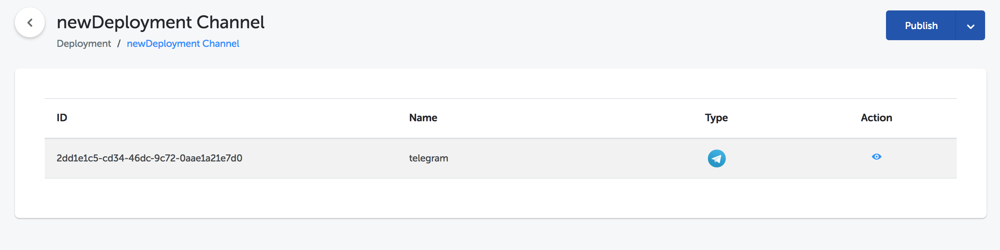
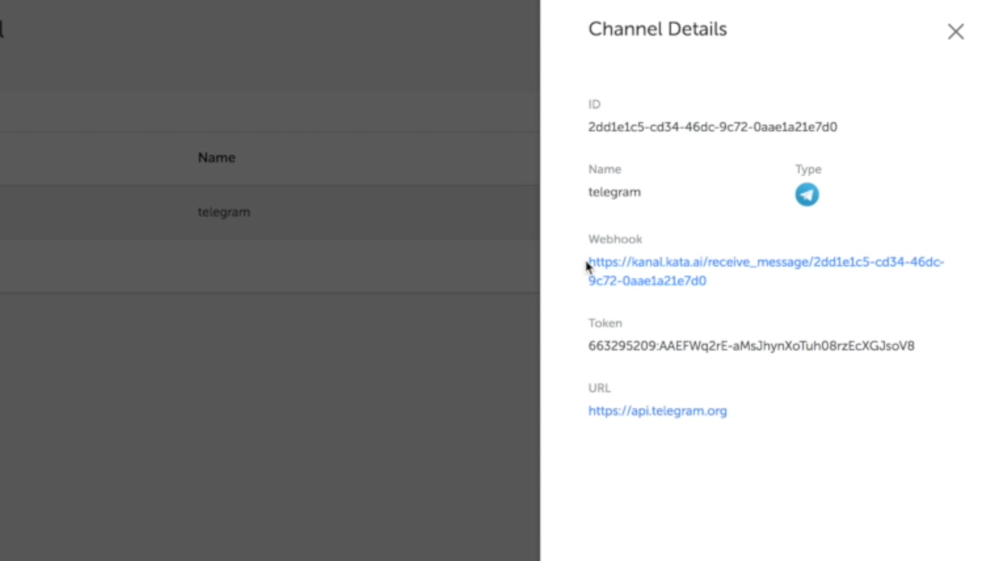

<iframe width="560" height="315" src="https://www.youtube-nocookie.com/embed/3NRZcyl7erM" frameborder="0" allow="autoplay; encrypted-media" allowfullscreen></iframe>

Telegram as one of the social media that is currently becoming citizen choice, has become an option for a brand to engage the customer. Therefore, this tutorial featured how to connect our chatbot to Telegram. In this tutorial, we will use API Bot template which is a bot to inform weather in big cities such as Jakarta, Bandung and Surabaya.

## Create Chatbot

Firstly, go to bot studio in Kata Platform and click “Create with This Template” in API Bot card. Fill in all fields as below


Then, you have to test you chatbot by creating a deployment. Go to deployment menu in sidebar and click “Create Deployment”




## Integration with Telegram

You have to download telegram app in desktop (download link : https://desktop.telegram.org/) before integration process. Remember, you must have Telegram account to sign in. After you signed in to Telegram, search BotFather account to register your chatbot.



Then, type “/newbot” and BotFather will ask your chatbot name. Feel free to use any name you like.


Lastly, you will ask to enter your chatbot username.


Final step is you will see a bot token to access HTTP API



## Create Channel with Telegram

In this step, you have to create channel in Kata Platform. Go to “Deployment” menu and click “View Channel”. Then, create a channel as below


You have to enter Bot Token which generated from Telegram. Copy the bot token from BotFather window chat. The created channel can be seen as follows.



Click the eye icon to open generated webhook from Kata Platform. You may see a webhook URL. This URL shall be inserted later to Telegram.



Next, open a new tab and enter this URL.

```
https://api.telegram.org/bot{my_bot_token}/setWebhook?url={url_to_send_updates_to}
```

Afterward, change “my_bot_token” into your own bot token. Also, change webhook URL from Kata Platform into the URL.


Click “Go” or press enter on keyboard. You may see successful message as follows.


You're all set ! Let's try our chatbot in Telegram by searching your bot username and start to chat

## Conversation Simulation to User

Search your username and type “info cuaca” and continue to city name.


Congratulation! Your bot is well prepared and you may try it in Telegram desktop or mobile.
